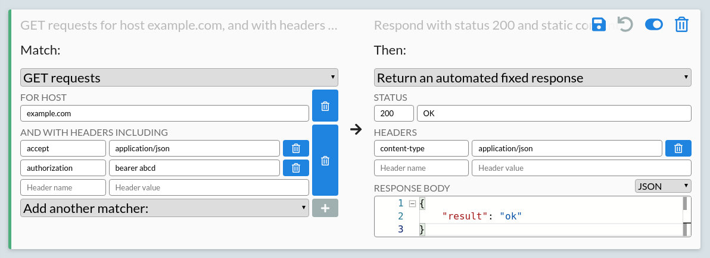
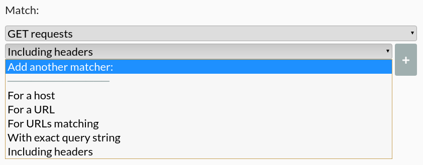
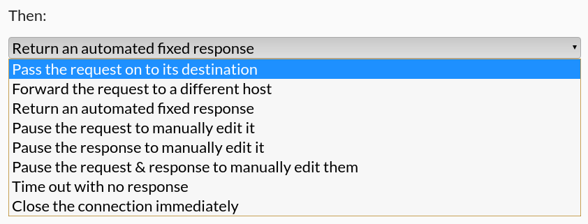

The Modify page allows you to rewrite traffic, simulate fake servers, test edge cases, or change real HTTP requests and responses in any other way you'd like.

It shows a list of rules, which define how all HTTP traffic is handled. Each rule has a matcher and one or more steps. The matcher defines which requests it applies to, and the steps define what happens to matching requests.

Every request is matched against each rule one by one from the top, until a matching rule is found, and the steps for that rule are then run in order. Only one rule ever matches any request. If no rule matches, the request receives a 503 error, where the body explains the details of the request, and the details of the existing rules that didn't match.

Rule changes only take effect when saved. You can save all changes to rules from the button at the top, or save any one individual rule from the button on its row.

Rules defined here are only stored persistently with [HTTP Toolkit Pro](/get-pro/). For hobbyist users, the rules reset to their defaults every time HTTP Toolkit restarts.

## Page structure

The Modify page consists of a set of controls at the top, an 'Add a new rule' button, and a reorderable list of existing rule rows.

### Modify page controls

The controls at the top are, from left to right:
- Clear all: resets all rules to default. This deletes all custom rules, and all changes from the built in rules.
- Import rules: this imports a set of exported rules, replacing all existing rules (_requires [HTTP Toolkit Pro](/get-pro/)_).
- Export rules: this exports the current set of rules to a file, for your own use later or to share with others (_requires [HTTP Toolkit Pro](/get-pro/)_).
- Revert changes: reverts all unsaved changes to rules.
- Save all: this saves all unsaved changes to all rules.

### Add new rule

This button creates a new rule at the top of the list. New rules always start matching nothing, and passing any matched requests on to the real server (i.e. effectively doing nothing). You'll want to change those, and then save the rule.

### Rule rows

You typically start with two rules: a rule that provides a test page at amiusing.httptoolkit.tech, and a rule which forwards all unmatched traffic to the real target server. You can edit or remove either of these if you'd like.

Hovering over any rule will show a draggable tag on the left, and a set of controls that can be used to manage the rule.

Each rule row shows these controls in the top right. You can hover over any button to see a short description. From left to right, they are:

* Save rule / collapse rule (depending on whether there are unsaved changes).
* Revert unsaved changes to this rule.
* Give this rule a custom name, to make it easier to recognize in a long list.
* Deactivate/reactivate rule (note that you will need to save the rule for this change to apply).
* Clone rule, to create a copy you can edit separately.
* Delete rule (note that you will need to save the full list of rules for this change to apply).

Rules can be reordered by hovering over the rule whilst it is collapsed, and dragging it using the draggable tag that appears. For keyboard use you can tab to this tag, which will appear if previously invisible, start dragging with space, select a position with the arrow keys, and place the rule with space again.

Rules can also be collected into named groups, by dragging one rule onto another. Groups can be collapsed and reordered as a unit, which is useful to keep large sets of rules manageable.

To edit any rule, click it or press enter on it in the list, and it will expand to show its details. You can collapse it again from the chevron button in the top right. If you've made changes, that becomes a save button, which will save the changes to this rule before collapsing it. To avoid saving changes, first use the revert button, which will put the rule back to its last saved state.

Within each row, you can see:

* A top line, showing a summary of the matcher and steps currently selected. This is greyed out when the rule is expanded.
* A colour marker on the left. This corresponds to the HTTP method matched, to allow easier skimming within large lists of rules.
* A set of matchers on the left.
    * These are combined together, so that requests will match only if all matchers match the request.
    * Change the first dropdown to match by HTTP method (or to ignore the method entirely).
    * More specific matchers that have been added are shown below this, with their editable configuration.
    * Press the delete button next to any matcher to remove it.
    * Use the dropdown at the bottom to select a new matcher, then configure it, and click the + button to add it to the rule.
* A list of steps on the right, shown below a 'Then:' header.
    * These are applied in order to all matching requests as they arrive.
    * Change the dropdown at the top of any step to select the step to use.
    * The configuration and an explanation for the selected step will appear below it.

Some matchers and steps have validations, for example host matching requires a valid hostname. If any data is invalid, it will be marked with a warning icon, and the rule will not be changed until you provide a valid value.

## Matchers

There are a variety of matchers available to filter the requests that a rule will affect:

* An HTTP method or 'any requests'. This is always shown as the top matcher, and filters requests by the HTTP verb used.
* A host. This matches requests to a given hostname, regardless of the protocol, path or query string provided.
* A URL:
    * This matches an absolute or relative URL, excluding the query string.
    * Matching `/abc` will match that path regardless of the host or protocol.
    * Matching `example.com/abc` will match that host and path, regardless of the protocol.
    * Matching `https://example.com/abc` will match only that exact URL.
* A URL matching a regular expression:
    * This matches any request whose relative or absolute URL (excluding the query string) matches the given regular expression.
    * Matching `^https:` will match all HTTPS requests.
    * Matching `^/abcd?` will match requests to path `/abc` or `/abcd` on any host.
* An exact query string:
    * This matches any request with the exact query string provided.
    * If empty, this matches only requests with no query parameters at all.
    * If set, this matches the exact query string provided.
* Query parameters including:
    * This takes a list of name/value pairs.
    * It will match any request whose query string includes all those parameters, regardless of any others.
* Including headers:
    * This takes a list of name/value header pairs.
    * It will match any requests that include those pairs of headers.
    * Edit the last name/value row to add a new pair.
    * Use the delete button on any row to remove any pair.
* A body:
    * 'With exact body' matches requests whose body is exactly the content given.
    * 'With body including' matches requests whose body contains the content given anywhere within it.
* A JSON body:
    * 'With JSON body' matches requests whose body is JSON exactly equal to the JSON given.
    * 'With JSON body including' matches requests whose body is JSON containing at least the properties given, ignoring any others.

After selecting and configuring the matcher, press the + button on the right of the matcher to add it to the set of matchers for this rule, and then use the save button to save the rule.

_Have suggestions for other matchers you'd like to see? File [some feedback](https://github.com/httptoolkit/httptoolkit/issues/new/choose), or contribute them directly [for yourself](https://github.com/httptoolkit/httptoolkit-ui#contributing)._

## Steps

Each rule runs a series of steps against the requests it matches. Most steps are final: they complete the request, and so must come last. A few steps instead run and then continue, and selecting one of those will automatically add a following step, so you can build up a rule that (for example) waits, fires a webhook, and then returns a fixed response.

Only passthrough (do nothing) and the breakpoint (manual rewrite) steps are available for free. All other steps require [HTTP Toolkit Pro](/get-pro/), and are shown in the dropdown under a 'With HTTP Toolkit Pro' heading otherwise.

### Continuing steps

These steps run and then hand over to the next step in the rule:

* Wait before continuing: pauses for a given duration before running the next step, to simulate a slow server or network.
* Enable webhooks:
    * This sends a copy of the request and/or response to a URL of your choice, as it happens.
    * The traffic itself is unaffected, so this is useful to feed real traffic into your own tooling.

### Final steps

These steps complete the request, and end the rule:

* Pass the request on to its destination: This proxies the request to its target server, and returns the server's response, with no changes.
* Forward the request to a different host:
    * This changes the target server of the request.
    * By default the 'Host' header is also updated to match, although this can be disabled.
* Return a fixed response:
    * Request triggering this rule are never sent upstream to any real server, but receive a response directly from the proxy.
    * The response status, status message, headers and body can be specified manually.
    * Header rows can be added by editing the final name/value pair, or deleted using the delete button next to each individual row.
    * The body editor is based on [Monaco](https://github.com/microsoft/monaco-editor) (the internals of Visual Studio Code), so includes many of its features, including syntax highlighting, regex search, and code folding.
    * The syntax highlighting to use can be selected using the dropdown on the right of the body editor.
    * The body dropdown will automatically update the content-type header, and will automatically match type of the header if it is specified & recognized.
* Return a response from a file:
    * Request triggering this rule are never sent upstream to any real server, but receive a response directly from the proxy.
    * The response status, status message and headers can be specified manually.
    * Header rows can be added by editing the final name/value pair, or deleted using the delete button next to each individual row.
    * The body content will come from a file, selected using the button shown.
    * The file contents are read fresh for each request, so future changes will be immediately visible in responses.
* Transform the real request or response automatically:
    * This passes the request through to the real server, but rewrites parts of the request and/or response on the way, without any manual intervention.
    * See [transforms](#transforms) below for the full details.
* Pause the request to manually edit it:
    * This will breakpoint each matched request as it is received, before it is sent upstream to the server.
    * When a matching request is received, HTTP Toolkit will immediately jump to the request on the View page to show it.
    * Requests can be manually edited, to redirect them to a different URL, edit the method, header or body content that will be sent upstream, or reply directly.
* Pause the response to manually edit it:
    * This will breakpoint each matched request after it has been sent upstream and a response has been received.
    * When a response for a matching request is received, HTTP Toolkit will immediately jump to the request on the View page to show it.
    * Responses can be manually edited, to edit the status code, status message, headers and body before they are returned to the initiating HTTP client.
* Pause the request & response to manually edit them:
    * Matching requests will be breakpointed both before they are sent upstream, and after a response is received from the upstream server.
    * This behaves as a combination of the previous two rules.
* Time out with no response: matching requests will never receive any response, and the connection will remain open until they time out (or until HTTP Toolkit is closed).
* Close the connection: as soon as a matched request is detected, the connection will be immediately closed with no response.
* Forcibly reset the connection: like closing the connection, but the connection is reset rather than closed cleanly, to test how clients handle abrupt network failures.

After selecting and configuring your steps, remember to save the rule to begin applying it to matching traffic.

_Have suggestions for other steps you'd like to see? File [some feedback](https://github.com/httptoolkit/httptoolkit/issues/new/choose), or contribute them directly [for yourself](https://github.com/httptoolkit/httptoolkit-ui#contributing)._

## Transforms

The 'Transform the real request or response automatically' step rewrites traffic as it passes through, so you can change real requests and responses without stopping at a breakpoint each time.

The step is configured in two halves, for request transforms and response transforms. Each part defaults to using the original value, and you can enable as many parts as you like at once.

For requests, you can change:

* The method, replacing it with any other HTTP method.
* The URL, either changing the protocol, replacing the host outright, or using match & replace on the host, path or query string.
* The headers, either overriding specific headers (leaving the rest untouched) or replacing all of them.
* The body, as below.

For responses, you can change:

* The status code.
* The headers, with the same options as requests.
* The body, as below.

In both cases the body can be replaced with a fixed value or the contents of a file, or edited in place: merging JSON data into a JSON body, applying a [JSON patch](https://jsonpatch.com/) to a JSON body, or running match & replace over the raw body text.

Match & replace takes a regular expression and a replacement, applied to the matching part of the request or response. This makes it easy to rewrite just one value, such as swapping a hostname in a redirect or an API key in a body, whilst leaving everything else as it is.

## WebSocket rules

WebSocket traffic is matched and modified with its own rules. To create one, set the first matcher of a rule to 'Any WebSocket', and the available matchers and steps will update to match.

WebSocket rules use the same matchers as HTTP rules, applied to the initial setup request, with their own set of steps:

* Pass the WebSocket through to its destination: connects to the real server, and proxies messages in both directions unchanged.
* Forward the WebSocket to a different host: as above, but connecting to a different server than the client asked for.
* Reject the WebSocket setup request: refuses the connection with an HTTP response, so it's never upgraded.
* Accept the WebSocket but send no messages: completes the connection, and then stays silent.
* Echo all messages: completes the connection, and sends every received message straight back to the client.

Passthrough and forwarding are available for free here. The remaining steps require [HTTP Toolkit Pro](/get-pro/).

**Any questions? [Get in touch](/contact/)**