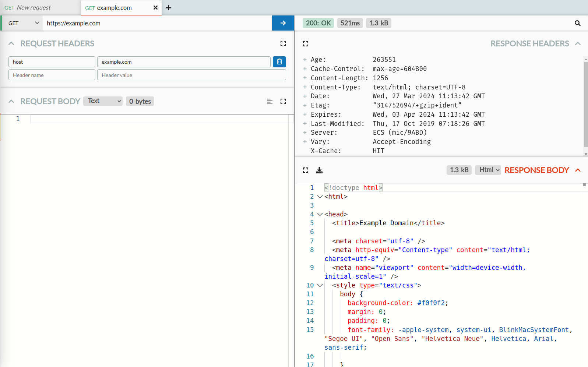

From the Send page, you can send HTTP requests yourself directly, with HTTP Toolkit acting as a graphical HTTP client. You can also resend intercepted requests (with [HTTP Toolkit Pro](/get-pro/)) by selecting a request on the View page and clicking the Send icon in the bottom right, to recreate an intercepted request here ready to be sent manually.

When you send a request, HTTP Toolkit sends it directly to the server (not via HTTP Toolkit's proxy) so it's not affected by mock rules, and you'll see the real behaviour of the request.

Sent requests and their responses are also recorded in the traffic log, along with intercepted traffic, so you can see them on the View page like any other traffic. All requests are marked with the red Send icon, so they're clearly visible.

Similarly to mock rules, requests defined on the Send page are only stored persistently with [HTTP Toolkit Pro](/get-pro/). For hobbyist users, this pane resets every time the app restarts.

The Send page is split into three parts:

* A tab bar at the top, to create and switch between multiple requests
* A request pane on the left, where you can enter the details of a request to send
* A response pane on right right, showing the latest response for the request

## The tab bar

The tab bar at the top shows a tab for each request you've created, with a plus button on the right to create a new one. This controls both panes below, which show the corresponding request & response for the selected tab.

Each tab shows the request method (e.g. POST) and URL, or a 'New request' placeholder if no URL has been entered yet.

The selected request shows a cross icon to close it. You can also close requests by focusing the tab bar and pressing delete, or by middle-clicking any tab.

## The request pane

In the request pane on the left, you can define each part of the request you'd like to send. It's made up of a few parts:

* A top row, containing an HTTP method selector, a URL input, and a button to send the request
* A request headers section
* A request body section

Both the request headers & body can be collapsed by clicking their names, and you can also expand either (using the icon in the corner) to show only that pane at its maximum size.

### Request headers

The request headers section shows a series of key/value rows, for the headers that should be sent with the request.

To add a header, go to the last row (which will show a 'Header name' and 'Header value' placeholder) and start typing. To remove any row just click the delete icon at the end.

Some headers have special behaviour, such as:

* The `host` header. This is required in all modern HTTP requests. This value will be automatically populated & updated whenever the URL is edited, unless it has been manually modified to a different value.
* The `content-length` and `transfer-encoding` headers. These are used to tell the server how long the body will be (sending an explicit length either in the header, or by encoding the body as a series of chunks with their own lengths). When you add a body, a `content-length` header will be automatically added & updated to match the body length, unless you manually modify the header or add your own `transfer-encoding: chunked` header.
* The `content-encoding` header. This is used to define encodings (generally compression) that should be applied to a request body. If you set this header to a valid value (such as `gzip`) then the body will be automatically compressed to match when it's sent, and any `content-length` header will also be updated to match the compressed length.
* The `content-type` header. This defines the format of the content (e.g. JSON, XML, Protobuf). If you set this to any recognized value, the request body section will update to show the body in the corresponding format. If you modify the format used by the request body section, this header will be updated automatically, unless it has been manually modified to a different value.

### Request body

The request body section shows an editor where you can enter the body of the request you'd like to send.

You can enter any text you'd like here, and you can select from various common formats in the dropdown to enable automatic syntax highlighting & validation.

For content types that can be automatically formatted (e.g. JSON and XML) you can click the format icon in the top right to tidily reformat & indent your input.

The top of this section also shows the total unencoded byte length of the request body. Note that this might differ from the final sent length of the body (as shown in the `content-length` header) if a `content-encoding` header is set so that compression such as gzip is applied.

## The response pane

The response pane on the right shows the latest response data, after the request has been sent at least once (if not, it stays blank).  It's made up of a few parts:

* A top status row, showing the essential response details
* A response headers section
* A response body section

Both the response headers & body can be collapsed by clicking their names, and you can also expand either (using the icon in the corner) to show only that pane at its maximum size.

### The response status row

This row shows, from left to right:

* The response HTTP status.
* The total response time, measured between starting the initial connection and receiving the completed body.
* The raw encoded size of the response body, if any.
* A button to jump to this HTTP exchange on the View page, to show more detailed information.

### The response headers section

This section shows the headers as returned by the server, in the same format as the View page.

You can click the plus icon next to any recognized header for more information and links to the Mozilla Developer Network's docs for this header.

### The response body section

This section shows the body as returned by the server, in the same format as the View page. The body shown here is automatically decoded if any `content-encoding` header was provided, so that encodings like gzip compression are handled transparently.

At the top of this section, you can configure the formatting of this body in the dropdown. This setting will automatically reformat the body (e.g. tidily indenting JSON for readability) and enable features like syntax highlighting and folding for the specified format.

You can also see the size of the body here (this shows the full decoded size - see the size data in the top status row for the raw encoded size) and download the entire body as a file (requires [HTTP Toolkit Pro](/get-pro/)) for reference later or analysis elsewhere.

**Any questions? [Get in touch](/contact/)**