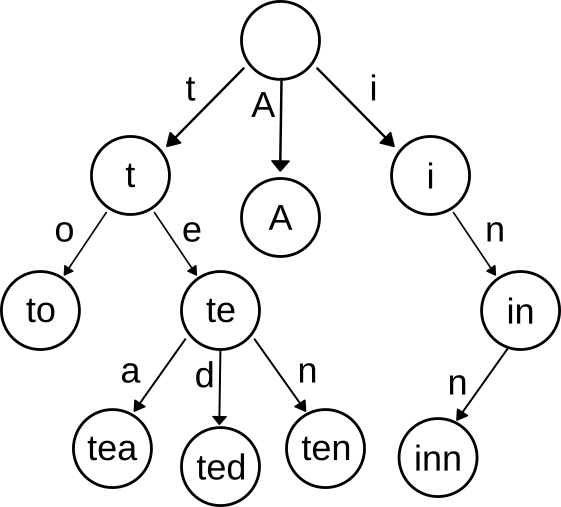
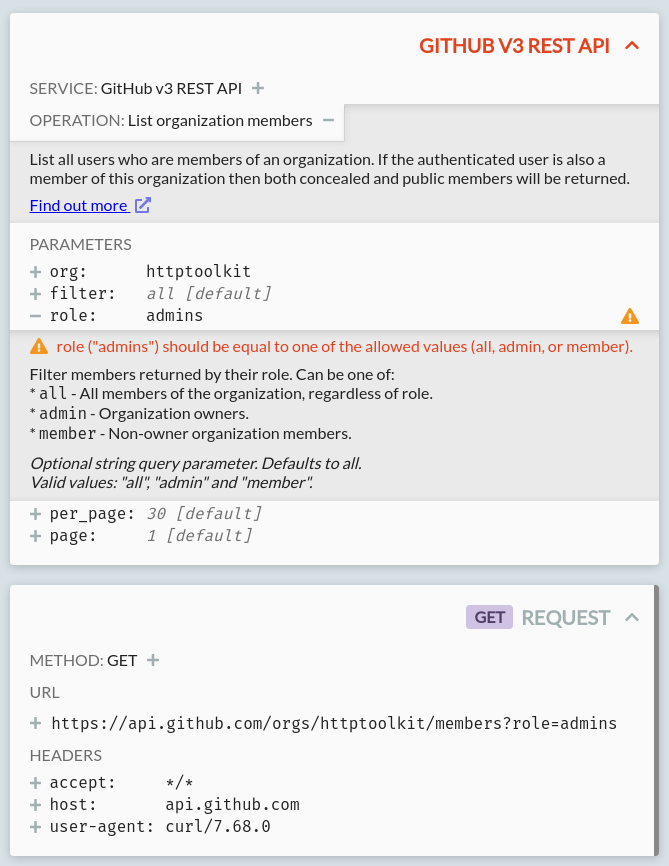

Wouldn't it be neat if you could take any HTTP request URL, and immediately find the matching API documentation, along with a detailed specification of the endpoint you're talking to?

I thought that would be _very_ neat, so I built an index to do it.

More specifically, I've taken the [OpenAPI Directory](https://apis.guru/openapi-directory/) - an amazing project that has collected the OpenAPI specifications for thousands of popular APIs, from AWS to Stripe to GitHub - and built a tiny & fast index to query it, for every single API endpoint listed (all 226,379 of them)

This was fun, but it's also useful: [HTTP Toolkit](/) uses this to automatically provide validation, metadata and links to documentation, so that when you intercept & inspect a request to a known API you can tell exactly what it's doing (and what it's doing wrong, if anything).

If you want to give this a quick test yourself, you can play with a demo directly at [runkit.com/pimterry/openapi-directory-js-demo](http://runkit.com/pimterry/openapi-directory-js-demo).

If you want to know how this works, read on. This gets pretty complicated, but it's a really interesting set of algorithmic challenges and neat datastructures that solve some concrete problems.

## Why is this useful?

API specifications have been a growing field a long time, but they're really coming to maturity now. For a time we had fighting standards for this, but in the last few years one standard has reached widespread use and become the clear choice: [OpenAPI](https://en.wikipedia.org/wiki/OpenAPI_Specification).


API specifications allow tools and automated systems to automatically understand API interactions. That opens a whole world of options:

* Documentation generated from specifications, staying automatically up to date, with tools like [ReDoc](https://github.com/Redocly/redoc#readme).
* APIs that can be automatically tested against their own specification to guarantee a single source of truth.
* Interactive HTTP clients that can suggest the endpoints or query parameters you're looking for, and spot mistakes automatically.
* SDKs that can be generated directly from API specifications for 40+ languages with tools like [Swagger-CodeGen](https://swagger.io/tools/swagger-codegen/).
* Error reporting tools that can include human-readable explanations of errors and links to documentation, drawn straight from the spec.
* Mocking tools like Stoplight's [Prism](https://stoplight.io/prism/) that can automatically generate API mock servers.
* Type systems that know the type of HTTP response bodies automatically, without needing a locally hardcoded copy of the API's response format.
* HTTP debuggers like [HTTP Toolkit](/) that can add metadata and validation to intercepted traffic.

All of this is great, and OpenAPI specifications are now published by most major APIs, like [GitHub](https://github.blog/2020-07-27-introducing-githubs-openapi-description/), [Stripe](https://github.com/stripe/openapi) and [Twilio](https://github.com/twilio/twilio-oai). Even more are written and maintained by the community, for APIs from [healthcare.gov](https://github.com/APIs-guru/unofficial_openapi_specs/blob/master/healthcare.gov/1.0.0/swagger.yaml) to [XKCD](https://github.com/APIs-guru/unofficial_openapi_specs/blob/master/xkcd.com/1.0.0/openapi.yaml).

Most of this is focused on single API usage though: the benefits when using specs internally, or when manually hunting down the spec for a single API you can about and using it while making requests or testing against that one API.

If you could do this for _all_ APIs, you could provide these kind of benefits to all your HTTP traffic, with no manual research required. Your HTTP client could automatically validate all your HTTP requests and parse & type your HTTP responses for you, your error reporting could include detailed error descriptions from docs in exception messages instead of just "Bad status: 400", and automated testing tools could automatically mock all external APIs out of the box.

There's a whole world of amazing tooling you can build if detailed machine-readable context is available alongside every single HTTP request. Of course, we're not going to get a specification for every single API in the world, but with the [OpenAPI Directory](https://github.com/APIs-guru/openapi-directory) we can get damn close.

## How does this work?

To do this, at a high level, we need to:

* Take all the OpenAPI Directory specs and normalize them into a standard format.
* Derive all the URLs that can identify each API.
* Build an efficient data structure to conveniently index these for quick lookup.
* Build an easy way to look up the right spec for a given request URL.

Of course, 'efficient' is a relative term. In HTTP Toolkit's case, we're potentially looking up URLs 100s of times a second as traffic comes past, and it's already busy doing lots of other things, so queries need to be significantly less than a millisecond of CPU time. If it did take longer, say a couple of milliseconds, and we intercept a few hundred requests in a second-long burst then we could plausibly spend _most_ of our time querying this index, and the UX is going to go downhill fast.

It's also very useful to have the index be a small-ish file so we can, for example, embed it into a webpage and cheaply pass it around. Comfortably under 1MB uncompressed seems like a good goal.

That's the plan, let's dig into the details:

## Standardizing the specs

If you're not familiar with [OpenAPI](https://swagger.io/docs/specification/about/) itself, the basics are pretty simple: a specification is a YAML or JSON file that defines bits of metadata for an API (the name, the URLs of its servers, links to the docs), lists all the endpoints and operations for each endpoint with info (what does it do, perhaps some docs here too), and provides schemas for all the input & output values from the API, so you know what data you're handling. Twitter's [OpenAPI spec](https://github.com/APIs-guru/openapi-directory/blob/master/APIs/twitter.com/current/2.7/openapi.yaml) is a fairly simple example.

OpenAPI is really powerful as format for this. Primarily because it has all the data we need for the myriad use cases above, but also because there's a huge world of existing tooling around it to support more advanced transformations and analysis, and it's fundamentally a fairly simple human-readable format that fits neatly in with other standards like JSON Schema. This all sounds great!

I had expected that getting specs in the OpenAPI Directory ready to process would be easy, but it very much isn't. There's a few problems here:

* There's at least two major incompatible versions of OpenAPI in circulation: Swagger v2 (the old name) and OpenAPI v3+.
* Both can be in either YAML or JSON format.
* Many include `$ref` references that point to external resources (typically to partial schemas that are shared between multiple specs). You can't quickly or reliably use a spec if it requires a network connection to go fetch extra details, so we want to bundle all of these inline.
* There's multiple versions of the same specs in many cases: sometimes mistakenly, and sometimes for genuinely different versions of the same API.
* Many of these specs use non-standard extensions, e.g. Microsoft puts many of their endpoints under a `x-ms-paths` property instead of `paths`, so it can break certain rules.
* Many others have bugs in either the original specs, or in OpenAPI Directory's filing of them, from `$ref` references to invalid local or external address, through to outright spec violations and invalid content. Some examples: https://github.com/APIs-guru/openapi-directory/issues/540.

To make all these specs consistently and easily usable, and make it possible to build our index at all, we need to normalize them.

This is a potentially endless task, but a few small steps take us a long way:

* You can automatically convert Swagger to OpenAPI using the excellent [Swagger2OpenAPI package](https://www.npmjs.com/package/swagger2openapi).
* You can bundle external references using API Dev Tool's [@apidevtools/swagger-parser package](https://www.npmjs.com/package/@apidevtools/swagger-parser). This also handles the initial parsing and does some validation for us en route, so this is perfect.
* It's possible to [manually transform](https://github.com/httptoolkit/openapi-directory-js/blob/f3976b582b09b70da8493b71080ce594cc4733f0/src/buildtime/generate-apis.ts#L39-L49) many extensions into formats that work for our purposes and are valid enough that we can access the data within consistently with everything else.
* The OpenAPI directory has a custom `x-preferred` field to indicate the preferred spec for each endpoint, allowing us to filter our specs to just the main official version.
* Filing bugs and working through them, either with the API team themselves (whose details are listed in each spec, for official specs) or in the OpenAPI Directory directly (for custom or automatically generated specs like [AWS's](https://github.com/APIs-guru/aws2openapi)) has managed to fix up most remaining serious kinks.

All put together, the [resulting code](https://github.com/httptoolkit/openapi-directory-js/blob/f3976b582b09b70da8493b71080ce594cc4733f0/src/buildtime/generate-apis.ts#L21-L37) is not so bad at all:

```typescript
import * as swaggerParser from '@apidevtools/swagger-parser';
import * as swaggerToOpenApi from 'swagger2openapi';

async function generateApi(specPath: string): Promise<OpenAPIDocument> {
    // Happily parses both Swagger v2 and OpenAPI v3 files
    const parsedSwagger = await swaggerParser.parse(specPath);

    // Convert everything to OpenAPI v3
    const openapi: OpenAPIV3.Document = await swaggerToOpenApi.convertObj(parsedSwagger, {
        direct: true,
        patch: true // Automatically fix various common minor errors
    });

    // Extra conversion to transform x-ms-paths into normal-ish paths:
    mergeMsPaths(openapi);

    // Manually patch some other small known API issues:
    patchSpec(openapi);

    // Bundle all external $ref pointers:
    return <Promise<OpenAPIDocument>> swaggerParser.bundle(openapi);
}
```

This immediately gives us a workable, valid, and mostly consistently formatted set of 2,000 API specifications to work with.

**Before we go any further, I should give some credit to the ecosystem that makes this possible**. There's been a huge amount of work behind the scenes here to build this collection of packages, including the [API Dev Tools](https://github.com/APIDevTools) team (I believe are partly backed by [Stoplight](https://stoplight.io)?) who maintain many of the tools I've used here, [APIs.guru](https://apis.guru/) who built more and started the OpenAPI Directory itself in 2015, and especially from [Mike Ralphson](https://twitter.com/PermittedSoc) who's been almost single-handedly maintaining, fixing & expanding this huge API collection for 4+ years now. Amazing work.

## Identifying every API

Once we have a big bag of consistent API specifications, we can start talking about indexing them. The goal here is to take a URL, and to automatically find the specification for that URL, with a tiny portable fast index we can use anywhere. That means the first step is to work out the identifying URLs for each API.

For some specifications, this is easy data to collect. OpenAPI specifications have a top-level `servers` field, which tells you which servers host the API and at what path:

```json
  "servers": [
    {
      "url": "https://api.gigantic-server.com/v1",
      "description": "Production server"
    }
  ]
```

In the simplest case, there's a single spec for a service, that says the API is hosted at a single address like `https://example.com/api/v1`. We put that base URL in the index, and for any request URL that starts with this base address, we look up that spec for validation.

We just need to:

* Get all our normalized specs.
* Get the base server URLs from each.
* Build a map from base server URL to the spec id, for each base server URL.

Easy!

Not so fast. In quite a few cases (e.g. Twilio, Azure, AWS) _many_ specs share the exact same server base URLs, and each defines a different subset of the endpoints for part of the larger API.

To differentiate these, we need to check every separate endpoint in each spec...

### Precisely matching API endpoints

So the base servers addresses from the spec are not specific enough. Fortunately the full endpoint paths are unique (well, almost - there are one or two places where specs do define _exactly_ the same endpoints - but few enough to ignore). If we can filter a little more precisely to match the full endpoint path, then we can generally find the specific spec we're looking for.

To do this, we're going to need to collect every possible endpoint URL for every single API, and look up APIs from that using the full request URL.

One option would be to include every single endpoint URL in the index, just building a map from endpoint to API specification.

That works, it's totally correct, but it's not pretty. It's too big, and it's expensive to query.

It's too big not just because the specs themselves define 40,000 or so endpoints, but because in many cases there's _many_ server base URLs (e.g. AWS has one per region for many services) and there's variables within endpoint paths and server URLs themselves, and every combination of these server & path values is a valid endpoint.

In practice, there are 226,379 defined API endpoints here in total (today, and that's increasing fast). This makes for an index large enough that we can't distribute anywhere near as easily as I'd like. Stored naively, the raw data alone is about 17MB. Not great.

Instead of trying to put all of those into a single index, we want to get the _smallest_ set of base URLs that uniquely identifies each spec.

For example, if you have one API specification that includes

* `example.com/api/billing/customers`
* `example.com/api/billing/orders`
* `example.com/api/billing/refunds`
* `example.com/api/files/invoices`

and then a 2nd specification that includes

* `example.com/api/social/posts`
* `example.com/api/social/comments`
* `example.com/api/files/user-uploads`

then we could say:

* API 1 should match any URLs starting with `example.com/api/billing` or `example.com/api/files/invoices`
* API 2 should match any URLs starting with `example.com/api/social` or `example.com/api/files/user-uploads`

Since most APIs cover a specific sub-path or a couple of them, this helps enormously. Reducing the set of endpoints like this takes us from 226,379 URL keys in our index down to a mere 10,000. Amazing!

Implementing this in practice though is non-trivial. If you're really interested, you can look at [the full implementation](https://github.com/httptoolkit/openapi-directory-js/blob/f3976b582b09b70da8493b71080ce594cc4733f0/src/buildtime/generate-apis.ts#L124-L290), but my algorithm is basically:

* Get a set of APIs that all have the same base server URL, and the list of paths that each one defines.
* For each spec:
  * Create an initially empty list of prefixes unique to this spec
  * Loop through the endpoints in this spec, and build a list of common prefixes:
    * If a prefix for this spec already covers this endpoint, we're good, skip it.
    * If it doesn't, see if we have any prefixes we could shorten to include this endpoint without matching any other spec's endpoint. If there's multiple options, use the most specific.
    * If we can't, push this specific path as a prefix for this spec
  * Build an index that maps these prefixes to this spec
  * Take any sets of still-conflicting prefixes in this index (i.e. two specs that define the same exact endpoints) then shorten them together, down to their shared conflicting prefix.
    * If we don't do this, the previous step creates a separate conflicting prefix for every single conflicting endpoint, which blows up the size of the index hugely. If, for example, two specs conflict both define all the same `example.com/api/billing` endpoints (yes, Azure basically does this) then we just want one index value that points to both specs, not an index value for every single endpoint.
* Merge the base URL plus path prefixes from this index back in with the base URL index we've used for every other spec.

Phew. Are we done? Not quite! We now have a map of URL prefixes to API specs, but it's still bigger than we'd like (about 1MB) and it's still not practical for quick querying.

## Building the index

As I mentioned at the start, for HTTP Toolkit purposes (and for many interesting purposes), we want to be able to distribute this index in significantly less than 1MB, and query it in less than 1ms.

We've got it down to our size limit, but only just. That is before loading any spec content, to be clear: that's just the size of the index mapping from URL prefixes to spec ids (the ids are things like `stripe.com` or `amazonaws.com/s3` - they're defined uniquely in the spec metadata).

It gets worse when we want to query this though, because doing so is not a straight string lookup. There's two big problems:

* We're matching string prefixes of varying lengths. That means we can't do `index[myUrl]` to look values up directly. Instead, we need to compare every single key in the index with our input, like `input.startsWith(indexKey)`, and then pick the longest matching key. Ouch.
* Even worse: parts of the inputs are various kinds of wildcards (modeled as regexes within our index key) so now we need to potentially do a regex matching against every single key.

This is bad! To naively do this, we have to string match and/or regex match against every single key in the index. Even with some simple optimizations, this requires a lot of string prefix comparisons, and it takes about 10ms to query on my laptop - that's 100% CPU time, with no IO involved, on a fairly fast machine. Ok for some use cases and occasional queries, but not ok if you want to query this frequently with live HTTP traffic.

We need a fundamentally different index structure.

Let's talk about Tries.

### Introducing Tries

A trie (pronounced 'tree', confusingly, and also known as a prefix tree) is a tree-like data structure that shares prefixes between keys. Wikipedia has [some detailed background](https://en.wikipedia.org/wiki/Trie) if you want to dig into the details, but I'll summarize here.

It's easiest to explain with a picture:



This trie stores a set of strings: "to", "tea", "ted", "ten", "A", and "inn". The characters of the strings are stored as links between nodes. To look up "ted", you start at the top, follow the link for "t", then the link for "e", then the link for "d".

You can extend this further by storing values in the nodes. Once you do that, you have a map from strings to values: you follow the characters of your key until you reach of node, or run out of links, and then you read the value from the node at the end.

Trie structures are useful for building indexes like this, because:

* They store overlapping strings very efficiently, without duplicating shared prefixes. Where we have APIs indexed by the full URL of each endpoint, we have a lot of shared prefixes!
* They can be quickly queried by prefix: we walk just down the trie making simple string hashmap lookups until either there's no next key which matches, or we reach a leaf value, and then we're done. It doesn't matter if it's an exact match or a prefix match, and the time taken is proportional just to the number of unique parts (like 't', 'e', 'd' above) in the key, not the number of keys in total.

That's the basics. We extend this concept a little further and fill it with API data, so that our real trie looks more like this:

```json
{
  "api.": {
    "httptool": {
      "kit.tech": "http-toolkit-api"
    },
    "example.": {
      "com": "api.example.com",
      "org": {
        "/v1/": {
          "": "api.example.org-main-spec",
          "auth": "api.example.org-auth-spec",
          "bill": {
            "ing": "api.example.org-billing-spec"
          }
        }
      }
    }
  },
  "cool": {
    "-api.test/api/": {
      "v1": "cool-api-spec",
      "v2": "cool-api-v2-spec",
      "v3": "cool-api-v3-spec",
      "v4": "cool-api-v4-spec",
      "v5": "cool-api-v5-spec"
    }
  }
}
```

That trie is equivalent to:

```json
{
  "api.httptoolkit.tech": "http-toolkit-api",
  "api.example.com": "api.example.com",
  "api.example.org/v1/": "api.example.org-main-spec",
  "api.example.org/v1/auth": "api.example.org-auth-spec",
  "api.example.org/v1/billing": "api.example.org-billing-spec",
  "cool-api.test/api/v1": "cool-api-spec",
  "cool-api.test/api/v2": "cool-api-v2-spec",
  "cool-api.test/api/v3": "cool-api-v3-spec",
  "cool-api.test/api/v4": "cool-api-v4-spec",
  "cool-api.test/api/v5": "cool-api-v5-spec"
}
```

In the former case, we can look up a value with between 3 & 6 hashmap lookups (`index[nextUrlPart]`). In the latter, we need to do `myUrl.startsWith(key)` at least 10 times, and the index contains many string prefixes (like `api.example`) that get repeated over and over again.

As the index gets larger, the trie version stays relatively compact and quick to query, while the simple map duplicates everything, and takes time directly proportional to the total size of the index. Although it appears longer as presented here, if you strip the whitespace from the trie example above it's already 25% shorter than the simple map, and that effect gets stronger as the number of overlapping strings in the index increases.

### Tries in practice

Theory is all very well, but how does this actually work? The implementation is in two parts:

* First, we [build the trie](https://github.com/httptoolkit/openapi-directory-js/blob/master/src/buildtime/build-index.ts) as part of the indexing process.
* Later, at runtime, we [load and query the trie](https://github.com/httptoolkit/openapi-directory-js/blob/master/src/runtime/trie.ts).

There's some details we'll talk about in a second, but the quick summary is:

* To build the trie, for each key we incrementally build the tree of hashmaps, going through the key character by character, and then we use string values containing the specification id as leaf nodes at the end.
* To query the trie, you walk the hashmaps, each time looking up the next part of your input URL. If you reach a leaf node before you run out of URL, then you have a prefix match for that id. If you reach a step where there's no key in the hashmap that matches your URL, or you run out of URL, then you've matched nothing.

On top of that, there's a few interesting and notable tricks in here:

* Compressing the trie
* Using prefix branches
* Using regex keys

#### Compressed tries

We're actually using a _compressed_ trie. Technically the trie index example above was a compressed trie too, and a normal trie should only have single-character keys, like:

```json
{
  "a": { "p": { "i": { ".": { /* ...Etc */ } } } }
}
```

This is simpler and it's much easier to mutate if you're doing that, but it's clearly less efficient. We can avoid it! We do build our trie initially character by character like this, but then when it's done we compress it, by collapsing any node with just a single non-leaf child into that child, until we get larger strings (as in the index example above). For example, we turn `{ "a": { "b": ..., "c": ... } }` into `{ "ab": { ... }, "ac": { ... } }`.

This shrinks the tree a lot, but still ensures it's queryable by keeping the keys at each level always the same length. To look something up at one level, we find the key length by looking at any key, then get the corresponding next N characters of our input, and then look that up that string in the hashmap. Keeping the key length at each level the same allows us to do simple lookups everywhere, so we never have to scan over keys at any level.

#### Prefix branches

If you have two keys where one is a prefix of the other (`api.com` and `api.com/v2` for example) you need a way to match the shortened version.

We represent that using empty string keys, like `{ "api.com": { "": "default-spec-id", "/v2": "v2-spec-id" } }`. If there's ever no matching string value whilst querying, we look for an empty string value, and use that if present.

#### Regexes in tries

We need regexes in our keys because we can have wildcard placeholders within our URL paths (in fact, OpenAPI supports more specific cases, but we just treat them as wildcards for our purposes). For example, a URL might be `api.example.com/users/{user-id}/invoices`. To handle this, we use a single regex to act as a path placeholder (`[^/]+`). We always use this same regex, so there's only ever one regex at any level, which simplifies things.

To put this in the index, we use that regex as a key in the map directly (using an ES6 [map](https://developer.mozilla.org/en-US/docs/Web/JavaScript/Reference/Global_Objects/Map), so we can use non-string keys) while building the index. Later, if we ever can't find a matching string value whilst querying, and there's a regex at the same level, we test that and continue that way if it matches.

For `api.example.com/users/{user-id}/invoices`, that might result in an index like:

```json
{
  "api.example.com": {
    "": "main-spec",
    "/users/": {
      "": "main-users-api-spec",
      /[^/]+/: {
        "/invoices": "user-invoices-spec"
      }
    }
  }
}
```

#### Trie performance

This could absolutely be optimized further, but it's enough for our goals. In practice when indexing our 10,000 endpoints prefixes, the deepest key has 45 steps in it (an extremely heavily conflicting endpoint, deep in the darkest corners of the Azure API). That's a lot, but it's much cheaper to do 45 hashmap lookups than 10,000 string+regular expression tests. And that's the worst case: most lookups need just 2 or 3 steps to get a result.

In practice, this trie-based implementation can find the right spec within those 10,000 prefixes in just under 0.2 milliseconds on my laptop. That's 50x times faster than the naive alternative, and that difference will increase as the API directory expands further. It ends up reasonably sized too, weighing in under 500kB for the whole index with all the runtime code required to query it.

That's 500kB with some very simple & convenient serialization, and so it compresses far further, gzipping down to just 54kB on the wire. Not bad to match 200,000 API endpoints!

If all this sounds interesting, or you want to get more precise on the details, do look through the [buildtime](https://github.com/httptoolkit/openapi-directory-js/blob/master/src/buildtime/build-index.ts) & [runtime](https://github.com/httptoolkit/openapi-directory-js/blob/master/src/runtime/trie.ts) trie index implementations for the full story.

## Putting it all together

We've now got a big box of standardized specifications, with an index that references to them. How do we distribute it?

First, all the above gets run at build time, and then the index and all the APIs are serialized to disk. The APIs are all stored as JSON, for easy & consistent parsing, and the index is serialized using [serialize-javascript](https://github.com/yahoo/serialize-javascript), which allows us to directly serialize things like ES6 maps and regexes, using a superset of JSON.

Then it's bundled it up for runtime use as an npm package, containing an `/api/` folder, which includes every API spec and the index data itself, and a small set of runtime code to actually querying the index. To use it, you just need to do:

```javascript
const { findApi } = require('openapi-directory');

// Look up the API in the index from a request URL:
const apiId = findApi(requestUrl);

// With the id, require() the full specification:
const apiSpec = require(`openapi-directory/api/${apiId}`);
```

The resulting package, including the index and normalized specifications, is distributed as [an npm package](https://www.npmjs.com/package/openapi-directory) so you can easily use the directory (with the index, or just the raw specs themselves) in JS codebases on the front or back end. It's not currently easily usable in other languages or as an API itself, but if there's interest that'd be easy to do (if you're personally interested, [get in touch](/contact/)!).

And with that, HTTP Toolkit and other tools can automatically grab all the metadata data required to do things like this:



That's a request to GitHub, fully annotated with the API endpoint details, links to docs, parameter info, and fully validated against the spec, all automatically derived from just the request shown. And the same thing works for another 2,000 APIs or so, all without a manually configured specification in sight.

The full package with all the data that makes this possible is open-source & published [on npm](https://www.npmjs.com/package/openapi-directory) and so the raw content is also available directly [from unpkg](https://unpkg.com/openapi-directory/), so anybody can immediately start building OpenAPI-powered tools on top of this.

I hope that was interesting! Have a play with [the demo](http://runkit.com/pimterry/openapi-directory-js-demo), test it out in HTTP Toolkit, and feel free to get in touch [by email](/contact/) or [Twitter](https://twitter.com/pimterry) if you have any questions or you start building on this yourself.

_Want to debug, test or mock HTTP(S), from browsers, servers, phones, and everything else? Try out **[HTTP Toolkit](https://httptoolkit.com)** now._