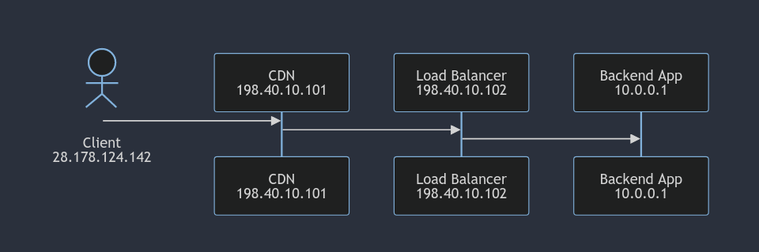

The X-Forwarded-For (XFF) HTTP header provides crucial insight into the origin of web requests. The header works as a mechanism for conveying the original source IP addresses of clients, and not just across one hop, but through chains of multiple intermediaries. This list of IPv4 and IPv6 addresses is helpful to understand where requests have really come from in scenarios where they traverse several servers, proxies, or load balancers.

A typical HTTP request goes on a bit of a journey, traversing multiple layers of infrastructure before reaching its destination. Without the `X-Forwarded-For` header, the receiving server would only see the IP address of the last intermediary in the chain (the direct source of the request) rather than the true client origin.

{/* sequenceDiagram
    actor Client as <br><br><br><br><br>Client<br>28.178.124.142
    participant CDN as CDN<br>198.40.10.101
    participant LB as Load Balancer<br>198.40.10.102
    participant B as Backend App<br>10.0.0.1
    Client->>CDN:
    CDN->>LB:
    LB->>B: */}




In thie example, by the time the backend application is seeing an incoming request, the IP address of the original client is long forgotten. This is where the `X-Forwarded-For` header can help out. It looks like this:

```http
X-Forwarded-For: 28.178.124.142, 198.40.10.101
```

The goal here is to give a proxy the chance to say "Alright hang on, I'm forwarding you a request, and this is the history of where it came from, as far as I know".

Note that the last proxy will not add its own IP address to the list, because that's already available: if the receiver of the request cares about who is calling it directly, they can combine the `X-Forwarded-For` with the request's source IP address from the incoming connection, e.g: `req.connection.remoteAddress` in NodeJS.

In this example above, the load balancer has said "Hey backend app, I am forwarding you a request that came from this client, via the CDN", and it doesn't need to pop its own IP in there because the backend app can already tell if it's coming from the load balancer or not.

And of course the backend app's own IP is also not included, as it's the one actually receiving the header.

## What is X-Forwarded-For used for?

Knowing the original source & processing path of requests has a whole load of use cases depending on what you're building.

- **User Authentication:** Use the header information to ensure that login attempts originate from recognized and authorized locations, and flag the login as suspect if not, triggering 2FA checks.

- **Load Balancing:** Evenly distribute incoming traffic across servers, to ensure optimal performance during busy periods.

- **Data localization:** European Union, Brazil, China and others have privacy laws about where data can be kept, and this can help identify those users who need special treatment.

- **Geographic Content Delivery:** CDNs use `X-Forwarded-For` to determine the user's location and serve content from the nearest server to reduce latency.

- **Access Control and Security:** Websites use `X-Forwarded-For` to verify the legitimacy of requests and implement access controls based on IP addresses, like a corporate intranet that only allows access to certain resources for employees coming from recognized office IP ranges.

- **Web Application Firewalls (WAF):** Filter incoming traffic, blocking suspicious requests from a known malicious IP address listed in `X-Forwarded-For`.

- **Fraud Prevention:** Financial institutions use `X-Forwarded-For` to detect and prevent fraudulent activities based on user location, e.g. identifying an unusual login attempt from a location that is inconsistent with the user's typical access patterns.

- **API Rate Limiting:** APIs use `X-Forwarded-For` to enforce rate limiting on a per-client basis. An API provider limits the number of requests from a specific IP address within a given time frame to prevent abuse.

- **Localized Advertising:** Ad platforms use `X-Forwarded-For` to customize and target ads based on the user's geographical location.

- **Logging and Analytics:** log to analyze user traffic patterns and behaviors for statistical purposes, like the geographical distribution of users over a specific time period.

We're talking about security here, but this is an HTTP Request header... so can it not just be completely faked? Is the whole Internet built on a lie?!

## Can you trust X-Forwarded-For?

You should never fully trust anything in an HTTP request that is coming from the outside world, and that includes `X-Forwarded-For` headers.

Actors can be malicious or misconfigured, but either way the contents of an HTTP request can be completely made up, and somebody could use `X-Forwarded-For` to pretend they're coming from inside your corporate VPN once they know the IP, pretend they're in the same geographic region as a user whose bank account they're trying to log into, or all sorts of other shenanigans.

Here's an example of how that might look, if the incoming header is blindly trusted:


{/* sequenceDiagram
    actor Client as Client<br>IP 28.178.124.142<br><br><br><br><br><br><br><br><br><br><br><br><br><br>
    participant CDN as CDN<br>IP 198.40.10.101
    participant LB as Load Balancer<br>IP 198.40.10.102
    participant B as Backend App
    Client->>CDN: X-Forwarded-For:<br>1.1.1.1
    CDN->>LB: X-Forwarded-For:<br>1.1.1.1, 28.178.124.142
    LB->>B: X-Forwarded-For:<br>1.1.1.1, 28.178.124.142, 198.40.10.101 */}


In this case, the client is sending an initial request to us that already includes an `X-Forwarded-For` header with a 1.1.1.1 value. This could be the client's real internal address that's been added by proxy related to the client, or it could be an attempt by the client to confuse the server about the client's IP. It's impossible for us to tell the difference, so we must ignore this, and treat the client address our infrastructure sees (28.178.124.142) as the real source IP.

One way to gain some control over the `X-Forwarded-For` header is to involve a trusted reverse proxy, and disable direct access at the network level to the backend server and other proxies/servers/load balancers except through that proxy. For API developers this is typically handled by an API Gateway, but it could also be a CDN like Fastly, Squid Proxy, Cloudflare, etc. If the request is coming through a trusted proxy, and that reverse proxy itself hasn't been hacked, you're probably ok to believe at least some of the IP chain you're seeing. But which parts?

In general, the further left you look in the header the more room there is for mistakes, as there are more servers which could be misconfigured, and anything that's coming from beyond the left-most proxy you control should be treated with suspicion.

To help with this, you can make decisions at the reverse proxy level that change how the header is constructed. For example, [nginx](https://www.nginx.com/) can override the `X-Forwarded-For` header completely, ditching whatever the client provides, and replacing it with the IP address it is seeing. If all requests come through nginx, this effectively draws a line around your infrastructure, and drops all untrusted values received from outside, allowing all other services within your infrastructure to trust the header.

You can do that for nginx using the below config:

```
proxy_set_header X-Forwarded-For $remote_addr;
```

This replaces the `X-Forwarded-For` header with the client's real IP address, dropping anything else.

This resolves the issue with the client above who appears to be trying to hide their IP address, or pretend to be somebody else, by sending a falsified `X-Forwarded-For` header. This header would be ignored by the CDN, and the request value would be replaced with just the actual IP address as seen by that server rather than being blindly accepted, like so:

{/* sequenceDiagram
    actor Client as Client<br>IP 28.178.124.142<br><br><br><br><br><br><br><br><br><br><br><br><br><br>
    participant CDN as CDN<br>IP 198.40.10.101
    participant LB as Load Balancer<br>IP 198.40.10.102
    participant B as Backend App
    Client->>CDN: X-Forwarded-For:<br>1.1.1.1
    CDN->>LB: X-Forwarded-For:<br>28.178.124.142
    LB->>B: X-Forwarded-For:<br>28.178.124.142, 198.40.10.101 */}


Dropping all external values like this is the safest approach when you're not sure how secure and reliable the rest of your call chain is going to be. If other proxies and backend apps are likely to blindly trust the incoming information, or generally make insecure choices (which we'll get into more later) then it's probably safest to completely replace the `X-Forwarded-For` header at that outside-world facing reverse proxy, and ditch any untrustworthy data in the process.

On the other hand, if you're confident the backend app is able to handle it, you can accept the incoming values, and simply append the IP address being seen by the server on the end of the chain. This can be helpful if your infrastructure doesn't necessarily have a single entry point, making it harder to guarantee this kind of header sanitization.

To simply append the incoming address to the header, but preserve the original values too, you can use this nginx config:

```
proxy_set_header X-Forwarded-For $proxy_add_x_forwarded_for;
```

This is a special bit of functionality in nginx, but most reverse proxies will have similar logic. It will build up the header to maintain whatever the client initially passed, and if they are connecting through any intermediary proxies, so long as those proxies support `X-Forwarded-For`, then that information will be passed along too.

With this approach, the backend server receives the full chain of everything reported through to them. This can be good or bad, and requires that everyone using this header knows that there can be a fair few problems with this data, and is prepared to handle it correctly.

## Which IP in the list is really the client?

In either of the above scenarios, your backend server will eventually end up with a header containing a list of IP addresses.

You might be looking at that list of IPs wondering "which is _the_ client IP" - for almost all the use cases discussed, this is the key value you're interested in. The answer: **reading right to left, the first IP address that is not one of yours**. Although there might be more IPs before this (which could be proxies local to the client, or their ISP) there's no way whatsoever to verify them, and so you have to ignore them entirely and use the first-from-right unknown address.

Note that this logic assumes that your server is _not_ directly accessible. If it is, you need to check the actual request source IP address is one of yours first - effectively treating that as an extra right-most address.

When it comes to logging you want to log all of these IPs (escaped and limited to valid values) but when it comes to security-based use cases there is only one "client IP" you can trust: the one immediately to the left of the last known private/internal IP address. In other words: the last "not one of ours" server that's valid, and not internal.

So, if we got a request like this, which one do we use for security checks or geolocation?

```nohighlight
X-Forwarded-For: 1.2.3.4, 172.16.1.101, 28.178.124.142, 198.40.10.101
```

There are two common approaches to actually implement this:

### 1) Picking by Trusted Proxy List

One approach is to look at the specific IPs and see if they are recognized, going from the right until you see an IP you don't recognize. This requires maintaining a list of IPs (or at least IP ranges) for your internal infrastructure.

- Let's assume that `198.40.10.101` is flagged as one of your own servers in your list.
- Then you look at `28.178.124.142`. Is that not one of yours? Not invalid? Not internal? Great - that's the client, and it looks like they're in Ohio, USA. Serve them content from the American servers, and no data protection required because they don't care about privacy laws.

One mistake here would be to look one to the left of the first-from-left internal IP. If you do so, that might notice `172.16.1.101` which is an [internal IP according to IANA](https://www.lifewire.com/what-is-a-private-ip-address-2625970). Yes, it is internal, but it's not a known and trusted internal IP you control. That has been reported to you in the HTTP request, possibly for valid reasons (the client is using some sort of intermediary server), or possibly malicious reasons (the client is really `28.178.124.142` but they want you to think their real IP address is `1.2.3.4` and hoped this would trick you).

That can be a pretty complicated approach and requires the backend to know quite a lot about the infrastructure involved, and might be even harder in a cloud environment where IPs might be changing a lot, but it's doable.

### 2) Picking by Trusted Proxy Count

Instead of looking at the specific IPs, the number of trusted proxies between the internet and the backend server can be configured. This can be more flexible that tracking IP ranges, but requires careful maintainence whenever layers of intermediate infrastructure are changed, and can be very challenging if there are multiple paths to the same servers.

To do this, the `X-Forwarded-For` IP list is searched from the right, **skipping the number of proxies minus one**.


For example, in this infrastructure we know we have two intermediaries: the CDN & the load balancer.

Let's assume the server receives something like this:

```nohighlight
X-Forwarded-For: 1.2.3.4, 172.16.1.101, 28.178.124.142, 198.40.10.101
```

When reading this, remember that the backend is the one receiving this header, so it doesn't modify it or appear in it, and everybody else adds the _previous_ step, so the load balancer isn't included either (this is why we minus one from our count).

So, to understand this header we're going to count from the right, counting how many proxies are to the left before we get to the outside Internet. Remember that we could the number of intermediaries _minus one_ - so in this case we just skip the one right-most value (`198.40.10.101`). The logic is:

1. Load Balancer - this IP is not shown in the header (but is available to the backend server anyway, because it's the direct source of the request connection).
2. `198.40.10.101` - CDN
3. `28.178.124.142` - Client IP

Code to do this for yourself could look something like this:

```javascript
const headers = {
  "X-Forwarded-For": "1.2.3.4,172.16.1.101,28.178.124.142,198.40.10.101"
}

const config = {
  trusted_proxy_count: 2
}

const ips = headers["X-Forwarded-For"]
  .split(',') // Get the separate IPs
  .reverse(); // Count from the right
const clientIp = ips[config.trusted_proxy_count - 1];

console.log(clientIp) // "28.178.124.142"
```

_(This is simplified for readability - note that this doesn't handle any of the broader security concerns we'll discuss below)_

Basically if there are three reverse proxies, the last two IP addresses will be internal.

If your infrastructure is simple and there is only one reverse proxy, that proxy will add the client's IP address, so the rightmost address can be used directly (as long as you're sure that the backend server is _only_ accessible via the proxy server or you always validate that the IP of the received request itself is the reverse proxy's IP).

## Parsing X-Forwarded-For headers

Above we've talked about which parts of the data you read from the X-Forwarded-For header you can trust. But there are also some risks to manage in the parsing stage, before you even start looking through the values themselves.

In most cases, this parsing should be handled for you by a library or your server framework, but it's important to understand how that works, and to test that this is handled correctly in your environment.

### Invalid IP Addresses

First of all, there's no reason to assume everything in there will always be a valid IP address.

A client can include anything. If your code assumes valid data in a specific format, it can easily crash, typically resulting in 500 Internal Server Error for the client and potential other side effects server-side, and opening the door to all sorts of DDoS attacks.

Even valid data can be challenging, as there's a few different possible formats here. The IPv4 address format is fairly simple, standard & well recognized (IPv4 addresses should be 4 numbers, each from 0 to 255, separated by dots) and so this is generally not a huge problem, but with the rising use of IPv6 this gets quite a bit more complicated, and it's worth familiarizing yourself with the [IPv6 address format](https://en.wikipedia.org/wiki/IPv6_address) if you're not already.

In some scenarios, the header may also include a port on the addresses too (with a `:$PORT` suffix) - typically you'll want to just ignore this, but it's worth testing that that is handled correctly.

Wikipedia has some [useful examples](https://en.wikipedia.org/wiki/X-Forwarded-For#Format) of common formats.

### Separator parsing

Between each IP address, a simple comma with optional whitespace is used as a separator.

This too has some parsing gotchas. There's a few ways you could parse this wrong, and doing so would open doors to [request smuggling](https://en.wikipedia.org/wiki/HTTP_request_smuggling), where an intermediate server interprets data differently to the backend server, and shared assumptions break down.

Blindly splitting on a simple `,` character and sending the result off to various other services (like an API call) means all sorts of unexpected things could happen.

You'll want to watch out for trailing or leading commas here, make sure you trim whitespace between values, and again reject any unexpected invalid data here aggressively to keep things clean & under control.

### Multiple headers

It's quite possible for a request to include multiple `X-Forwarded-For` headers! There's rarely any good reason to do this, but similar to these other issues, you should make sure you handle it correctly.

If this happens, the [HTTP spec](https://www.rfc-editor.org/rfc/rfc7230#section-3.2.2) says:

> A recipient MAY combine multiple header fields with the same field name into one "field-name: field-value" pair, without changing the semantics of the message, by appending each subsequent field value to the combined field value in order, separated by a comma.

I.e. it's technically correct to combine them together in order. That said, trusting that this is safe & correct requires assuming that upstream proxies have done the same, or you're exposed to request smuggling here too.

Up to you, but in practice this should be extremely rare in normal usage, so if you're not sure I'd be inclined to drop all duplicated headers entirely.

### Arbitrary code execution?

Beyond invalid or faked addresses, it's technically possible to include literal malicious code in here!

If a bad actor knew (or guessed) the programming language and logging frameworks being used, and if that logging system does not sanitize/escape input or has a bug that allows code to be executed in the logger, then somebody could be running random code on your server.

This is particularly notable given vulnerabilities like [CVE-2021-44228 a.k.a. "Log4Shell”](https://blog.shiftleft.io/log4shell-apache-log4j-remote-code-execution-4f58ed7e74f9) where logging a string could indeed potentially run arbitrary code.

Given a request like:

```nohighlight
X-Forwarded-For: 1.2.3.4,nonsense,${malicious()},2.2.2.2,28.178.124.142,198.40.10.101
```

If a service affected by this vulnerability attempted to log that via log4j, it could run arbitrary code, creating major problems.

To protect against this, remember to validate inputs first - any logic using this field should ignore anything that is not a valid IP address. Beyond that, it's sensible to do some basic checks before logging this to a database, like checking the length of string so you're not filling up your DB with trash and potentially making other DDoS and resource management issues.

See [OWASP A03:2021 – Injection](https://owasp.org/Top10/A03_2021-Injection/) and [OWASP API4:2023 - Unrestricted Resource Consumption](https://owasp.org/API-Security/editions/2023/en/0xa4-unrestricted-resource-consumption/) for more on what can go wrong there.

Whichever approach you pick for the client-facing proxy, make sure every other server in the chain is not directly accessible, or you'll not ever be able to trust any of it.

## Alternatives & Standards

### Forwarded Header

`X-Forwarded-For` is very widely used, but it's not part of any current formal specification. It's a convention implemented by various bits of software and services in a similar way, but has not been standardized by anyone like the IETF.

The IETF folks have been deprecating X- headers since [RFC 6648: Deprecating the "X-" Prefix and Similar Constructs](https://datatracker.ietf.org/doc/html/rfc6648) in 2012 (if you're interested in why, Mark Nottingham gives great backstory on this in [Stop it with the X- Already!](https://www.mnot.net/blog/2009/02/18/x-)). In part the effort to standardize common X- extensions is down to a single specification making implementations more reliable, but in practice its also because the convention that was first imagined is often overly simplistic, missing important use-cases not thought of when first conceived.

Whilst the `X-Forwarded-For` is popular, and generally doesn't suffer from compatibility issues, there's room for making it better, and that takes the form of the `Forwarded` header defined by [RFC 7239: Forwarded HTTP Extension](https://datatracker.ietf.org/doc/html/rfc7239) finalized in 2014:

```
Forwarded: for=192.0.2.60;proto=http;by=203.0.113.43
```

It's really similar to `X-Forwarded-For`, but also incorporates functionality from `X-Forwarded-Proto`. By combining `-For` and `-Proto` into a single header there's less room for confusion stitching things together.

```
X-Forwarded-For: 192.0.2.172
Forwarded: for=192.0.2.172

X-Forwarded-For: 192.0.2.43, 2001:db8:cafe::17
Forwarded: for=192.0.2.43, for="[2001:db8:cafe::17]"
```

_(Examples from [MDN Web Docs: HTTP > HTTP headers > Forwarded](https://developer.mozilla.org/en-US/docs/Web/HTTP/Headers/Forwarded))_

Whether you should use `X-Forwarded-For` or `Forwarded` version can be a tricky question, and typically depends on the tools and service providers you're using. Does all the tooling in your infrastructure support it?

Does it matter for any practical reason when you can just use `X-Forwarded-For`, or is this just vibes and "being proper"? There is has one major benefit that might make it worth the effort of checking compatibility: Forwarded has extensibility.

With `X-Forwarded-For`, you have to figure out which IP address is the client IP with hardcoded rules such as “take the 3rd last IP address”. Whether you're using lists or counts, it's not just a faff, it's subject to change as your infrastructure evolves.

With `Forwarded`, [as nginx suggest](https://www.nginx.com/resources/wiki/start/topics/examples/forwarded/), your trusted client-facing proxy could include a secret token to identify itself:

```
Forwarded: for=12.34.56.78, for=23.45.67.89;secret=egah2CGj55fSJFs, for=10.1.2.3
```

Additionally, `Forwarded` allows including other fields like `proto=`, `by=`, `host=`, and potentially others in future.

Really, the only true downside here is the existing much wider use & support for `X-Forwarded-For`, but there are solid reasons to aim to use `Forwarded` where possible, and to plan to migrate tooling in that direction in future.

### X-Forwarded-Host/Proto

There are actually two other headers in the XFF family:

* `X-Forwarded-Host`: this allows a proxy to forward the originally provided `Host` header from an upstream client
* `X-Forwarded-Proto`: this allows a proxy to forward the originally used protocol (`http` or `https`)

Neither is widely used, but it's worth being aware of these in case you do have a specific need for extra data about the original client request in future.

### Via Header

There is another similar HTTP header: `Via`, defined in RFC 9110 and finalized in 2022. This header exposes the data of the intermediaries on the request path themselves, rather than the client IPs they saw (i.e. each proxy will add its own address, not the address of the client from its perspective).

This also has more of a focus on the protocol (HTTP or HTTPS) and the version (`HTTP/1.1 proxy.example.re, 1.1 edge_1`). This information is intended to help figure out if connection has been downgraded at any point, whether that's from HTTP/2 to 1.1 or from HTTPS to HTTP, and to make backend servers aware of the capabilities of the full connection path.

As it also adds the hostname of proxy, and some optional information about the specific product and version of the proxy, it may seem pretty similar for `X-Forwarded-For` and `Forwarded`, but the `Via` header is more for information/debugging or identifying and working around buggy proxies.

### And others...

`X-Forwarded-For` is widely supported and easily the most popular solution to this problem, but it's definitely not the only one. In addition to the relatively standard options above, there's a few other non-standard headers available, which do similar things in certain contexts:

* `X-Real-IP`: how this is used varies quite a bit - some systems use it to forward just a single IP that they consider the 'real' client, some use it just like XFF, and who knows what else. This is rarely supported, and generally not recommended unless you're sure you know what it means in your context.
* `​​CF-Connecting-IP`: Cloudflare's version of the real IP header, listing the client IP specifically.
* `Ali-CDN-Real-IP`: Alibaba Cloud CDN's own version of this, potentially with minor variations (hard to tell).
* `X-NF-Client-Connection-IP`: this is Netlify's [officially recommended](https://answers.netlify.com/t/is-the-client-ip-header-going-to-be-supported-long-term/11203) header to get the client IP (they do not support XFF or others, even though they might still appear in your request headers!)
* `X-Vercel-Forwarded-For`: Vercel's version of XFF, with some additional (but unclear) extra validation
* `X-Vercel-IP-{...}`: a set of Vercel headers for the client's country, city, timezone, and other details their edge servers automatically infer. More info in [their docs](https://vercel.com/docs/edge-network/headers).
* `Cache-Status`, `X-Cache-Status`, `X-Served-By`, etc: this is the same concept in reverse. This header is included in responses, and provides response path information for clients, letting them know which caches processed the request, and whether the response came fresh directly from the backend server or from a cache en route. For more information, see [New HTTP Standards for Caching](https://httptoolkit.com/blog/status-targeted-caching-headers/).

## Summary

Now you know what `X-Forwarded-For` and `Forwarded` are for, and can leverage that knowledge to deliver localized content, support rate limiting, flag likely fraud, or even serve content from the closest server to [reduce the carbon impact of your data transmission](https://learn.greensoftware.foundation/introduction).

Use these powers wisely, and remember that this depends on close integration between backend & deployment infrastructure development, so don't sneak them into changes without talking to the rest of your team first!

_Want to inspect real clients' headers for yourself right now, or try spoofing your own headers and see what happens? Fire up **[HTTP Toolkit](https://httptoolkit.com/)**, intercept & debug your Android/web/Docker/other traffic, set some breakpoint rules to modify it, and explore this up close._

## Further Reading

- [RFC 7239: Forwarded HTTP Extension](https://datatracker.ietf.org/doc/html/rfc7239)
- [MDN Web Docs: X-Forwarded-For](https://developer.mozilla.org/en-US/docs/Web/HTTP/Headers/X-Forwarded-For)
- [MDN Web Docs: Forwarded](https://developer.mozilla.org/en-US/docs/Web/HTTP/Headers/Forwarded)
- [Using Forwarded in NGINX](https://www.nginx.com/resources/wiki/start/topics/examples/forwarded/)
- [Cloudflare Fundamentals: HTTP request headers](https://developers.cloudflare.com/fundamentals/reference/http-request-headers/)