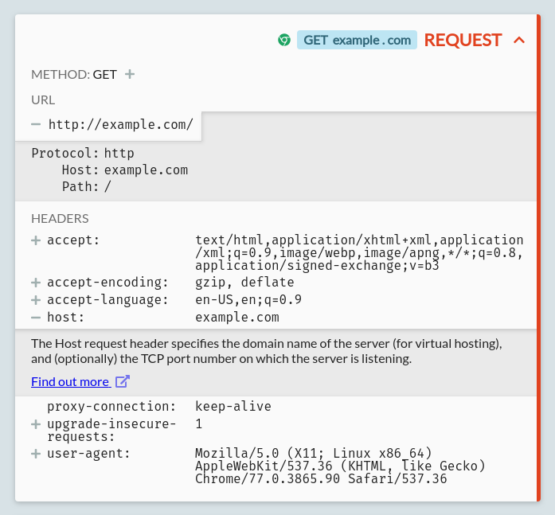
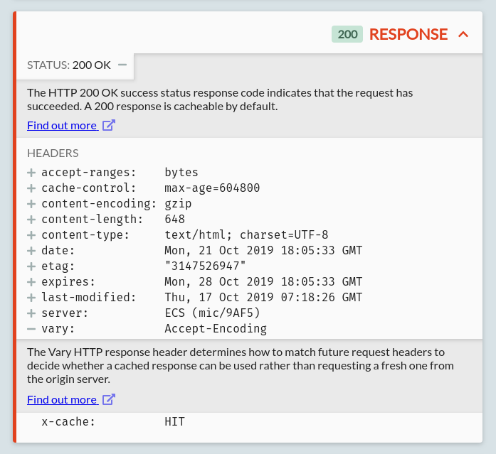
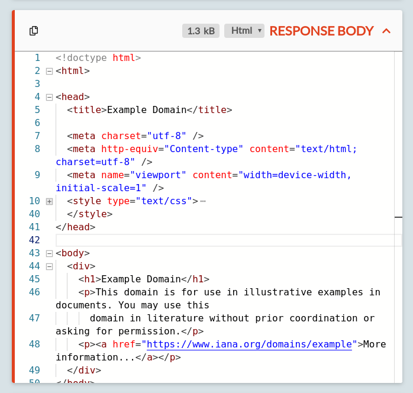
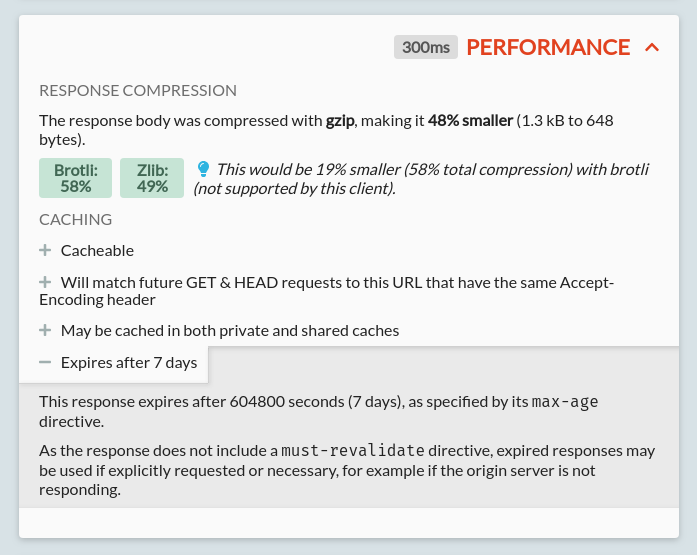
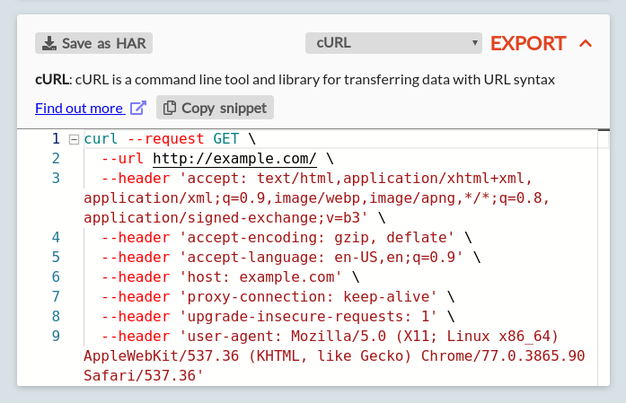

Once you've successfully [intercepted](/docs/getting-started/intercepting) traffic from an HTTP client, you can explore & examine it. This is often useful to understand how an application is communicating & behaving, and can be a powerful tool for debugging.

You can see the traffic that you've intercepted so far on the 'View' page:

There's a few parts to this page:

* A list of intercepted requests on the left
* List controls at the bottom
* A pane on the right to view the details of selected requests

Let's try these out:

## The list pane

On the left, you can see a list of all intercepted requests.

The requests are shown in the order they were received. Each one shows the essential request details, including the method, URL, source & status, colourized for each skimming so you can quickly find the requests you're interested in.

There's also controls available at the bottom, to filter requests & responses, pause capture of requests, clear all request data, and (for Pro users) import & export captured data:

Once you found a request that you'd like to look at in more detail, you can click it to see the full details on the right.

## The details pane

The pane on the right shows the full details of an HTTP exchange (a request and response), split into a series of collapsible sections. You can collapse & expand a section by clicking its title and chevron icon in the top right.

Let's go through each section in turn.

### The request

The first section shows the basic request details: the HTTP method used, the URL, and each of the headers.

All of these are expandable for more information, using the +/- toggles: there's quick summaries available for all standard headers & methods, with links to the full documentation from the Mozilla Developer Network, and the URL is also broken down into its component parts and parameters.

For Pro users, API-specific validation & documentation will also be shown here, for all 1400+ APIs with [the OpenAPI directory](https://github.com/APIs-guru/openapi-directory).

This request for example was a GET request to `http://example.com`. It comes with a selection of common headers; these are the default headers sent by Google Chrome.

### The response

Once a response arrives for your request, another section will appear below, showing the response details.

This shows the HTTP status code and headers, again with documentation available if you want to look closer.

### The response body

If the response has a body, it's shown in the next section. This isn't always present, for example, 301 redirect requests typically don't include any response body.

Some requests will also have a body: in that case there's an identical request body section shown after the request section too.

Each request or response body section shows the body content formatted as a given content type. HTTP Toolkit will attempt to autodetect the best content type to use, and you can also change this using the dropdown in the top right.

When a content type is selected, the content is highlighted for that type, and also formatted for readability (e.g. minified JavaScript will be expanded), and convenient inspection tools are provided (e.g. you can see CSS colours inline next to their colour codes, or mouse over JavaScript variables to see their inferred types). This makes it easier to understand and explore the data, but you can also switch to the 'Text' content type to see the unformatted content as it was sent on the wire (decoded as UTF8 text), or use the 'Hex' content type to examine the raw byte data.

These editors are powered by Monaco, the editor within Visual Studio Code, and include many of the same features. You can collapse and expand content as you'd expect, search by plain text or regex with `Ctrl+F` (Windows/Linux) or `Command+F` (Mac), select open brackets to see the corresponding close bracket highlighted, and more.

### The performance & exports sections

Pro users can also use the Performance & Exports sections at the bottom of this pane.

The performance section helps you understand the performance characteristics of your traffic and improve it:

The exports section allows you to export an individual request & response exchange to a HAR file, to share the raw data with other users or tools, or to get ready-to-use code snippets for more than 20 languages & tools:

## Next steps

Feeling comfortable exploring your HTTP? Let's take a look at how you can **[mock & rewrite it](/docs/getting-started/rewriting/)**.