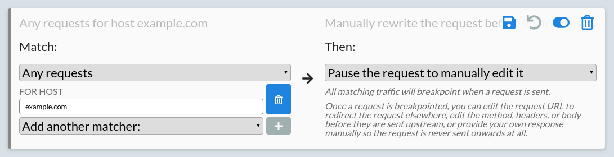
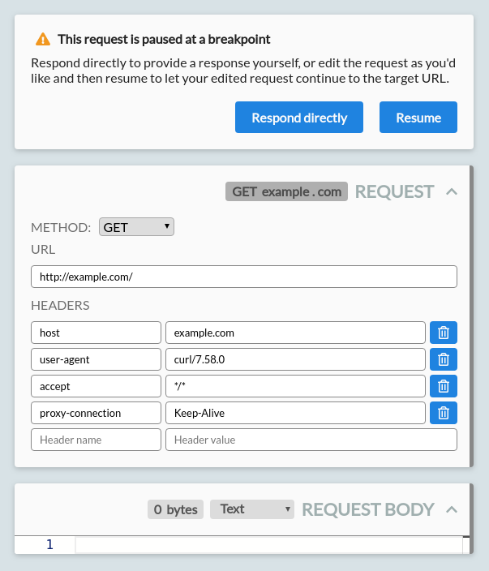

Once you've successfully [intercepted](/docs/getting-started/intercepting) traffic from an HTTP client,HTTP Toolkit allows you to mock & rewrite intercepted HTTP requests and responses, both manually and automatically.

To do this, you first need to configure a rule. Each rules specifies what traffic it matches, and then what happens to that traffic.

As an example, let's add a rule that matches all requests to example.com, and then pauses the request, so we can manually rewrite it before its sent.

## Matching requests

We first need to make a rule that matches our requests. You do this by clicking the 'Add a new rule' button at the top of the 'Mock' page:

Clicking this will give you a new blank rule, which matches nothing (the left side), and then does nothing (the right side).

We want to match all requests to example.com. To do that:

* Click the 'Never' dropdown on the left, and select 'Any requests'
* Click the 'Add another matcher' dropdown that appears, and select 'For a host'
* Enter `example.com` into the input that appears
* Click the blue plus button to add the matcher

You can add other matchers here too if you like, to more precisely specify the requests you're looking for. All matchers are ANDed together, so a request will only match a rule if _all_ configured constraints match.

## Handling requests

Now we need to configure all requests that match this rule to pause so that we can rewrite them. To do this, pick the 'Pause the request to manually edit it' option from the dropdown on the right.

Once you're done, your fully configured rule should look like this:

That's it! Save your rule to activate it. You can save rules individually from the save icon on the rule, or click the 'Save changes' button at the top of the page to save everything.

## Rewriting HTTP

To trigger the rule, send a request to example.com from an intercepted client. You can open it in a browser, run `https.get('https://example.com')` in node, run `curl example.com` in a terminal, or do anything else you'd like.

As soon as you do, HTTP Toolkit will jump to the breakpointed request:

You can now rewrite this request. For your own applications it might be interesting to change the method, headers or body, but for now we'll simply redirect the request elsewhere.

Edit the URL to `http://httpbin.org/get` and press 'Resume', to redirect the request to the GET echo endpoint of [httpbin.org](https://httpbin.org). This is a testing endpoint, which responds with the details of the request it received.

You should see a JSON response returned from httpbin.org, showing the metadata of your request. You'll see this in the HTTP Toolkit UI, and also see it received in your HTTP client itself, rather than the standard [example.com](https://example.com) HTML page. You're rewriting live HTTP traffic!

## Next steps

We're barely scratching the surface here, but there's a lot of options to go further and make more dramatic changes:

* Match more specific requests, to surgically edit busy streams of traffic
* Rewrite requests in more complicated ways; edit headers to simulate different clients or add/remote authentication from requests, edit request bodies to test edge cases, or change HTTP methods entirely.
* Use the 'Response directly' button on a paused request, to skip sending the request and instead manually provide your own response data.
* Rewrite responses, or even requests _and_ responses in a single exchange, to receive real response data from other servers and manually tweak it yourself.
* With [Pro](/get-pro), add even more powerful & automated HTTP rewriting:
    * Respond automatically with fixed response data, to automatically mock endpoints or entire servers, even if they don't exist
    * Simulate connection timeouts & resets
    * Forward all requests automatically from one server to another

Enjoy! Have any questions, bugs, or feature requests? Feel free to [file a feedback issue](https://github.com/httptoolkit/feedback/issues/new) on GitHub, or [get in touch directly](/contact).