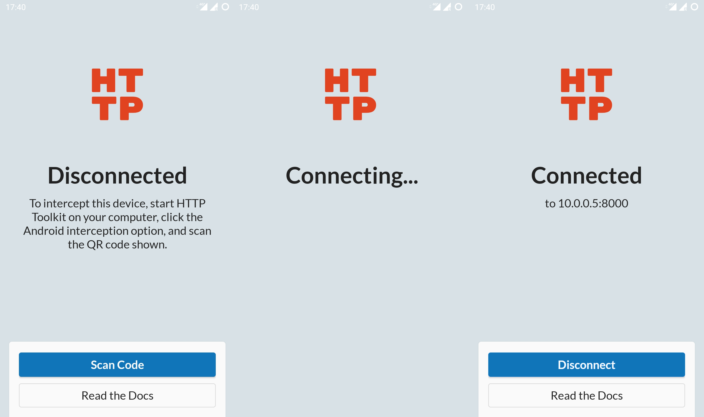
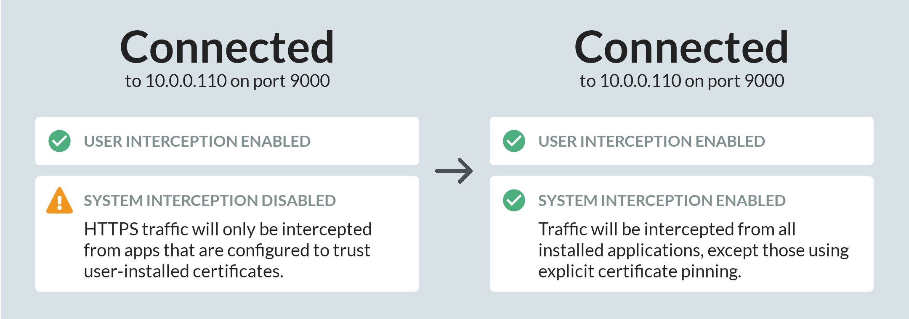

**Android support is in invite-only alpha. Want to try it out? [Get in touch](/contact)**

HTTP Toolkit can automatically intercept, inspect & rewrite traffic from any Android device.

For plain HTTP, or for HTTP & HTTPS traffic from most browsers this works with zero manual setup required.

To intercept secure HTTPS traffic from other modern apps, you need to either:

- Make a small change to the app's config, so that it trusts user-installed CA certificates
- Use an emulator or a rooted device with HTTP Toolkit's ADB-based interception, to inject a system CA certificate.

If you're debugging your own app, rebuilding with the config change and using any test device you like is very quick and easy, and usually the simplest option. If you're trying to intercept HTTPS from a 3rd party app or an existing build that can't be easily changed, you'll usually want to use an emulator or rooted device instead.

Keep reading to get started right away, or jump to the full details for your case in ['intercepting HTTPS traffic from your own app'](#intercepting-traffic-from-your-own-android-app) or ['intercepting HTTPS traffic from 3rd party apps'](#intercepting-traffic-from-3rd-party-android-apps).

## First time setup

To get started:

1. [Download](/android) and install HTTP Toolkit, if you haven't already.
1. Start HTTP Toolkit on your computer and click the 'Android device' interception option to expand it:
    
1. Scan the code to start setup.

    If you have a QR code reader:

    1. Scan the code shown and open the link within.
    1. This will take you to Google Play. Install & open the app from there.
    1. HTTP Toolkit will automatically begin interception setup.

    If you don't have a QR code reader:

    1. Install [the HTTP Toolkit app](https://play.google.com/store/apps/details?id=tech.httptoolkit.android.v1) from the play store.
    1. Start the app, press 'Scan Code', and give HTTP Toolkit permission to access your camera.
    1. Scan the code to begin interception setup.
1. Accept each of the shown Android prompts to set up interception:

    You'll be asked to allow HTTP Toolkit to act as a VPN, redirecting your network traffic.

    * Your traffic is never sent to any remote servers, only to your local HTTP Toolkit instance.
    * More details on how this works are available in ['The Technical Details'](#the-technical-details) below.

    You'll then be prompted to trust HTTP Toolkit's Certificate Authority (CA) certificate.

    * This is installed as a user-installed CA certificate, and allows secure HTTPS traffic from apps that trust user certificates to be intercepted by HTTP Toolkit.
    * On some devices, this will require you to confirm your device PIN, password or pattern, or to configure one if your device doesn't already have one.
    * The CA used was generated by your computer's HTTP Toolkit instance. It's unique to you, and isn't shared with anybody else or any other devices.
    * If you'd like to remove this CA later, go to Settings -> Security -> Encryption & Credentials -> Trusted Credentials, and remove it from the 'User' tab.
1. You're done! The app should say 'Connected', which means HTTP Toolkit is now intercepting your device.

In future, just open the HTTP Toolkit app (or any other barcode scanner), scan the code shown on your computer, and interception will start again automatically. You can also press 'Reconnect', to reuse the previous successful configuration, which should work as long as the HTTP Toolkit app is still running on the same port & IP as before.



Once this is complete, you're good to go. All apps' HTTP traffic will be intercepted and shown on your computer, and HTTPS traffic from apps that trust user-installed CAs will appear too. Hit the "Test Interception" button to open a test page that will confirm that HTTP Toolkit can successfully collect & rewrite traffic from your device.

If you do have running apps that don't trust the CA, you'll see events in HTTP Toolkit like "Certificate rejected for &lt;domain&gt;" and "HTTPS setup failed for &lt;domain&gt;". If you see events like these related to apps you'd like to intercept, you'll need to either configure those apps to trust user-installed CA certificates, or use a rooted device or emulator with ADB-based setup to install a system CA certificate. Each of these cases are covered in more detail below.

## Capturing traffic you care about

### Intercepting browser traffic

All traffic sent by Chrome on Android will trust the HTTP Toolkit certificate automatically. This also applies to webviews inside applications, and to many other browsers including Brave & Microsoft Edge.

Behaviour of non-Chromium browsers varies. In general these should be treated like [intercepting a 3rd party app](#intercepting-traffic-from-3rd-party-android-apps), but many browsers will have their own options available to manually trust HTTPS CA certificates.

In Firefox specifically, you can trust your HTTP Toolkit's CA certificate by browsing to `http://amiusing.httptoolkit.tech/certificate` (note the `http://`, not `https://`) in Firefox whilst interception is active, and then accepting the prompt to trust the certificate that's downloaded:


### Intercepting traffic from your own Android app

If you are targeting an Android API level below 23 (below Android 7), your application will trust the automatically installed certificate automatically, and no changes are required.

If not, you need to explicitly opt in to trusting the CA certificate. You'll know this is happening because you'll see messages in HTTP Toolkit like "Certificate rejected for connection to..." and "Aborted connection to..." and "HTTPS setup failed for...". Each of these typically means the application rejected our HTTPS interception before sending its requests.

To fix this you need to trust user-installed certificates in your app, like so:

#### If you don't have a custom network security config:

1. Put the below into your application's XML resources folder as `network_security_config.xml`:
  ```xml
  <?xml version="1.0" encoding="utf-8"?>
  <network-security-config>
      <base-config>
          <trust-anchors>
              <certificates src="system" />
              <certificates src="user" overridePins="true" />
          </trust-anchors>
      </base-config>
  </network-security-config>
  ```
2. Add `android:networkSecurityConfig="@xml/network_security_config"` to the `<application>` element in your application manifest.

That's it!

This configures your application to trust both built-in & user-added CA certificates for all HTTPS connections, for debug & release builds.

You can include this in your config at all times, and it will work with and without HTTP Toolkit. The only risk is that your end users will be able to intercept their own HTTPS traffic from your app, and potentially any users who are tricked into trusting an attacker's CA could have their traffic intercepted. For most applications that isn't a major concern.

If you'd like to enable this only for your debug builds, replace `base-config` with `debug-overrides` in the XML above.

See Android's [network security config documentation](https://developer.android.com/training/articles/security-config) for more details.

#### If you already have a custom network security config:

Add `<certificates src="user" overridePins="true" />` within the `<trust-anchors>` element of either your `<base-config>` element (to trust user-added certificates for all builds) or `<debug-overrides>` (to trust user-added certificates in debug builds only).

See Android's [network security config documentation](https://developer.android.com/training/articles/security-config) for more details.

### Intercepting traffic from 3rd party Android apps

To intercept HTTPS traffic from apps which don't trust user-installed CA certificates, HTTP Toolkit can inject system certificates using [ADB](https://developer.android.com/studio/command-line/adb) on supported devices:

* Rooted physical devices
* Official emulators running the standard Google API or AOSP builds (but not Google Play builds)
* Genymotion emulators

Although in these cases you often don't have the Google Play Store available, you can use [Open GAPPS](https://opengapps.org/) to install it manually.

To install a system certificate, connect a supported device using ADB, and the "Android device connected via ADB" interception option will appear on the 'Intercept' page in your HTTP Toolkit application. Click that, and the certificate will be added as a system certificate on the device, the HTTP Toolkit Android app will be installed if not already present, and interception will be started automatically.

When system interception is installed successfully, it's shown in the app:



The system CA cert is installed using a temporary filesystem in place of the device's real certificate store, and will disappear next time the device reboots. For the full low-level details, see ['The Technical Details'](#the-technical-details) below.

### Intercepting traffic from 3rd party Android apps with certificate pinning

System interception is not guaranteed to access _all_ HTTPS traffic. It will intercept 99% of apps, including all apps using Android's default network security configurations, but it can be blocked by apps that include their own built-in list of valid certificates & certificate authorities and check these are used by every connection.

This is known as [certificate pinning](https://security.stackexchange.com/questions/29988/what-is-certificate-pinning), and may be used in security-conscious apps (e.g. banking services) or some very high-profile apps (e.g. Facebook).

If you install a system CA certificate, and find that most HTTPS traffic is intercepted, but some specific apps of interest are still showing HTTPS errors, then you'll need to do further work to disable or remove this logic from the app itself.

The best option to do this is on rooted devices or emulators is [Frida](https://frida.re/). Frida is a framework for dynamic application injection. Once installed, it can rewrite logic inside apps on your device on demand, to remove most cert pinning restrictions.

Alternatively, it's possible to rewrite the target app externally. To do so, you first need to download an APK for the app. [ApkPure.com](https://apkpure.com/) is a useful site to do this for most apps on the Google Play store. You may also be able to retrieve an APK from a device with the application, by using `adb shell pm list packages -f -3` to get the path to installed applications, and `adb pull <apk path>` to pull the APK itself.

Once you have the APK, you'll need to edit the application to trust user certificates and disable any certificate pinning. You can do this using [apk-mitm](https://github.com/shroudedcode/apk-mitm). Apk-mitm automatically opens up the APK, makes the network security config transformations described above, disables most standard certificate pinning, and rebuilds the application ready to be reinstalled.

None of this is foolproof, and it will often require manual changes and exploration that vary for each case. If you want to make your own manual changes to the source of an application as part of this, you can also run apk-mitm with the `--wait` argument, which allows you to explore the decompiled source of the application, and edit it manually before resuming repackaging.

## The Technical Details

HTTP Toolkit interception requires two things:

* Redirecting HTTP & HTTPS traffic to HTTP Toolkit
* Ensuring that HTTPS connections trust HTTP Toolkit

On Android, the former is implemented by the [HTTP Toolkit Android app](https://play.google.com/store/apps/details?id=tech.httptoolkit.android.v1), whilst the latter is done partly by the app (for user CA certificates) and partly by the HTTP Toolkit ADB interceptor (for system CA certificates).

The source for all of this is available in the [HTTP Toolkit](https://github.com/httptoolkit) Github organization, in [the Android app repo](https://github.com/httptoolkit/httptoolkit-android) and within [the HTTP Toolkit server](https://github.com/httptoolkit/httptoolkit-server/blob/master/src/interceptors/android/android-adb-interceptor.ts).

### The Android app

The Android app works by registering with Android as a VPN server. Doing so means that it receives all raw IP packets sent from the device. The app then parses each packet, and rewrites TCP packets to be sent to the configured HTTP Toolkit desktop app, if they are sent to servers on TCP ports:

- 80
- 443
- 8000
- 8001
- 8080
- 8888
- 9000

TCP packets to other ports, all UDP packets, and ICMP ping packets are sent on as normal, unchanged.

In addition to this port matching, on Android 10+ the VPN sets a default HTTP proxy configuration. Most apps will observe this automatically for all HTTP(S) traffic, allowing HTTP Toolkit to capture this traffic even when sent to ports not in the above list.

The initial configuration used by the app to communicate with the HTTP Toolkit desktop app is received either as a QR code or via the ADB connection. This configuration includes every local network IP address of the computer. The Android app then connects to that desktop app to retrieve the full HTTPS CA certificate, and to verify connectivity on at least one of the given IPs.

In each case, the initial configuration includes a certificate fingerprint, to verify that the HTTP Toolkit instance we connect to is the correct one, and that our HTTPS MITM is not itself MITM'd.

When connecting, HTTP Toolkit checks that this CA certificate is trusted on the device, and prompts to install it as a user-installed certificate if not. It also prompts for permission to register as a VPN, to allow it to intercept traffic as described above. Once complete, the VPN activates, intercepting all traffic, and a notification is shown whilst this is active.

When the VPN is stopped, the CA remains installed indefinitely, although it will not be trusted by most apps by default unless they opt-in. The VPN remains registered but inactive. The VPN cannot activate silently, and both can be removed manually from the device settings if necessary. This is enforced by Android's own VPN system, which kills the VPN service within seconds if it is ever running without an attached persistent notification, and also shows a separate key icon and warning in your notifications whilst any VPN is active on the device.

### ADB interception

ADB interception is managed by the HTTP Toolkit server, running on your computer as part of the desktop app.

This is used to inject HTTPS system certificates, to automatically install the app if not present, and to configure the Android app without using any QR codes.

Internally, this uses an existing ADB server or attempts to start its own. Port 5037 is checked for an existing ADB server by default, which can be overridden with the standard `ANDROID_ADB_SERVER_PORT` environment variable. If not available, ADB will be started using the instance suggested by `ANDROID_HOME` if set, or by looking for `adb` in your PATH otherwise.

Once connected, the ADB interception option will be available in HTTP Toolkit when at least one device is connected. If multiple devices are connected, you can pick between them from inside the app after clicking the interception option.

When activating the ADB interception option, it:

* Injects HTTP Toolkit's current CA certificate as a system certificate, if possible.
* Downloads & installs the Android app on the device, if not present,
* Activates the app VPN by sending an intent over ADB.

System certificate injection works by:

* Checking we can act as root over ADB:
    * First by testing `su root` and `su -c root`
    * Then, if those fail, by trying to restart ADB in root mode
* Pushing the CA certificate file to the device
* Running a script on the device as root, which:
    * Copies out all the existing system certificates from `/system/etc/security/cacerts`.
    * Places a temporary in-memory mount point over the top of that directory, thereby making it editable without long-term side-effects.
    * Copies the existing system certificates back into that mounted temporary directory.
    * Copies our own CA file into that directory as well
    * Updates the permissions & SELinux context labels of the mounted directory and its contents so Android treats it as trustworthy.

This ensures that the CA certificate appears as a legitimate built-in certificate on the device, whilst remaining only temporary, and without remounting the entirety of `/system` as read-write (which requires reboots and emulator reconfigurations in some cases, and can cause issues with [SafetyNet](https://developer.android.com/training/safetynet) checks).

On devices where root isn't available, CA injection is skipped, and ADB interception acts as just a convenient alternative to QR code setup for ADB-connected devices.