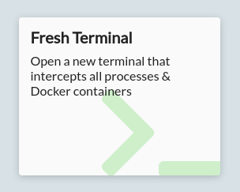
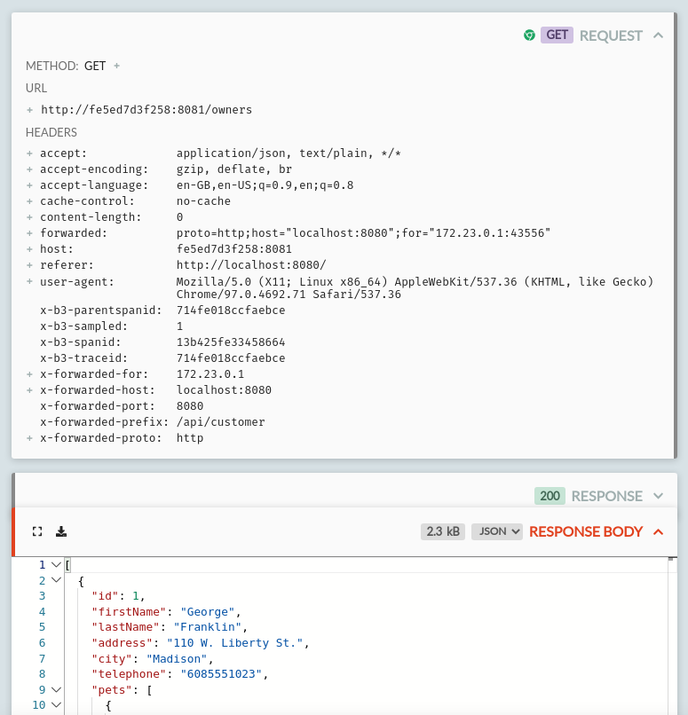
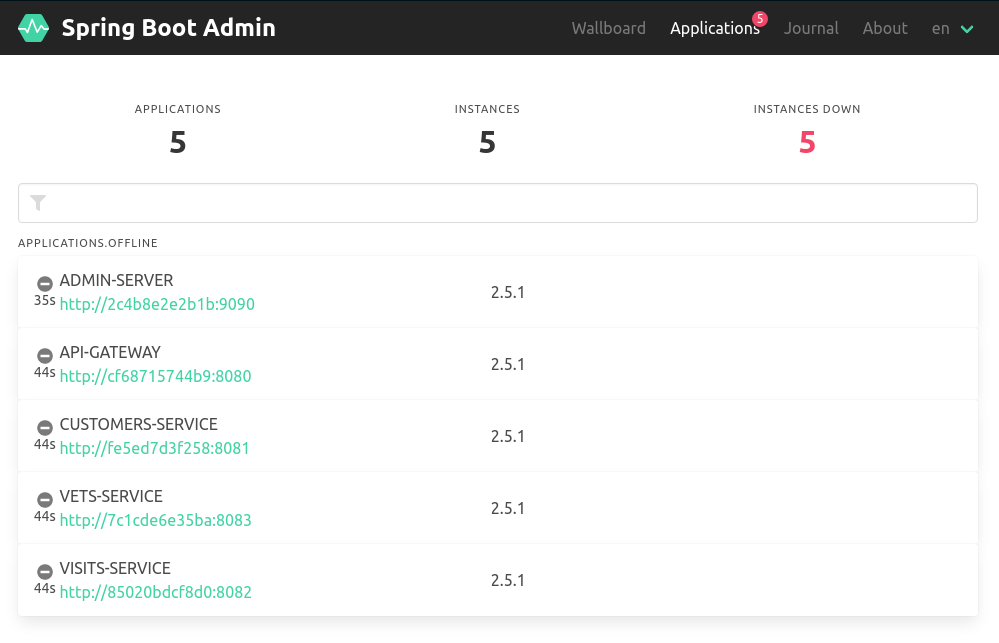

HTTP Toolkit can automatically intercept, inspect & rewrite traffic from any Docker container.

For a quick demo and an outline of how this works, check out the [HTTP Toolkit for Docker](/docker/) page, or read on for a detailed guide.

You can intercept HTTP from Docker containers in two ways:

* By launching an intercepted terminal within HTTP Toolkit, and creating Docker containers or running Docker builds inside that terminal
* By launching Docker containers elsewhere, and using the "Attach to Docker container" option in HTTP Toolkit to recreate & restart a container with HTTP Toolkit's settings injected.

Most of the time it's more convenient to use an intercepted terminal, but attaching to containers can be useful if you need to use a separate tool or workflow to launch your containers.

Read on for a step-by-step guide to intercepting your Docker containers and Docker builds, or feel free to skip to the [low-level details of how Docker interception works](#the-technical-details) or tips on [how to troubleshoot common Docker issues](#troubleshooting).

## How to intercept HTTP from a Docker container

The easiest way to capture, inspect & mock traffic from a Docker container is to launch a fresh terminal in HTTP Toolkit, and run Docker commands there.

To get started, click the 'Fresh Terminal' button on the Intercept page in HTTP Toolkit:



This will open a terminal. Any Docker containers created by this terminal will be automatically intercepted. That means you can use commands like `docker run`, `docker create` or even `docker-compose up` to launch containers, and you'll immediately & automatically intercept all their traffic.

You can test this by launching any container you like. As an example, let's use the [official Curl Docker image](https://hub.docker.com/r/curlimages/curl) to make an HTTP request, by running:

```
docker run curlimages/curl https://amiusing.httptoolkit.tech/
```

This will make an HTTP request to AmIUsing.httptoolkit.tech (pulling the curl Docker image, if you don't already have it locally).

If HTTP Toolkit interception is working correctly, you'll see an HTML response including "You're being intercepted by HTTP Toolkit", and you'll see the request appear on the View page inside HTTP Toolkit itself. You can also log the headers with `-v` and you'll see a `httptoolkit-active: true` header sent in every intercepted response.

That's it! `docker run` creates and starts a container, and by running it in this intercepted terminal, the correct settings are injected into the container when it's initially created.

You can test this with other languages too:

```js
$ docker run --rm -it node
> require('https').get('https://amiusing.httptoolkit.tech', (r) => console.log(r.headers));
/* ... */
{ 'content-type': 'text/html', 'httptoolkit-active': 'true' }
```

```python
$ docker run --rm -it python
> import urllib.request
> urllib.request.urlopen("https://amiusing.httptoolkit.tech").read()
#...
<h1>You\'re being intercepted by HTTP Toolkit</h1>
#...
```

```python
$ docker run --rm -it php
> print(file_get_contents("https://amiusing.httptoolkit.tech"));
#...
<h1>You're being intercepted by HTTP Toolkit</h1>
#...
```

```ruby
$ docker run --rm -it ruby
> require 'net/http'
> Net::HTTP.get_print(URI("https://amiusing.httptoolkit.tech"))
#...
<h1>You're being intercepted by HTTP Toolkit</h1>
#...
```

In each case here we're interactively writing code, and making requests with each language's built-in HTTP APIs, but none of that is required. You can run any container that runs any code making HTTP requests any way it likes, and all HTTP & HTTPS traffic will be automatically intercepted by HTTP Toolkit.

Once you've intercepted some traffic, you're free to do with it as you will: you can inspect the details of your application's traffic up close, add breakpoints, mock out endpoints with fake responses, inject errors & timeouts, redirect traffic, or anything else you might want to play with.

## How to intercept HTTP from Docker Compose

Just like launching individual containers, Docker Compose interception works totally automatically. Just run `docker-compose up` from an intercepted terminal.

You can test this out right now using the [Spring projects's Docker-Compose Java microservices demo](https://github.com/spring-petclinic/spring-petclinic-microservices), by running:

```
$ git clone git@github.com:spring-petclinic/spring-petclinic-microservices.git
$ cd spring-petclinic-microservices
$ docker-compose up
```

This will pull, build & start a demo Pet Clinic web app on your machine. This app is intended to demonstrate a fully featured Java Spring setup, powered by a network of 10 containers, including an AngularJS frontend & API gateway server, 3 backend Java API microservices, an Spring Boot admin server, monitoring infrastructure with Prometheus & Graphana, request tracing with Zipkin, and config & discovery services to glue that all together.

All these services communicate over HTTP. As the applications start up, you'll immedaitely see initial failing requests as services test connectivity to one another, then consistently successful responses once the infrastructure is online, followed by periodic health checks requests against each service:


Starting up the full suite of containers will take a few minutes, but once it's complete you should be able to visit `http://localhost:8080` to view the AngularJS frontend (open it in an intercepted browser via HTTP Toolkit to see your Docker & web traffic all in one place!).

Click the 'Owners', then 'All' buttons in the menu to dynamically load the list of pet owners in the service, and you'll see in HTTP Toolkit that a browser request is made to `http://localhost:8080/api/customer/owners`, followed by a proxied request to the backend Owners microservice at `http://<container id>:8081/owners`, including tracing ids, and returning the raw JSON for the owner data.

That proxied request might look like this:



All data running in this service is totally local, so feel free to edit owners, create new pets and record pet visits to the clinic to see the traffic that's sent between these microservices under the hood.

You can also try visiting the interfaces of the other components, such as the admin server at `http://localhost:9090`. Once your containers have started, this should show all containers up and running. If you want, you can mess with this too by adding a mock rule to fail health checks:


([HTTP Toolkit Pro](/get-pro) is required to add automated response rules like this, but you can do the same manually using the "Pause the request to manually edit it" option and manually killing health check requests)

You should quickly see failing requests on the View page, and when you refresh the admin server's status page it will show the entire infrastructure going offline:



HTTP Toolkit can intercept and rewrite traffic like this for any Docker or Docker Compose project, to automatically inspect, debug, and mock any HTTP or HTTPS traffic you like.

## How to intercept HTTP from a running Docker container

In most cases, launching containers from an intercepted terminal is the easiest way to intercept them. If that's not possible for your workflow though, it's possible to intercept containers launched elsewhere.

To test this out, first start up a Docker container that's not intercepted. For example, you can start the Docker Compose microservices demo used above from a separate (non-HTTP Toolkit) terminal, like so:

```
$ git clone git@github.com:spring-petclinic/spring-petclinic-microservices.git
$ cd spring-petclinic-microservices
$ docker-compose up
```

This should successfully launch these containers so that (after a minute or two) you can use the app from `http://localhost:8080`. At this point, nothing should appear in HTTP Toolkit.

You can then intercept this by clicking the "Attach to Docker Container" option on the Intercept page in HTTP Toolkit. Clicking this button will show a list of the currently running containers on your machine:


Click any one of these containers to restart it with HTTP Toolkit's settings injected. Once it restarts, you'll should start seeing the intercepted traffic from that container on the View page. You can intercept as many containers as you like, depending on which you're most interested in.

When using Docker Compose and other similar tools, your existing attached Docker session will persist as long as at least one of the containers is still running, and as you restart containers Docker Compose will re-attach to the output of each container, so you can still see logs as normal.

In some other environments, such as when running an individual container with Docker, restarting the container like this may detach you from the container's output. To re-attach to the restarted container you can use `docker attach <container id>` in any terminal.

## How to intercept HTTP from a Docker build

In addition to debugging running containers, HTTP Toolkit also allows you to intercept Docker builds. This lets you explore exactly what HTTP requests your Docker build is making, and test out failure scenarios or alternative inputs.

To do this, launch an intercepted terminal from HTTP Toolkit, and then run your build there using `docker build`.

At the start of your build (or the start of each stage, in multi-stage builds), you'll see an extra step added by HTTP Toolkit, followed by the rest of your build output. For a simple Go build, that might look like this:

```bash{5}
$ docker build .
Sending build context to Docker daemon  3.072kB
Step 1/4 : FROM golang:1.16
 ---> 71f1b47263fc
 *** Enabling HTTP Toolkit interception ***
 ---> b8f231d31098
Step 2/4 : COPY . .
 ---> e2103cef8df8
Step 3/4 : RUN go build app.go
 ---> Running in fda11e0705c1
Removing intermediate container fda11e0705c1
 ---> 883a818d1216
Step 4/4 : ENTRYPOINT ["./app"]
 ---> Running in 0155c41044a3
Removing intermediate container 0155c41044a3
 ---> 288dc90a4c02
Successfully built 288dc90a4c02
```

Other than this extra injection step, your build will run as normal, but with all HTTP and HTTPS traffic automatically redirected and captured by HTTP Toolkit.

## Troubleshooting

### Docker support is not available

If HTTP Toolkit can't successfully connect to Docker, the "Attach to Docker Container" button will be deactivated and running Docker commands in an intercepted terminal will fail.

HTTP Toolkit attempts to connect to Docker at startup to detect whether it's available. By default the standard local pipe connections for each platform are used (`//./pipe/docker_engine` on Linux and Mac or `/var/run/docker.sock` on Windows).

These settings can be overridden by starting HTTP Toolkit in an environment with the standard Docker env vars set to configure the connection. To do so, start HTTP Toolkit with the standard `DOCKER_HOST` environment variable set to the address of your Docker daemon. You can also use the `DOCKER_TLS_VERIFY` and `DOCKER_CERT_PATH` options if your Docker daemon uses TLS.

### Starting an preexisting container in an intercepted terminal fails

HTTP Toolkit can only intercept containers at creation time, so it's not possible to intercept an existing non-intercepted container that was created elsewhere.

To avoid cases where this might happen unexpectedly, launching a container like this in an intercepted terminal will fail immediately, showing a message like:

```
Error response from daemon:
HTTP Toolkit cannot intercept startup of preexisting non-intercepted containers.
The container must be recreated here first - try `docker run <image>` instead.
Error: failed to start containers: <your image id>
```

To avoid this, you can either launch the container elsewhere and then intercept is using the "Attach to a Docker Container" button in HTTP Toolkit, or you can recreate the container in the intercepted terminal, by either:

* Creating & starting a new container with `docker run <image>`
* By manually recreating the container with `docker create <image>`, and then using the printed id to launch it later via `docker start <container id>`

### Intercepted images and containers disappear after HTTP Toolkit exits

All intercepted containers & images contain persistent configuration that changes the proxy settings and trusted certificates, so that traffic can be intercepted. Unfortunately, this means that when HTTP Toolkit exits, they generally become unusable, because all their network traffic is redirected through a proxy that's no longer running.

To avoid this causing issues, and ensure that usage elsewhere always recreates everything fresh with no interception settings leftover, all intercepted Docker containers & images and automatically stopped and deleted when HTTP Toolkit exits.

If you have a specific reason that you need to preserve this data, you can do so using `docker commit <container>` to preserve the state of a container as a new image that can be run elsewhere, or `docker image save <image> -o <filename>` to back up an existing image as a file on disk.

### Docker BuildKit builds can't be intercepted

This is a known issue right now: HTTP Toolkit can't yet intercept BuildKit builds, so in intercepted terminals BuildKit is disabled so that Docker falls back to standard builds.

BuildKit is still disabled by default in many other environments anyway, so this should not be a problem for the vast majority of builds, unless you depend on some specific BuildKit functionality.

If this feature is important to you, please [file an issue](https://github.com/httptoolkit/httptoolkit/issues/new/choose) with more details, so supporting this can be prioritized.

## The Technical Details

### Overview

Making all of this work smoothly is quite complicated, as you might imagine. A quick summary is that:

* We need to inject some extra files & environment variables into containers & images when they're first created/built.
* We do this by transforming container creation config and image dockerfiles.
* To inject into containers, when HTTP Toolkit starts we create a data volume (`httptoolkit-injected-data-$VERSION`) containing the files to inject, and then later we modify the config of each intercepted container to mount that, and set our environment variables.
* To inject into builds, we add the files to the build context, and modify the Dockerfile to add these files and set various environment variables at the start of each build stage.
* Docker attachment works by connecting to Docker, cloning a container, making these transformations to its config, and starting the transformed container.
* To intercept Docker clients in terminals, HTTP Toolkit runs a Docker proxy when Docker is available, and reroutes Docker clients to use it as their Docker daemon.
* The Docker proxy rewrites Docker API requests to inject extra settings into new containers & builds, and rewrites API responses to convince Docker Compose not to reuse non-intercepted containers.
* To provide inter-container connectivity, a Docker SOCKS tunnel container is launched, and an internal Docker-only DNS server is used to map hostnames and aliases to IPs the tunnel can reach.

Read on to dig into the details:

### Interception requirements

HTTP Toolkit interception requires two things:

* Redirecting HTTP & HTTPS traffic to HTTP Toolkit
* Ensuring that HTTPS connections trust HTTP Toolkit's certificate

HTTP Toolkit intercepts command-line applications in terminals by using a combination of environment variables to temporarily inject extra configuration and files into applications run in that session.

For simple cases, HTTP Toolkit sets variables like the `HTTP_PROXY` environment variable (used by many applications to detect proxy settings) and the `SSL_CERT_FILE` variable (used by many applications, especially anything based on OpenSSL, to find trusted CA certificates). For more complex cases like JVM applications, variables like `JAVA_TOOL_OPTIONS` are used - this allows HTTP Toolkit to set a `-javaagent` JVM option that loads a [custom JVM agent](https://github.com/httptoolkit/jvm-http-proxy-agent/) which reconfigures proxy and certificate settings inside any JVMs that are started.

You can see the full list of environment variables used [here](https://github.com/httptoolkit/httptoolkit-server/blob/cf136585cb0ef840d94e5ba8a4c03323523f5d67/src/interceptors/terminal/terminal-env-overrides.ts#L64-L136).

To intercept Docker applications, HTTP Toolkit does the same thing, but by modifying containers & images to set extra environment variables when they're created, and to mount the extra files required (like the CA certificate, and the JVM agent JAR) into the filesystem at `/.http-toolkit-injections`, using a Docker volume called `httptoolkit-injected-data-$VERSION` that's set up when HTTP Toolkit starts.

There's two ways that this image/container modification & interception happens:

1. By using a Docker API proxy to rewrite Docker commands in terminals
2. By connecting to Docker, and cloning a running container with new settings, when attaching to running containers

We'll look first at the details of these modifications, and then talk about how the proxy & container attach systems apply it.

### Modifying Docker containers

So, to intercept a container or build we need to inject some extra files & env vars. We can do all this entirely within the container configuration (not normally something you touch as a Docker end user, but visible using `docker inspect <container>` if you're interested). The full modifications are:

* In `Config.HostConfig.Binds` we add a volume mount to inject your local HTTP Toolkit CA certificate and the various [override files](https://github.com/httptoolkit/httptoolkit-server/tree/4b48ade/overrides) into the container.
* In `Config.Env` we append all our terminal env vars, remapping references to override paths to the mounted override files
* In `Config.Labels` we add a `tech.httptoolkit.docker.proxy=$YOUR_PROXY_PORT` label, so we can tell which containers are intercepted by which proxy.
* If `Config.Labels` contains a `com.docker.compose.config-hash` label (i.e. if Docker Compose is managing the container) then we change the value and append `+httptoolkit:$YOUR_PROXY_PORT` to the hash. This ensures your normal Docker Compose won't use this image outside intercepted environments, and lets us remap it so that it does get used by in the appropriate intercepted Docker Compose environment (more on that under 'Intercepting Docker Compose' later).

This doesn't ever actually modify existing container configuration (that's not generally possible). Instead, we take an existing configuration, copy & modify that, and then create a totally new container with the new config.

The full code for this transformation is [here](https://github.com/httptoolkit/httptoolkit-server/blob/4b48ade/src/interceptors/docker/docker-commands.ts#L70-L152).

### Modifying Docker images

The above changes work for individual containers. To intercept traffic from builds, we have to inject the same env vars & files into the build process itself.

To do so, we intercept Docker builds using the Docker proxy (see below). By proxying the build traffic, we can add extra files into the build context, and add a few extra lines to the Dockerfile at the start of each build stage:

* A `LABEL tech.httptoolkit.docker.build-proxy=started-$YOUR_PROXY_PORT` step (note the `started-` prefix) so that we can recognize which build is being intercepted by which proxy.
* A `COPY` step that copies in the HTTP Toolkit CA certificate and the various [override files](https://github.com/httptoolkit/httptoolkit-server/tree/4b48ade/overrides) from the build context.
* An `ENV` step for [each environment variable](https://github.com/httptoolkit/httptoolkit-server/blob/4b48ade/src/interceptors/terminal/terminal-env-overrides.ts#L80-L158) that's required.
* A `LABEL tech.httptoolkit.docker.build-proxy=$YOUR_PROXY_PORT` step, replacing the previous label, so we can recognize which built images are being intercepted by which proxy.

This creates a lot of extra steps at the start of each build stage! Fortunately they're small and fast, and to avoid confusing console noise the Docker proxy (see below) strips these out of the build console output, turning them into a single HTTP Toolkit setup step.

### The Docker Proxy

To apply these transformations, we need to control how Docker clients use the Docker daemon, so we can modifying how they create containers and start builds.

Docker consists of two main components: a Docker client and a Docker daemon. The Docker daemon handles all the internals of building, running and managing containers, while the Docker client provides a command-line interface to send commands to the daemon.

While the daemon is required, the client is optional, and there's many clients available - the `docker` command is one client, but `docker-compose` is a totally independent client, and tools with Docker integrations available like Visual Studio Code include their own Docker clients.

These Docker clients all talk to the Docker daemon over HTTP. To create hook into Docker containers and intercept traffic, HTTP Toolkit proxies each Docker client's communication with the Docker daemon, and transforms how some API requests work.

It does this by running a local HTTP server, and setting the `DOCKER_HOST` environment variable to redirect Docker daemon API traffic there. This server is our Docker proxy (full code [here](https://github.com/httptoolkit/httptoolkit-server/blob/4b48ade/src/interceptors/docker/docker-proxy.ts)). That env var is set in all intercepted terminals, and so any process started there will inherit it and talk to HTTP Toolkit's Docker proxy instead of the real Docker daemon when it wants to do something with Docker.

The Docker proxy transforms requests in a few ways:

* When containers are created (`POST /containers/create`) it modifies the client's container config (as above) to add our settings.
* When a container is started (`POST /containers/$id/start`) we inspect the container first, and we return an error if it's not intercepted (to avoid unexpectedly starting an unintercepted container in an intercepted environment).
* When a build is started (`POST /build`):
    1. We transform the streamed Docker context in the request, to add in our extra files and modify the Dockerfile (as above) to add our extra build steps
    2. We transform the streamed build output, to replace everything between the `LABEL tech.httptoolkit.docker.build-proxy` steps with output that just says `*** Enabling HTTP Toolkit interception ***`, and update all the step count numbers (1/6, 2/6, 3/6...) to match, so that HTTP Toolkit setup isn't counted and your steps match your non-intercepted builds.
* When a container is inspected (`GET /containers/$id/json`) or all containers are listed (`GET /containers/json`) we transform the response to replace Docker Compose's container labels, so that only the intercepted containers have the correct hash (see 'Intercepting Docker Compose' below)
* For any other requests, we just stream the request & response directly between the Docker daemon, so everything runs as normal.

### Attaching to containers

Attaching to container is far simpler than the Docker proxy. To intercept a running container, HTTP Toolkit:

1. Connects to the Docker daemon.
2. Gets the config of the target container.
3. Transforms that config to inject our settings (as above).
4. Stops & removes the target container.
5. Creates the new container from our transformed config.
6. Starts up the new container and reconnects the appropriate networks.

### Intercepting Docker Compose

In theory, intercepting Docker Compose is no different to intercepting any other Docker client, and everything should work with just the container & image modifications above when Docker Compose commands are run in an intercepted terminal.

In practice, that's true in a completely fresh environment, but not in real-world scenarios. The challenge is that if you already have a container which was built from your `docker-compose.yml` and there's been no modifications, Docker Compose won't recreate the container. That creates two problems: first, there's no container creation for HTTP Toolkit to hook into when you run `docker-compose up` in an intercepted terminal, if your containers are already up to date, and second if you run `docker-compose up` in a non-intercepted terminal it'll reuse intercepted containers, which will a) be very surprising and b) probably break things.

Docker Compose implements this by hashing the project's config file, and storing that hash in a `com.docker.compose.config-hash` label on each container. When you run `docker-compose up`, it compares the hash to the running containers, and it doesn't recreate them if it still matches.

To work around this, HTTP Toolkit remaps the hashes:

* When a container is created through the Docker proxy with a hash, HTTP Toolkit appends `+httptoolkit:$YOUR_PROXY_PORT` to the config hash. This means that intercepted containers queried from non-intercepted terminals have a mismatched hash, so Docker Compose usage elsewhere never reuses the container.
* When a container query is sent via the Docker proxy (e.g. when Docker Compose runs in an intercepted terminal, and checks to see if it needs to recreate a container) we remove the `+httptoolkit:$PORT` suffix, when the port matches, and we add a `+unintercepted` suffix for all containers that have a hash with no suffix at all (i.e. containers created elsewhere).

This means that Docker Compose in an intercepted environment sees every container as having the correct hash only if it was intercepted when it was created. If it wasn't intercepted, it'll have an `+unintercepted` suffix, so Docker Compose will see a hash mismatch, and recreate the container from scratch, at which point the container creation hooks in the proxy can kick in and inject the required files & env vars to intercept the container.

Meanwhile, in a non-intercepted environment, all intercepted containers have invalid hashes and will never be used.

### Docker Connectivity

There's one last area that's worth mentioning: how does HTTP Toolkit route traffic back into Docker containers when intercepting traffic between containers that are running on their private Docker networks?

When Docker containers are connected to a network, they can send traffic to other containers on that network using the target container's hostname, its IP addresses, any container aliases that were defined when it joined the network, or the names of any container links that are in use (container linking is now deprecated, but people still use it).

To proxy this inter-container traffic, HTTP Toolkit has to be able to correctly route requests to all those addresses.

To do so, HTTP Toolkit first monitors the Docker daemon (by listening to its event stream, and querying the state when things change). This ensures that HTTP Toolkit knows which intercepted containers are running at any time, and which networks those are connected to. It then queries Docker for the details of those networks, so which gives us a full list of all possible destinations of intercepted inter-container traffic.

Given this information, there's two problems:

* We need to map the possible names of these hosts to their correct IP addresses.
* On Windows & Mac, containers run inside a VM, where container addresses are never routable from the host machine.

To solve the first problem, HTTP Toolkit runs its own internal DNS server. This uses the raw network & container data monitored above to resolve Docker container names, aliases and container link names back to their correct IP addresses.

To solve the second problem, HTTP Toolkit runs a [SOCKS tunnel container](https://hub.docker.com/repository/docker/httptoolkit/docker-socks-tunnel/), and ensures that it's always connected to every network that contains an intercepted container. This tunnel is started when HTTP Toolkit starts up. When traffic is proxied, if it matches any known container name, then the name is resolved and traffic is proxied to the corresponding IP address via this SOCKS tunnel. Since the tunnel is on the same networks as all possible destination containers, it can reliably route traffic to containers on all OSs.
