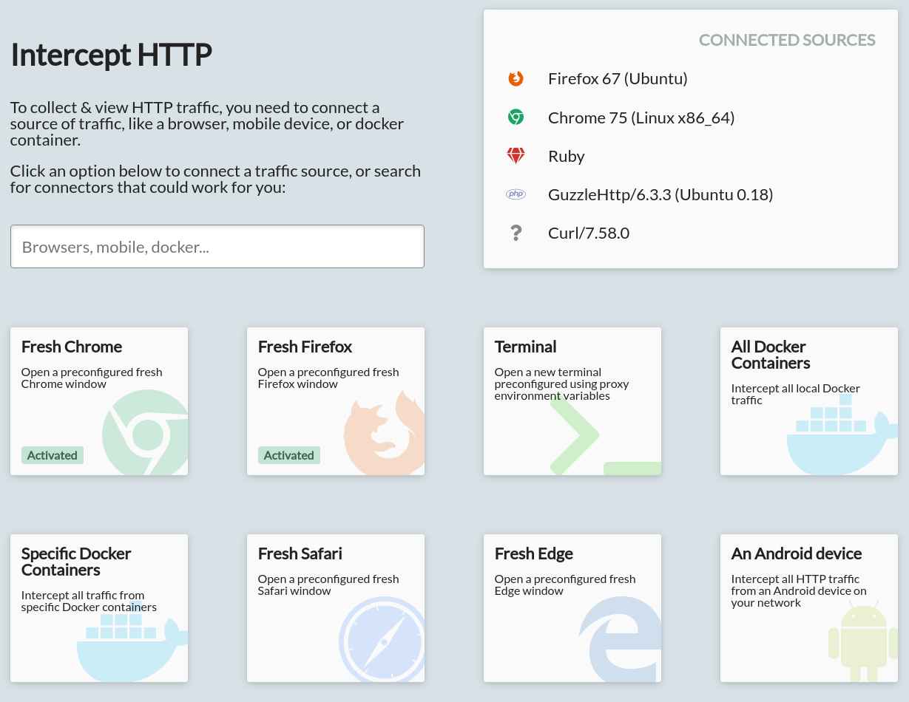

On the Intercept page you can connect HTTP and HTTPS clients, whose traffic will be intercepted. That traffic can then be viewed on the [View page](/docs/reference/view-page/), or you can add rules on the [Mock page](/docs/reference/mock-page/) to rewrite the traffic from these clients.

The page consists of a grid of clickable interception options, each of which helps you set up a different type of client for interception.

In addition, there's a search box, and a 'Connected Sources' panel.

The search box allows you to quickly filter the interception options for the one most relevant to you. This filters on the names of each interception option, and also various tags. E.g. searching for 'mobile' will show both the iOS and Android options.

The connected sources panel shows the list of sources from whom traffic has been intercepted so far. Note that this is based on actually intercepted traffic: it's possible for a client to be correctly configured but not appear in this list, if they haven't yet sent any requests.

## Interception Options

### Chrome, Edge, and Brave

These interceptors launch a fresh instance of the Chromium-based browsers, preconfigured to use the HTTP Toolkit proxy and trust the HTTP Toolkit certificate.

This browser instance is an independent process and profile from others on your machine. That means that it doesn't change the certificate or proxy settings on any other window, and it runs as a separate app. Only the traffic from this specific browser process (this window or windows opened from here) will be intercepted. The separate profile ensures that this window starts completely fresh, with none of your day-to-day cookies or extensions, which is useful for testing. Otherwise though this window acts just like any other Chrome/Edge/Brave window on your machine.

### Fresh Firefox

This interceptor launches a Firefox instance, preconfigured to use the HTTP Toolkit proxy. When it is first started, it will prompt you to trust the certificate: select 'Trust this CA to identify web sites' and click ok.

Once that's done, any traffic from this Firefox instance will be intercepted and visible in HTTP Toolkit. If you do this wrong, the certificate won't be trusted, and you'll see failing requests in the View page. In that case, you can just close Firefox and then restart it using the same interception option, and it'll prompt you to try again.

This Firefox instance is an independent process and profile from others on your machine. That means that it doesn't change the certificate or proxy settings on any other Firefox window, and it runs as a separate app. Only the traffic from this specific Firefox process (this window or windows opened from here) will be intercepted. The separate profile ensures that this window starts completely fresh, with none of your day-to-day cookies or extensions, which is useful for testing. Otherwise though this window acts just like any other Firefox window on your machine.

### Global Chrome

Most of the time it's preferable to launch a fresh isolated browser window, which can be intercepted independently of other traffic on your machine.

Sometimes though, it's useful to be able to use your existing browser state, extensions and configuration. To do this for Chrome, you can intercept your browser globally.

This starts an intercepted session using your normal browser profile. This injected configuration is the same, but it will affect all normal Chrome windows on your machine. This requires restarting Chrome, but HTTP Toolkit will prompt you before it does so if Chrome is currently running.

The configuration injected is temporary, and will disappear when Chrome is restarted from outside of HTTP Toolkit. This doesn't necessarily mean all intercepted effects will disappear though, for example cached mock responses may persist in your browser even when it's not intercepted by HTTP Toolkit.

### Android device connected via ADB

Android devices can be intercepted by connecting them to the Android Debug Bridge on your machine, enabling debug mode, and then selecting this option.

The option will only be enabled when an accessible device is connected. You can run `adb devices` on the command line to use ADB to check for devices for yourself and debug any issues with this.

This will attempt to automatically install a temporary system certificate on rooted devices and some emulators, then download & install the HTTP Toolkit Android app if it's not already present, and then send configuration to that app to start interception. The first time you do this, the device may show some permission prompts to activate a VPN and setup certificates.

Interception requires connectivity between your Android device and your computer. They need to be on the same network, the network needs to allow connectivity between them, and if your computer has a firewall it must allow incoming traffic to HTTP Toolkit's proxy port.

For more details, see the in-depth [Android interception guide](/docs/guides/android).

### Android device connected via QR

Alternatively, Android devices can be intercepted by scanning a QR code, without enabling debugging on the device. You can scan this with any QR code reader, or with the "Scan QR Code" button in the HTTP Toolkit app.

The first time you scan the code, if you don't have the HTTP Toolkit app installed, it will open the Google Play store page for the [HTTP Toolkit Android app](https://play.google.com/store/apps/details?id=tech.httptoolkit.android.v1) so you can get set up.

The first time you do this, the device may show some permission prompts to activate a VPN and setup certificates. The QR code contains the configuration required for the device to connect to your computer, but it can't automatically set up certificates like ADB setup can, so ADB setup is recommended, especially on rooted devices & emulators.

Interception requires connectivity between your Android device and your computer. They need to be on the same network, the network needs to allow connectivity between them, and if your computer has a firewall it must allow incoming traffic to HTTP Toolkit's proxy port.

For more details, see the in-depth [Android interception guide](/docs/guides/android).

### Fresh Terminal

This interceptor launches a terminal window. This window is preconfigured so that the vast majority of CLI tools or languages that you might use from the command line will automatically use the HTTP Toolkit proxy and trust the certificate. This includes:

* cURL, and most clients using libcurl
* CLI tools like git and HTTPie
* Package managers like apt-get
* Node, and anything node-based, including npm itself
* Python, and python-based tools like pip
* Java, and anything running on the JVM
* Ruby, and ruby-based tools like gem
* PHP and PHP-based tools (when started directly from this window)
* Perl, and perl-based tools
* Many others

This is powered primarily through environment variables such as `HTTP_PROXY`, which are used automatically by many tools and frameworks. Because environment variables are inherited, subprocesses will generally also be intercepted correctly.

In addition, the terminal prepends an extra path to your PATH variable, which allows wrapping of certain commands. For example, a `node` wrapper is defined, which ensures that any node process starts with the proxy settings & certificate correctly injected.

The specific terminal application that will be used is autodetected according to various rules, depending on what's available. See [getTerminalCommand()](https://github.com/httptoolkit/httptoolkit-server/blob/master/src/interceptors/terminal/fresh-terminal-interceptor.ts#L60) in the HTTP Toolkit server for details.

Whilst this terminal is open, it also appends a change to the appropriate detected shell config files, e.g. `.bashrc` to ensure the PATH overrides are in place. This ensures that PATH changes in your bash config don't override the interception settings. This wrapped in a check for an `HTTP_TOOLKIT_ACTIVE` variable, so it won't affect other sessions, and is automatically removed again as soon as your terminal is closed.

### Existing Terminal

This interceptor shows a short copyable command, which can be pasted into any terminal window on your machine to immediately enable interception in that window.

In general this should behave the same as the 'Fresh Terminal' option, but being able to intercept existing terminals can be more convenient at times, and allows you to activate interception in some cases where the fresh terminal may not work.

As an example, using `nvm` to switch node versions in an intercepted terminal after it has started may override node interception, but using `nvm` and then subsequently enabling interception should work fine.

This interceptor is not available on Windows, as it's difficult to find a command that will work reliably in the many different shells available (e.g. cmd, git bash, cygwin, powershell, hyper, WSL).

### Electron App

This interceptor allows you to launch an Electron app, preconfigured to send all traffic through HTTP Toolkit. You can select the executable to run, or rerun a previous successfully run executable.

Interception is only supported for Electron apps using an Electron version above v1.7.4. All HTTP from standard clients in the renderer and main processes should be intercepted, although it is possible that traffic from applications using native extensions directly (e.g. libcurl) may not be.

This interceptor works by setting the environment variables set by the terminal interceptors, which is sufficient for many well-behaved applications that use the system proxy settings, and then injecting logic into the process itself.

The injection is done by starting the app with a `--inspect-brk` argument, so that it waits for a debugger before opening, then automatically connecting as a debugger to run a version of the interception logic normally used for Node processes in the terminal.

Using this to start non-Electron apps may have strange results: some may fail to start due to the bad command line flag, some may start as normal without any interception active, and some will observe the proxy & certificate settings from the environment variables, and will be intercepted even without using Electron.

### Attach to JVM

This interceptor allows you to attach to a running JVM instance launched elsewhere, and take control of its HTTP externally.

JVM applications can also be captured by launching them directly from an intercepted terminal, but attaching to running processes can be useful in some cases where you need to launch the process in other ways, or you want to start capturing from a process that's already running without restarting it.

When you select this option, it'll start scanning for potential targets. Once you select a target it'll turn green and show a tick if interception was successful.

This option requires JDK v9+, and it's only enabled if a suitable Java version is available. HTTP Toolkit looks for Java versions by testing the version of `java` in your `$PATH`, testing the Java version referenced by `$JAVA_HOME` (if any) and testing the version referenced by the `/usr/libexec/java_home` helper on Mac.

### Anything

This interception option shows the instructions and details required to manually connect any other clients to HTTP Toolkit.

Anything that can send HTTP via a HTTP proxy can be intercepted by HTTP Toolkit, if it is configured with the proxy settings shown here. For clients that send HTTPS, they will need to trust your certificate, in addition to these proxy settings. The certificate is unique to you, and is generated fresh for each install of HTTP Toolkit. The specific path of the certificate varies according to your platform and home directory, but just click this option to find it.

**Any questions? [Get in touch](/contact/)**