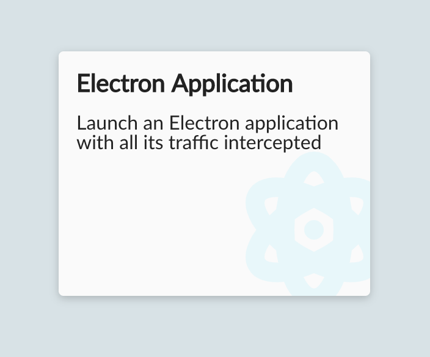
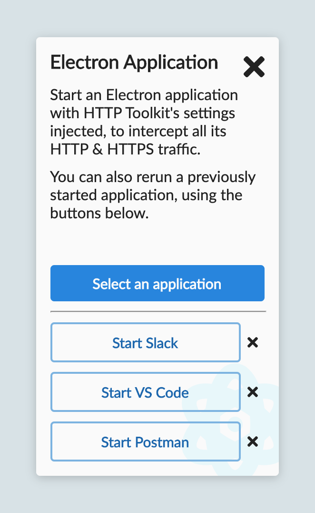

There's Electron apps everywhere nowadays, from Slack to Visual Studio Code to HTTP Toolkit itself.

Internally they're often complex applications, marrying web UIs - with all the power & challenges the modern web involves - to a standalone Node environment, typically running in an unpredictable end user environment.

Debugging this is hard. There's a lot of moving parts, and tracing exactly what such an app is doing and who it's talking to is tougher than it should be.

## Intercepting Electron's HTTP

As of today, HTTP Toolkit can now help you see inside this. There's a new 'Electron Application' intercept option, which lets you select an Electron app and start it with all HTTP & HTTPS traffic automatically intercepted by, inspectable & rewritable with HTTP Toolkit.

From there, you're free to examine each request up close, breakpoint and tweak live traffic, or define mock rules to inject fake responses or errors.

The interceptor itself allows you to select any executable to run, and remembers the last three selected apps too, so you can run them in one click.

One important note: for normal Mac app bundles, the executable in inside the .app folder, in `Contents/MacOS`.

Sound cool? [Try it out now](/mock/javascript).

## How does it work?

How does this work? How can you reconfigure any Electron app automatically like this?

The internals are pretty neat (and all [open source](https://github.com/httptoolkit/httptoolkit-server/blob/master/src/interceptors/electron.ts)). HTTP Toolkit does a few things to make this work:

* It starts the application with a selection of standard environment variables like `http_proxy` that are used to configure well-behaved applications to use the proxy automatically.
* It passes `--inspect-brk` to the application, so the app pauses on startup and waits for a debugger, all before doing anything.
* It automatically connects to the breakpointed app on startup, using the debug protocol, to run code inside the app before any real application code runs, before resuming it.
* Using that, it runs a script which:
    * Hooks into a variety of standard HTTP libraries & the built in `http` & `https` modules, to enable proxy & certificate settings.
    * Reconfigures the default renderer Chromium options, to use the proxy & trust the certificate there too.
    * Listening for certificate errors, and automatically allowing them through, if they failed against our certificate.

All of this isn't foolproof. It requires Electron > 1.7.4 (released in June 2017), and can hit problems with some specific configurations, but right now it works out of the box for most applications, from Visual Studio Code to Postman to Slack, and it'll be improving more in future.

**[Try it out for free now](/mock/javascript)**

Hit any problems, or have ideas on how to improve this? [Get in touch](/contact) with the details of what you're debugging & how it's failing to help it improve.