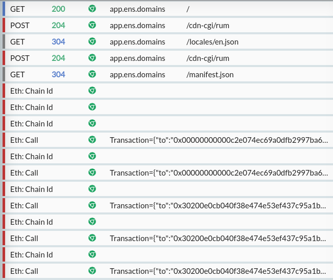

HTTP is important on the web, but as other alternative protocols grow popular in networked applications, it's often important to be able to capture, debug and mock those too.

I've been working on expanding HTTP Toolkit's support for this over the past year (as one part of [a project](https://httptoolkit.com/blog/developer-tools-decentralized-web/) funded by EU Horizon's [Next Generation Internet initiative](https://www.ngi.eu/)), to extend HTTP Toolkit to cover three additional rising protocols that are often used alongside simple HTTP in decentralized web applications: WebRTC, IPFS & Ethereum.

**This is now live!** If you're using HTTP Toolkit to intercept browsers, and a web application connects to another peer over WebRTC, interacts with the Ethereum blockchain, or pulls content from the IPFS network, then you'll now see this inline amongst your collected HTTP traffic, and you can create rules to rewrite these requests, define mock responses, or inject errors.

Let's talk about why this matters, what you can do with this, and how it actually works internally:

## Why?

HTTP remains the key protocol on the web, by a wide margin, and that's not going to change any time soon.

That said, there are an increasing number of new protocols being explored both alongside and on top of HTTP, covering alternate use cases and supporting different communication models, and as software evolves this will only increase. HTTP Toolkit needs to be able to support these, to ensure that you can easily understand and test all communications from the increasing number of multi-protocol applications.

There's a lot of examples of HTTP-adjacent protocols where this applies:

* [WebSockets](https://en.wikipedia.org/wiki/WebSocket), which grew to cover use cases needing persistent connections that weren't well supported by the request/response model, which use HTTP just for initial connection setup, and are now widely supported and used in HTTP-based apps.
* [WebTransport](https://web.dev/webtransport/), a new QUIC-based connection protocol that's aiming to supplant WebSockets with a modern approach that adds a swathe of other benefits on top.
* [GraphQL](https://graphql.org/), a general-purpose HTTP-based protocol for APIs that avoids REST patterns and typical HTTP semantics, to instead support a flexible querying language within the request body directly.
* [gRPC](https://grpc.io/), an RPC protocol built on top of HTTP/2 and protobuf to support high-performance bi-directional streaming RPC APIs on the web and elsewhere.
* [MQTT](https://mqtt.org/), a pubsub protocol, often used for pubsub API within backend infrastructure, for with IoT devices, and accessible on the web too over WebSockets.
* [WebRTC](https://en.wikipedia.org/wiki/WebRTC), a protocol designed particularly for video/audio streaming but also supporting arbitrary data, allowing general-purpose peer-to-peer data transfer on the web.
* [IPFS RPC](https://docs.ipfs.tech/reference/kubo/rpc/), a protocol for reading from & publishing to the content-addressed IPFS network.
* [Ethereum RPC](https://ethereum.org/en/developers/docs/apis/json-rpc/), a protocol for querying & submitting transactions to the Ethereum blockchain (and many other API-compatible blockchains).

Although some of these are based on HTTP, and as such the basic data is visible in HTTP Toolkit, advanced support is still important - you might be able to see raw gRPC or Ethereum requests, but you can't read them without manually decoding the unintelligible raw protobuf/ABI-encoded data within.

These last three in that list are what we're focusing on here today, as they define a clear set of protocols that are essential to understand, debug & test interactions within the new wave of decentralized web applications. There's more to come though: full WebSocket support has also been added to HTTP Toolkit alongside these changes already, WebTransport is definitely planned eventually (once Node.js gains [HTTP/3](https://github.com/nodejs/node/issues/38478) support), expanding support for GraphQL & gRPC is on the roadmap in the short term, MQTT is quite possible long-term too, and any & all other related popular protocols are welcome.

Clearly HTTP is the core focus, but any other network protocol you might realistically use in the same codebase alongside HTTP needs to be intercepted too, or you can't understand & test what your app is doing on the network (this is a long road, and we'll never be able to support _everything_, but this is the general direction).

## What can you do with this?

Using HTTP Toolkit, with these changes you can now:

* Intercept all network interactions over these three protocols, to capture the data send & received by decentralized web apps.
* Inspect these interactions, to easily view both the raw data and understand the parsed meaning of each interaction.
* Define rules to modify these interactions, matching interactions you're interested in and changing how they behave at the network level - allowing you to accurately test hard-to-trigger cases like timeouts & connection resets, inject error responses, or mock data & peer behaviour.

That's all available within the tool - in addition, outside HTTP Toolkit, you can also use the internals directly to build automation that does the same, e.g. for automated testing. Take a look at the previous blog posts to see how to do this with [WebRTC](https://httptoolkit.com/blog/decentralized-web-webrtc-debugging/) and [Ethereum & IPFS](https://httptoolkit.com/blog/decentralized-web-testing-libraries/).

Let's test that out in practice:

### Debugging WebRTC with HTTP Toolkit

First, set up HTTP Toolkit (take a look at the [Getting Started guide](https://httptoolkit.tech/docs/getting-started/) if you haven't already done this).

Then, launch any Chromium-based browser, like Chrome, Brave or Edge. For now, WebRTC interception is limited to Chromium (it's powered by a Chrome extension - more on that later) but this will be expanded to support Firefox and others in future.

In your new intercepted browser, open [webrtc.github.io/samples/src/content/datachannel/messaging/](https://webrtc.github.io/samples/src/content/datachannel/messaging/). This is the offical WebRTC messaging demo, and allows you to manually connect a WebRTC connection and send messages within a single page for easy testing.

Click 'Connect' to create two WebRTC connections within the same page, connected together. Immediately, you'll see two connections and two data channels appear in HTTP Toolkit:

Click on either connection, and you can see the full details: the connection parameters, the offer & answer SDP, and each stream within the connection (in this case, a single data channel, but in complex applications there could be many data & media channels here).

Click the data channel in the list (or scroll to the end of the full connection details) and you'll see a channel with zero messages. Send a message in the local or remote sections of the web page, and you'll instantly see the raw message data reflected here exactly as it was delivered.

That's a simple example, but you can test more complex cases like [snapdrop.net](https://snapdrop.net) (open it in two pages to make a connection, and try sending a file to see the data) which provides peer-to-peer file sharing over WebRTC, and you'll see all the raw data that apps like this are sending peer-to-peer between pages:

We can also define rules to mock WebRTC behaviours, or even a whole chain of steps that will run when each connection is created.

Looking at the Snapdrop traffic, you can see that when a file is sent, the page first sends a header message, containing the file details as JSON, then a binary message containing the content, then a transfer-complete message, with progress messages along the way. We can easily mess with this ourselves by creating a simple echo rule on the Mock page, like so:

Create and save this rule, refresh the page in your browser, and try to connect to a peer and send a file again - you'll find it sent back to yourself automatically, with each of the echoed messages visible in HTTP Toolkit, and the remote peer receiving nothing at all.

### Debugging IPFS with HTTP Toolkit

To test real IPFS traffic, you'll need an IPFS node running locally. If you have Node.js installed, you can do this by just running `npx ipfs daemon`. If not, the full instructions are [here](https://ipfs.tech/#install).

Once you have a node running, open HTTP Toolkit (check the [Getting Started guide](https://httptoolkit.tech/docs/getting-started/) if you haven't before) and launch any browser.

From your intercepted browser, open your node's WebUI at [127.0.0.1:5002/webui](http://127.0.0.1:5002/webui) (by default), and you'll immediately start seeing IPFS traffic mixed in with HTTP in HTTP Toolkit. To test this more actively, click 'Files' in the IPFS WebUI, enter `QmXoypizjW3WknFiJnKLwHCnL72vedxjQkDDP1mXWo6uco` and click 'Browse'. You'll see the full IPFS interactions, as the web app queries the content type, lists the contents, and then queries the details for each file within:

If you select each of these requests, you'll see a new "IPFS RPC API" section at the top on the right, and there you can see the details of the operation and parameters used, with descriptions inline and links to the full documentation, along with the default values for any omitted default parameters. In addition, the raw HTTP that's sent is visible below, so you can debug traffic at either level.

As with WebRTC, we can also define rules to mock this traffic. Try clicking 'index.html' in the WebUI listing for example, and you'll see that it pulls a tiny snippet of HTML page from the IPFS network. We can mock this content, by setting a rule on the Mock page like:

Go back in the WebUI, click 'index.html' again, and you'll see it now reads your own custom content, instead of reading from the real IPFS network.

### Debugging Ethereum with HTTP Toolkit

Last of all, we can inspect Ethereum traffic. First, open HTTP Toolkit if you haven't already (or see the [Getting Started guide](https://httptoolkit.tech/docs/getting-started/) if you never have) and launch any browser.

From your intercepted browser, you can now go to [app.ens.domains](https://app.ens.domains) and you'll immediately start seeing Ethereum blockchain interactions inline between your HTTP requests:

As with IPFS, each of these requests includes a new section when selected, which appears as "Ethereum JSON-RPC API" at the top, and shows the full parsed interaction details, details of each parameter and links to the corresponding documentation pages.

Again we can define rules to mock this. In this case, we can have some more fun. Install either [Brave browser](https://brave.com/) (or some wallet extension) and you can intercept traffic from this and mock arbitrary wallet balances right from HTTP Toolkit, like so:

With that rule set, create a wallet in Brave (click the wallet icon in the top right), and watch the money roll in:

## How does this work?

How does this work? Internally, this is built on top of the three standalone libraries also built as part of this project: [MockRTC](https://github.com/httptoolkit/mockrtc/), [MockIPFS](https://github.com/httptoolkit/mockipfs) & [Mockthereum](https://github.com/httptoolkit/mockthereum).

Mockthereum & MockIPFS work by defining their protocols in terms of HTTP, proving higher-level rules and parsing received traffic on top of [Mockttp](https://github.com/httptoolkit/mockttp), the HTTP library that powers HTTP Toolkit.

MockRTC works differently. As part of this project, Mockttp has been refactored to support plugins for arbitrary alternative protocols, acting as a network traffic mocking platform that starts and stops sessions intercepting any set of protocols, of which HTTP is just one.

MockRTC then acts as a Mockttp plugin, which defines its own interception server (acting a headless WebRTC peer itself) and rules that can be used to define the behaviour for each connected peer. It also provides a set of JS hooks, which HTTP Toolkit automatically inserts into intercepted browsers using a web extension, which capture signalling data (connection configuration, essentially) and swap it out for MockRTC's connection parameters.

In practice, that means it redirects all WebRTC traffic from the intercepted web page via MockRTC's configuration behaviour, and then (optionally) proxies the traffic onwards to external connections that are made to remote peers, if there is one.

In all 3 cases, this means that the intercepted protocols now run through a proxy within HTTP Toolkit, which has full access to the raw data to parse & expose it in the UI, or to transform it or inject responses en route.

That's the high-level summary - if you'd like more details then check out the previous blog posts on [WebRTC interception](https://httptoolkit.com/blog/intercepting-webrtc-traffic/) and [IPFS & Ethereum interception](https://httptoolkit.com/blog/decentralized-web-testing-libraries/).

## Dive in

If you're excited by this, you can [get started with HTTP Toolkit right now](/). All the features described here are now live, and they're all free and open-source (check out the source at [github.com/httptoolkit](https://github.com/httptoolkit/) if you're interested).

Of course, this is all still new and experimental! Feedback is very welcome, especially if you run into issues - feel free to [open an issue](https://github.com/httptoolkit/httptoolkit/issues/new), get in touch [on Twitter](https://twitter.com/pimterry) or [send me a message directly](/contact/).

---

_This‌ ‌project‌ ‌has‌ ‌received‌ ‌funding‌ ‌from‌ ‌the‌ ‌European‌ ‌Union’s‌ ‌Horizon‌ ‌2020‌‌ research‌ ‌and‌ ‌innovation‌ ‌programme‌ ‌within‌ ‌the‌ ‌framework‌ ‌of‌ ‌the‌ ‌NGI-POINTER‌‌ Project‌ ‌funded‌ ‌under‌ ‌grant‌ ‌agreement‌ ‌No‌ 871528._

