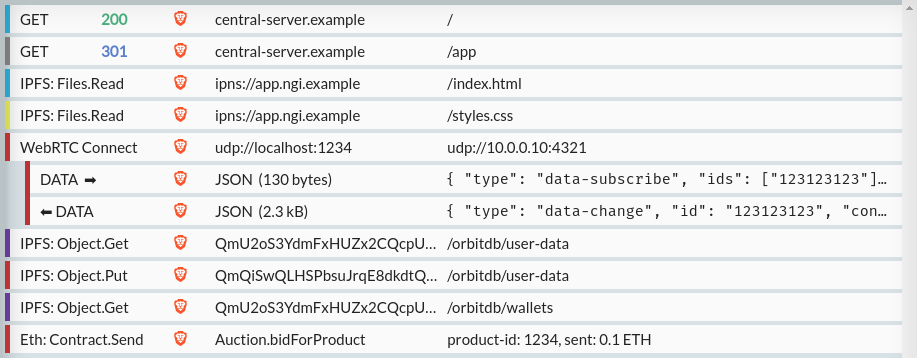

Through the [Next Generation Internet (NGI) initiative](https://www.ngi.eu/), HTTP Toolkit has been selected for funding from the EU's Horizon research & innovation program, to expand beyond HTTP and offer the same interception, debugging & testing functionality for applications built on top of the decentralized web.

This is going to be a huge opportunity to invest in expanding HTTP Toolkit to support some very exciting new technologies, and extending existing core functionality to do so along the way.

For this project I'm going to be specifically focusing on 3 main protocols that today form the backbone of the decentralized web: [IPFS](https://ipfs.io/), [WebRTC](https://webrtc.org/) & [Ethereum](https://ethereum.org/).

For each of these protocols, the essential technologies are usable now, but the wider ecosystem and uptake is still in their infancy. I think it's clear that most mainstream web developers are not currently using these technologies to build production-grade decentralized applications.

There are many reasons for this, but one is a lack of high-quality developer tooling. Moving from traditional client/server architectures to building decentralized applications requires developers to replace many day-to-day debugging & testing tools with manual logging, custom scripts and guesswork. This tooling gap makes decentralized development significantly more difficult.

The goal here is to fix that, by providing modern tools for the future of the web.

This is funded as part of the [NGI Pointer](https://www.ngi.eu/ngi-projects/ngi-pointer/) project, funding me as an individual to work on this for a year, with all the resulting output to be available under free & open-source licenses (of course, HTTP Toolkit is conveniently already 100% open-source, so that's no change at all).

If you're interested in the future of the web and you think developer tooling matters, I hope this is very exciting!

If you're an existing HTTP Toolkit user though and you're only interested in HTTP, don't worry. This is equity-free R&D funding, so HTTP Toolkit remains a completely independent open-source project, and although there's some crypto involved, it's just at the protocol level. HTTP Toolkit is not going to start issuing coins, gambling on NFTs, demanding to connect to your wallet, or anything of the sort. If you want to ignore the new features completely, that's totally fine.

Notably in terms of ongoing development, this is not going to be a full-time commitment, and a significant proportion of my time will still be spent on continuing to support & develop the existing HTTP-focused functionality alongside this. There'll be plenty of crossover too, and I'm confident that many of the new features & UI improvements for decentralized protocols will prove valuable to HTTP-only users along the way (notably there's a huge UX overlap between WebRTC & WebSockets debugging...).

That's the high-level summary. Let's dig into the details.

## Why is the EU funding this?

[NGI](https://www.ngi.eu/) is funded by the EU to build "a European initiative for a Human Internet that respects the fundamental values of privacy, participation and diversity".

I think a key motivation behind this is that many of today's protocols and major players on the internet have come from the US, and there's a feeling that many of these don't sufficiently protect some key European values, especially privacy and transparency.

Wherever you're from, I think we can all agree that today's internet has some problems.

Open-source is part of the solution to this, and has often driven & underlaid key innovations on the internet, but it's rarely well funded. This results in critical projects either languishing without the support they need ([relevant XKCD](https://xkcd.com/2347/)) which creates security problems and other issues, or projects depending on the backing of larger commercial entities with their own private and sometimes problematic interests.

The internet is going to continue to evolve. The EU wants to fund projects, especially open-source projects, to ensure that future evolutions are designed with key issues like privacy & security in mind from the onset, and to ensure that European projects are leading the way in building that.

Decentralization of the web is an important step in this direction. By decentralizing services, we can give users control over their own data, make it easier to protect privacy, give users more power to publish content for themselves, and improve the resilience & performance of internet services along the way.

HTTP Toolkit fits in here because it's open-source, it's European (I'm British, so Brexit has made that more awkward, but I live in Barcelona), it already provides tools to support transparency & privacy (HTTP Toolkit has been used for privacy research by organizations from [the FT](https://www.ft.com/content/0fbf4d8e-022b-11ea-be59-e49b2a136b8d) to [Privacy International](https://www.privacyinternational.org/long-read/4603/unhealthy-diet-targeted-ads-investigation-how-diet-industry-exploits-our-data), plus a huge part of the user base is security researchers, especially for Android), and so it's perfectly placed to provide tooling for this kind of decentralization.

If you're interested in funding too, NGI have a variety of other [open calls](https://www.ngi.eu/opencalls/) currently offering equity-free funding for researchers, open-source hackers, fledgling tech startups & others related to a whole variety of different scopes & topics.

NGI Pointer was just one of those, focused on supporting bottom-up open-source projects & tools, but there's funding available now for everything from software startups working in the blockchain ecosystem to academics researching the new building blocks for search & discovery.

It's early but NGI have been great so far, so if you're based in an EU or associated country ([most of Europe](https://ec.europa.eu/info/research-and-innovation/statistics/framework-programme-facts-and-figures/horizon-2020-country-profiles_en)) then I'd recommend taking a look at [their open calls](https://www.ngi.eu/opencalls/) and the other NGI-related [EU Horizon open calls](https://www.ngi.eu/horizon-europe-calls/) available.

## Why these protocols?

These three protocols were picked as they're some of the most popular & mature decentralization technologies for the web today, covering a wide range of functionality: persistence (IPFS), peer-to-peer communication (WebRTC) and payments/distributed computation (Ethereum).

If you're not familiar with them, let's run through a quick (heavily simplified) summary of each:

### IPFS

IPFS is a content-addressed network, unlike HTTP, where content is addressed relative to the server that publishes it. Instead of saying "Hi example.com, I would like hello.html", clients say "Hi everybody, I would like the content with hash ABCDEF".

Content is then delivered by whoever has it available, whether that's somebody else on your local network, an IPFS node that's hosted near you (perhaps by your ISP), or an IPFS node hosted by the original publisher. It's the same content regardless (verifiable using the hash) but allowing that content to be distributed widely means that it's possible to:

* Use IPFS during network partitions (as long as somebody on your network has the content you want, you can load it, even if the rest of the internet is unavailable)
* Access content even if the original publisher is entirely offline, as long as somebody has it cached somewhere
* Improve latency for popular content (when it's likely that somebody near you already has it)
* Reduce traffic spike load on publishers' servers (if content is popular, you don't need to go to the original publisher to get it)

In many ways, you can think of this as being technically similar to Bittorrent - content is loaded from the group of people who currently have it available, not from any one single source, and performance improves with popularity.

It's also very easy to publish to IPFS, making it possible to publish new content that's immediately accessible directly from a web browser, with no concept of servers or hosting providers necessary.

IPFS has gained more and more attention in recent years, with native support released in both Brave and Opera in the last 12 months, and an official HTTP gateway (for HTTP-only client compatibility) [made available](https://blog.cloudflare.com/distributed-web-gateway/) by Cloudflare to allow usage with clients that don't support IPFS. IPFS can also be used in other browsers using the IPFS Companion extension ([Chrome](https://chrome.google.com/webstore/detail/ipfs-companion/nibjojkomfdiaoajekhjakgkdhaomnch), [Firefox](https://addons.mozilla.org/en-US/firefox/addon/ipfs-companion/)).

Put together, this creates a versatile content distribution and publishing network, providing a good basis for persistence & content hosting for web applications with no central server and no single point of failure.

### WebRTC

WebRTC is a peer-to-peer protocol that's generally used through its standard JavaScript web API, supported out of the box today in all modern browsers.

It's already widely used for video and audio, powering many web-based video chat applications. It allows peer-to-peer communication between web pages, meaning that video can be sent directly between two users on the same site, without going through a central server, improving latency and reducing server load.

In addition to that though, WebRTC also supports data channels, allowing web pages to directly send arbitrary messages between one another. Think of these like user-to-user websockets, but with no server required.

This is incredibly powerful for decentralized applications: you can use WebRTC to let users directly interact, without needing any server whatsoever!

Using this, it's easy to imagine a fully decentralized chat room, perhaps with the page itself and its JavaScript served over IPFS, where every message is simply sent between peers directly and stored only in their browsers. It's also possible to go further, even building applications where a full database is stored client-side, with changes synchronized directly between peers over WebRTC.

### Ethereum

Ethereum is a widely used cryptocurrency, the second largest after Bitcoin by total value, and processing far more transactions per day than Bitcoin and most other popular cryptocurrencies (currently ~1.3 million transactions per day, compared with Bitcoin's ~250 thousand).

Ethereum's most notable feature though goes beyond simple transfers of money: Ethereum can host and execute [smart contracts](https://en.wikipedia.org/wiki/Smart_contract), effectively acting as a decentralized computer. Code in these contracts is fully public and auditable, and it's executed by the network's miners, who run the code & update state on the blockchain in much the same way that they run requested financial transactions and record the result on the blockchain.

This is important because it turns Ethereum from being just a currency into a platform, making it possible to store and atomically mutate application state in a fully decentralized system, with no servers or single points of failure required.

You can use Ethereum's smart contracts to build things like decentralized SaaS checkouts (send X money to an address, your account can now use paid features), to atomically transfer blockchain resources between users of your app, to build systems for your users to vote on planned features, or to provide an API that queries & exposes the blockchain-hosted state of your app.

Both Opera and Brave support Ethereum wallets natively, and other browsers can do so using wallet extensions such as [Metamask](https://metamask.io/). Alternatively, pages can interact with the network directly via a hosted HTTP Ethereum API provider like [Infura.io](https://infura.io/).

Notably these and other Ethereum clients all generally work by communicating with an Ethereum Node's [JSON-RPC API](https://ethereum.org/en/developers/docs/apis/json-rpc). This has become a defacto standard, and the same API is also supported by many similar platforms, like [Theta](https://www.thetatoken.org/), [GoChain](https://gochain.io/), [Moonbeam](https://moonbeam.network/) and [others](https://chainlist.org/). While those aren't the primary target here, they should be supported automatically regardless, along with any other future platforms built to support the same API.

There is one caveat here: Ethereum (and other crypto) does have a substantial [environmental impact](https://digiconomist.net/ethereum-energy-consumption/) which I'm not keen to encourage. That said, Ethereum is currently expected to [switch](https://ethereum.org/en/eth2/) to [proof-of-stake](https://ethereum.org/en/developers/docs/consensus-mechanisms/pos/) to enormously reduce this very soon (the current deadline is December 2021). I'm hopeful that that will be in place well within the next year, before this project is complete, and they have been making promising progress on that front [recently](https://blog.ethereum.org/2021/08/25/finalized-no-28/) (and significantly more progress than any other crypto).

### ...and more

These three protocols are intended as a starting point, not a final target.

A key goal here is to _explore_ the kinds of developer tooling that decentralized app developers need, independent of the specific protocol. Once the core technology & UX for these three are in place, that will provide a base on which other protocols could be more easily supported in future, to provide tooling for alternative protocols from Hypercore to Filecoin as the ecosystem develops.

## What's the problem today?

These protocols are all very well in theory, but right now they're a massive pain to build serious applications with, because browsers and other tools don't provide any of the kind of support you're used to when working with HTTP and other mainstream technologies.

That means if you build a web application using these, it's very difficult to debug or test. You cannot easily:

* See the contents of data sent through WebRTC data channels, at all.
* Add latency to explore how your application handles slow IPFS retrievals or timeouts.
* Stub an Ethereum smart contract for testing or prototyping.
* Quickly replace some IPFS content for testing, without republishing everything and updating all hashes.
* Breakpoint an Ethereum transaction to test an alternate result.
* Inject a message into a WebRTC channel.

This is a massive pain, which creates constant friction, and it's a long way away from the functionality that web developers are used to on the mainstream HTTP-powered web.

This isn't just bad for developers though. Investigating apps to see what exactly they're doing and poke at their internals is extremely important for security and privacy researchers, and without tooling the traffic for each of these protocols today is almost invisible & untouchable. As their usage increases, this poses a serious risk to security research & transparency on the web.

Fortunately, HTTP Toolkit already has the technology to support this kind of debugging with HTTP, it's already used in this kind of security & privacy research on today's web, and it should be very possible to expand this functionality to cover these decentralized protocols in future too.

## How will this work?

The basic idea is that HTTP Toolkit will sit between your browser and the rest of the network, and will intercept each of these protocols, and proxy their interactions through to the rest of the network, but allowing you to inspect those interactions and potentially change them or inject messages en route.

This might sound ambitious! Adding automatic interception & debugging support for three completely different protocols, in addition to HTTP, all within the existing app?

Fortunately, I have a trick up my sleeve: it's HTTP all the way down.

Specifically, the application-facing interface to both IPFS and Ethereum is actually just HTTP. In both cases, browsers and other clients use the protocol by making HTTP requests to the API of a local or remote node, which handles all the low-level peer-to-peer interactions between the wider network. Take a look at the APIs [here](https://docs.ipfs.io/reference/http/api/) and [here](https://playground.open-rpc.org/?schemaUrl=https://raw.githubusercontent.com/ethereum/eth1.0-apis/assembled-spec/openrpc.json&uiSchema%5BappBar%5D%5Bui:splitView%5D=true&uiSchema%5BappBar%5D%5Bui:input%5D=false&uiSchema%5BappBar%5D%5Bui:examplesDropdown%5D=false).

For IPFS & Ethereum, this simplifies things a lot! HTTP Toolkit already has all the building blocks to intercept, inspect & rewrite HTTP(S) traffic, so capturing and manipulating this traffic at a low level is mostly just a matter of configuration management.

In effect, HTTP Toolkit will act as an IPFS/Ethereum node that can transparently pass traffic through to a real target node (and so to the wider network) but which can also inspect and modify all API requests en route, for debugging & testing.

That's not to say this will be easy of course. There's significant additional work to make this truly usable, by providing an interface that allows you to easily understand and modify these interactions. For example, you would want to be able to interpret contract execution calls, test IPFS latency or failures, and breakpoint and modify Ethereum transactions (more details & mockups below).

WebRTC meanwhile is somewhat more complicated, but still tractable by extending HTTP Toolkit's existing interception framework, and the UI work is closely related to the work required to debug WebSockets too.

To make a WebRTC connection, a web page uses the built-in JS APIs in the browser, passing the details of the peer they want to connect to. These peer details are shared using out-of-band signalling - i.e. you need to use some non-WebRTC mechanism to share connection details before you can connect. The details one client should signal to the other via the signalling channel are also provided by the browser, and then shared by some other mechanism (a central server, QR codes, recommendations via other peers, you name it).

This signalling is the key for interception. If we can change the signalling details each browser uses, then we can change a connection from being peer-to-peer to peer-to-HTTP Toolkit plus HTTP Toolkit-to-peer, and from there we can inspect and modify WebRTC data however we like.

For normal HTTP(S) interception, today HTTP Toolkit intercepts browsers and other clients by injecting proxy & certificate information into the target process when it's started. To support WebRTC, this startup interception can be extended by injecting a temporary browser extension that hooks the JS WebRTC API in the target browser, and replacing all connection details there, to inject HTTP Toolkit as a proxy within every WebRTC connection from inside the browser itself.

With that in place, browsers will connect to HTTP Toolkit as the other peer in every WebRTC connection, and using standard WebRTC libraries we can accept those connections, to act as a mock peer, proxy the connection to another real peer, or do something else entirely.

That still leaves similar UX challenges to IPFS & Ethereum: we need to provide useful information when inspecting these interactions, and tools to easily modify & mock them. What does that look like, and how do we get there?

## What's the plan?

### 1. Release standalone interception libraries

The first step to build this is to extend [Mockttp](https://github.com/httptoolkit/mockttp) to provide a convenient API that anybody can use to create a proxy for these protocols, and to then verify & mock their interactions.

These libraries will provide the base for traffic handling in HTTP Toolkit and will be usable headlessly and standalone (just as Mockttp is). This allows application developers to intercept IPFS, WebRTC & Ethereum interactions in their own code to verify and mock behaviour in automated testing, or build other kinds of automated rewriting proxies on top of these protocols.

They'll be released as standalone libraries, one for each protocol. As a quick mockup for Ethereum for example, if the new library is called 'Mockthereum' (TBC) then you might be able to write code like:

```javascript
const Web3 = require("web3")
const mockNode = require("mockthereum").getLocal();

const contractToMock = "0x11f4d0A3c12e86B4b5F39B213F7E19D048276DAe";

describe("Mockthereum", () => {
  beforeEach(() => mockNode.start(8080));
  afterEach(() => mockNode.stop());

  it("allows you to mock Ethereum contracts", async () => {
    const web3 = new Web3(mockNode.url);

    // Define a mock result for an Ethereum contract:
    const mockedContract = await mockNode.whenCall(contractToMock)
      .thenReturn("mock contract result");

    // Actually call the contract using web3.js, just like normal
    // (this step would normally run within the real code being tested)
    const result = web3.call({ to: contractToMock });

    // Confirm that the code called the contact & got the expected result:
    expect(mockedContract.calls.length).to.equal(1);
    expect(result).to.equal("mock contract result");
  });
});
```

This is a simple extension of the existing Mockttp API, just adding an easy method to mock recognized Ethereum requests. You can imagine more methods though like:

* `mockEthNode.rejectTransactionsTo(address)`
* `mockIPFSNode.withContent(hash, content)`
* `mockWebRTCPeer.echoAllMessages()`

The specific methods that will be supported are TBC, but you get the idea. Take a look at Mockttp's [existing mock rules](https://httptoolkit.github.io/mockttp/classes/RequestRuleBuilder.html) for examples of what's already possible today for HTTP.

### 2. Automatically intercept traffic

With the standalone libraries, we'll be able to inspect & transform traffic once it reaches us, but we still need to redirect the traffic to our proxies somehow to do so.

We discussed the low-level of how this will work above. The practical steps to implementing that are:

* Inject configuration into target browsers to proxy Ethereum & IPFS's HTTP traffic via HTTP Toolkit at startup
* Create a WebRTC-intercepting browser extension
* Inject the WebRTC extension into browsers to intercept WebRTC p2p connections

With this in place, for any launched browser, Ethereum, IPFS & WebRTC will all work exactly like normal, but tunnelled through code that can freely transform and inspect everything they do. Raw HTTP requests for Ethereum & IPFS will appear in HTTP Toolkit immediately, and WebRTC requests will be transparently proxied but invisibly.

### 3. Build a UI to explore collected traffic and to define rules to transform it

Once all the traffic is in our control, we can start doing things with it. Let's take a look at some quick mockups

Below you can see traffic from a webapp that's using HTTP, IPFS, WebRTC and Ethereum, extending HTTP Toolkit's existing UI to show interactions from all of these protocols with their key metadata, all in one place:



In addition, HTTP Toolkit's rule builder UI will be extended to expose the interaction handlers from each standalone library in the UI:


_Remember these are mockups! Actual UI will vary. Do please [send some feedback](https://github.com/httptoolkit/httptoolkit/issues/new/choose) if you have opinions on this though._

## When?

This is going to kick into action over the next few weeks. The first step is to put a detailed roadmap in place before October this year, and then the project will run for a year until October 2022.

That's the plan - hopefully this sounds exciting! Watch this space to hear about all the next developments. If you haven't already, you can subscribe to this blog below, or subscribe to HTTP Toolkit major release announcements [here](httptoolkit.tech/keep-me-updated/).

**If you have opinions on this, especially if you're using one of these protocols today, I would love to hear about them**. Get in touch! Send me your thoughts, questions and feedback either [on Twitter](https://twitter.com/pimterry), as a [GitHub issue](https://github.com/httptoolkit/httptoolkit/issues/new/choose) or [by messaging me directly](https://httptoolkit.tech/contact/).

_This‌ ‌project‌ ‌has‌ ‌received‌ ‌funding‌ ‌from‌ ‌the‌ ‌European‌ ‌Union’s‌ ‌Horizon‌ ‌2020‌‌ research‌ ‌and‌ ‌innovation‌ ‌programme‌ ‌within‌ ‌the‌ ‌framework‌ ‌of‌ ‌the‌ ‌NGI-POINTER‌‌ Project‌ ‌funded‌ ‌under‌ ‌grant‌ ‌agreement‌ ‌No‌ 871528._

