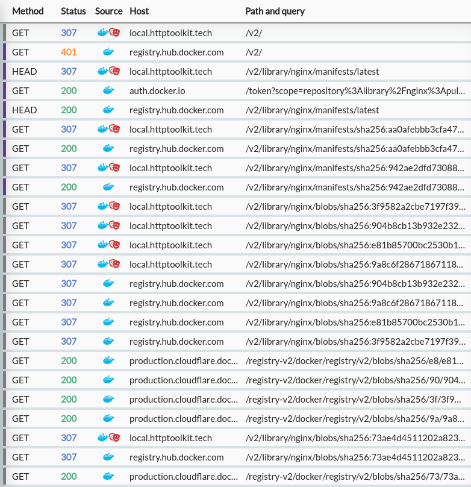

As you [may](https://blog.alexellis.io/docker-is-deleting-open-source-images/) [have](https://woju.eu/blog/2023/03/foss-and-docker-hub/) [seen](https://news.ycombinator.com/item?id=35154025), Docker Hub made a dramatic shift in policy this week, and effectively gave a 30 day eviction notice to almost all community-run images.

They've now made an [apology](https://www.docker.com/blog/we-apologize-we-did-a-terrible-job-announcing-the-end-of-docker-free-teams/) to 'clarify' a few details, and helpfully take some of the hard edges off, but this still highlights a big problem. Fortunately, there are solutions.

As initially described, this would've been catastrophic: Docker Hub has been used as the default host in tooling, tutorials, demos, blog posts, scripts, deployment definitions, CI builds and more for many years, and all those references were going to break - a self-inflicted [left-pad](https://www.theregister.com/2016/03/23/npm_left_pad_chaos/) for the Docker ecosystem. In their updated policy, it appears they now won't remove any existing images, but projects who don't pay up will not be able to publish any _new_ images, so they've effectively lost control of the namespace they used to deploy to their communities unless they purchase a full team subscription. Many [will not do so](https://mastodon.social/@bagder/110029589346386740).

This is an interesting challenge. Even if the existing images aren't removed, the direction of travel for Docker Hub is now clear: they don't want to host the core of the Docker community any more, no more freebies, pay up or go elsewhere (not unreasonable, but something of a rugpull after a full decade of the opposite).

As a small/open-source/community/hobbyist image publisher, or if you depend on Docker Hub for free image publishing in any capacity, you now have a problem. They don't want you there. You're explicitly not their audience, and the rules will likely tighten further. This isn't unreasonable - it's their service and hosting isn't free - but it's worth considering explicitly and reacting accordingly. **If you're not a paying Docker Hub customer, it's time to leave Docker Hub.**

The hard part is what to do instead.

Self-hosting a registry is not free, and it's more work than it sounds: it's a proper piece of infrastructure, and comes with all the obligations that implies, from monitoring to promptly applying security updates to load & disk-space management. Nobody (let alone tiny projects like these) wants this job.

Alternatively, there are plenty of other free hosted Docker registries, and paid services too, but migrating to one directly feels a lot like you're just going to hit the exact same problem 6 months from now, and have to change your image references everywhere all over again.

What if you could use your own fixed registry URL, on your own domain & entirely under your control, but without having to self-host forever, or even commit to any particular registry, or handle all the bandwidth & storage costs?

We're looking for a way to:

* Reference your images from an address you fully control (`docker pull docker.my-org.example.com/org/my-image`)
* Do so whilst still being able to use any registry hosted elsewhere, or self-hosted ourselves.
* Avoid storing, loading, or serving the content separately. For now at least, there's quite a few other registries who will happily do this for public images for free, and even if there weren't we'd like to avoid extra latency or ingress & egress fees from proxying this traffic.
* **Be able to change which backing registry we're using in future, without any of the image addresses ever changing again**.

What if I told you that's actually super easy?

## Exploring the possibilities

Let's talk about how this _could_ work, and then we'll dig into what `docker pull` actually does, and put together a quick solution (if you just want to know how to do this immediately, now's the time to [skip to the end](#transparently-wrapping-a-docker-registry)).

Docker's registry API runs on fairly simple HTTP, and HTTP APIs have a few different solutions available for situations like this.

The classic 'host under your own domain' solution is to use CNAMEs at the DNS level. This means setting up a DNS record under your domain, which points to a domain elsewhere, effectively defining an alias. When a client tries to connect, they'll lookup `your-registry.example.com`, find a record referencing the backing registry (`registry.hub.docker.com`, for example), and then all requests will get sent over there.

If this worked here, that'd be great! Zero hosting required, just handle it on the DNS level.

Unfortunately, this requires that target server to correctly handles HTTP requests with your 3rd party domain name in the `Host` header, knowing that they should be processed as requests to the real service. For Docker Hub at least, that's not possible (not for free certainly - although like many other services this might be offered as a paid addon). Requests sent to Docker Hub with the wrong hostname simply fail:

```bash
> curl -I https://registry.hub.docker.com
HTTP/1.1 200 OK
...

> curl -I -H'Host: example.com' https://registry.hub.docker.com
HTTP/1.0 503 Service Unavailable
...
```

I suspect this applies to many other registries too, so redirecting just at the DNS level is out.

Next plan: can we do this by redirecting and/or proxying at the HTTP level? There's lots of standard tools & approaches to do this within HTTP itself, along with an entire ecosystem of reverse proxies. Unfortunately though, whether or not API clients will handle redirects as we'd like is not guaranteed, and proxying without running into other issues is non-trivial.

To work out whether this'll work, we need to do some digging into Docker's traffic directly.

## How 'Docker Pull' works

First, let's take a look at what a Docker pull really does under the hood.

When you run `docker pull`, or do anything else with Docker (e.g. building an image) that triggers an image pull en route, there are a few requests that have to happen to download the full image you're looking for.

To dig into this traffic, the easiest option is to use an HTTP-debugging tool (such as **[HTTP Toolkit](https://httptoolkit.com)**) to see the raw interactions, and configure Docker to use this as your HTTP proxy (docs [here](https://docs.docker.com/config/daemon/systemd/#httphttps-proxy)) and trust the CA certificate ([here](https://docs.docker.com/registry/insecure/#use-self-signed-certificates)).

Unless you're super keen though, you can all skip that - I've done the hard work for you. Here's what happens when you run `docker pull nginx`:


What we have here is:

* An initial `/v2/` request to check the API status ([docs here](https://docs.docker.com/registry/spec/api/#api-version-check)). On Docker Hub this typically returns a 401, with headers redirecting the client to authenticate.
* An authentication request to `auth.docker.io`, which returns a JWT.
* A HEAD request to the base image URL (`/v2/library/nginx/manifests/latest`) which returns a response with a `docker-content-digest` header containing a sha256 hash:
  
* Two GET requests for specific manifests, both receiving a 200:
    * `/v2/library/nginx/manifests/sha256:aa0a...` (the hash from the previous response header) which returns a list of manifests tagged by platform:
    
    * `/v2/library/nginx/manifests/sha256:942a...` (the hash of the linux platform from the previous request) which returns a manifest listing hashes for individual image layers.
    
* A set of parallel requests for specific blob hashes, all in the format of
  `/v2/library/nginx/blobs/sha256:$HASH`.

    Each of these does _not_ return the content - they return 307 redirects to the content! In the case of Docker Hub, they return appear to return redirects to a Cloudflare-backed CDN:
    
* An interleaved set of parallel requests to the real image host (`production.cloudflare.docker.com`) to actually retrieve the content of the image config & layers.

Once the client has pulled all the layers and the image config, they're composed back together as a Docker image you can use directly locally.

## Transparently wrapping a Docker Registry

This is all very interesting, and gives us a good idea what's going on at the network level, so we can start testing this out to build what I'm calling a "registry facade" (a service that sits in front, but just as a shell, not a proxy).

Conveniently, in the traffic above we can see that there are already redirects in place, and working! That means that all Docker clients _must_ support redirects at least for `/blobs/` requests (otherwise Docker Hub would be unusable) and so probably support them for all requests.

So, given that, what happens if we just do the same directly ourselves, by creating a rule to return 307 HTTP redirects from all `$OUR_HOST/*` URLs to the corresponding `$OUR_REGISTRY/*` for any request?



Bingo.

This works fairly well! We're adding a bit of overhead with an extra 307 redirect response at each step (each request with the red icon is an injected redirect) but they're very quick, everything here is being sent successfully, and pulls work perfectly in every scenario I've tested. Definitely good enough to get started with (and because this will all be under our own control, we can iterate to improve this solution in future).

I tested this with a quick hacky rewrite rule in HTTP Toolkit - how do you do this in production?

Turns out that's pretty easy too: I've created a tiny [Caddy-based Docker container](https://github.com/httptoolkit/docker-registry-facade) (I enjoyed the irony of publishing this to Docker Hub) which you can deploy directly to any Docker hosting platform to do this in no time, or if you already have a CDN or hosting platform (e.g. Netlify) that lets you define simple rules like "redirect all requests for X to the same path at host Y" then you can use that too.

In my case, I'm using [Bunny CDN](https://bunny.net), who have a nice rules system that can do this very easily like so:


In production, one thing you may want to do is limit this functionality to just your own org's images, to avoid it being used as a general-purpose facade for all images or similar, so you know all requests to your domain will always get your images. The Caddy-based container above supports this by setting the `REGISTRY_ORG` variable, e.g. to `httptoolkit`, in which case only those images will be available and everything else will get a 403.

If you want to limit requests like this yourself with other tools, you'll just need to ensure that requests to all URL paths starting with `/v2/$YOUR_ORG/` are redirected, along with the specific `/v2/` endpoint - without that latter endpoint authentication won't work.

Once that's in place, you're all good. In my case, I've deployed this as `docker.httptoolkit.tech`, so you can now pull my Docker images from that hostname, even though they're currently still hosted on Docker Hub, like so:

```bash
> docker pull docker.httptoolkit.tech/httptoolkit/docker-socks-tunnel
```

In future I'll be migrating my images elsewhere, but I can start using this image address immediately, safe in the knowledge that it'll always work, backed by any registry I like, as long as I control that domain.

## Dodging the next Dockerpocalypse

If you're a project affected by this issue, this is something you can set up _right now_ as a quick wrapper before even starting to migrate from Docker Hub, and you can start shifting all your docs & scripts to reference that new URL immediately with no downsides.

More importantly though, either way, this ensures that whichever registry you migrate to, there's zero impact to switching in future, when your new registry of choice inevitably also goes bust/loses all your data/changes their rules with only 30 days notice.

That's enough for now (I need to get back to actually doing the full migration for all HTTP Toolkit's existing images) but I hope that helps others in the same mess. If you have comments, get in touch on [Mastodon](https://toot.cafe/@pimterry), [Twitter](https://twitter.com/pimterry), or [send a message directly](/contact/).