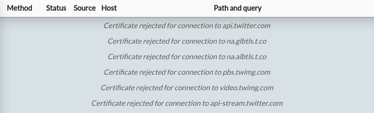

Some Android apps go to astounding lengths to ensure that even the owner of a device can never see the content of the app's HTTPS requests.

This is problematic for security research, privacy analysis and debugging, and for control over your own device in general. It's not a purely theoretical problem either - protections like this attempt to directly block HTTPS inspection tools like [HTTP Toolkit](https://httptoolkit.com/android/), which allow you to automatically intercept HTTPS from Android devices for inspection, testing & mocking, like so:

<center>
    <iframe class="video-embed" src="https://www.youtube.com/embed/ttf8IhfI0Ao" frameborder="0" allow="autoplay; encrypted-media; picture-in-picture" allowfullscreen></iframe>
</center>

This depends on the target application(s) trusting the debugging proxy's certificate for HTTPS traffic. These HTTP interception and mocking techniques are super useful for testing and understanding most apps, but they have issues with the small set of hyper-vigilant apps that add extra protections aiming to lock down their HTTPS traffic and block this kind of inspection.

In the end, this is your Android device, and whether you're a security researcher checking for vulnerabilities, a developer trying to understand how an app uses its API, or a privacy advocate documenting what data an app is sharing, **you should be able to see the messages that the apps you use transmit and receive on your own phone**.

Protections like certificate pinning make this difficult.

Let's talk about how you can fight back, by using [Frida](https://frida.re/) to remove SSL pinning, and expose the real traffic that any app is sending.

## What's certificate pinning?

By default, when an Android app makes an HTTPS connection, it makes sure that it's talking to a trusted server by comparing the issuer of the server's certificate to Android's built-in list of trusted system certificate authorities.

99% of apps stick with that default. You can't change the system certificate authorities on normal devices, so this list is fairly reliable and secure. You can change it though on rooted devices and most emulators, so it's quite possible to intercept and inspect HTTPS traffic from these apps by using a debugging proxy for HTTPS interception in those environments.

Unfortunately however, the last 1% which don't stick with the default configuration are more complicated. These apps include their own custom certificate validation, to specify the _exact_ HTTPS certificate issuers they're prepared to trust, instead of trusting all of the device's trusted certificate authorities. This ensures they will never trust a new certificate from a certificate authority that they don't explicitly recognize, and so won't accidentally expose HTTPS traffic to anybody other than the real server.

This is generally known as "public key pinning", "certificate pinning", or "SSL pinning".

Because this blocks all except a specific list of certificate authorities, it also blocks the private certificate authorities used by HTTPS debugging proxies, and so we hit our problem.

Certificate pinning used to be a much more popular technique, back before Android Nougat when Android's own certificate validation was more lax and users could easily be tricked into installing new trusted certificates on their devices. Nowadays this is more tightly controlled, and certificate pinning is much rarer, since (as we'll see) it's really [security theater](https://en.wikipedia.org/wiki/Security_theater), and Google's own docs now specifically [recommend against](https://developer.android.com/training/articles/security-ssl#Pinning) the practice:


For similar reasons, it's not popular on the web. There was a short-lived HTTP standard to support this ([HTTP Public Key Pinning](https://developer.mozilla.org/en-US/docs/Web/HTTP/Public_Key_Pinning)) but it's deprecated and support was removed from browsers, as it makes it far too easy to unexpectedly and irreparably (!) break applications for little security benefit.

That said, it's still used on Android in some corners, particularly by very high-profile apps (e.g. Twitter) and very security-sensitive apps (e.g. banking apps, like N26 or BBVA), all of whom are extremely protective over the details of how their APIs are used, and would prefer that prying eyes can't look too closely.

In practice, that means that if you want to know how the Twitter app uses the Twitter API, you're going to need to make it trust your HTTPS interception certificate.

## Enter Frida

[Frida](https://frida.re/) is a cross-platform multi-purpose framework for dynamically transforming how applications work, from outside the application. Think [Greasemonkey](https://addons.mozilla.org/en-US/firefox/addon/greasemonkey/), but for programs instead of web pages.

Frida lets you do things like logging every time an app calls a specific method, changing constants within built applications, recording how values within an application change or replacing methods to disable functionality entirely.

You make these changes by writing small scripts in JavaScript, which use Frida's API to define transformations that will be applied to the target process.

Frida supports Android, primarily using an on-device server that runs on rooted devices, and exposes an API via ADB so you can use Frida's CLI tools on your computer to transform apps on your phone on the fly.

This is very neat! But it's also quite intimidating if you're not familiar with low-level reverse engineering, since the internals and much of the documentation are very involved in the finer details of how applications work on each of the various target platforms.

Fortunately, it's not actually that complicated or that difficult. Let's walk through the whole process step by step:

## How can you remove certificate pinning with Frida?

At a high level, you need to:

1. Connect ADB to a rooted device or emulator
2. Install and start Frida on the device/emulator
3. Install Frida on your computer
4. Tell Frida the app that you want to edit, and provide a script that knows how to remove the certificate pinning logic

Let's walk through how to do that in practice:

### Connect to a device via ADB

ADB is the [Android Debug Bridge](https://developer.android.com/studio/command-line/adb) an official Android tool for remotely debugging and controlling Android devices.

If you don't have ADB already, you'll need to install it. To do so, you need to either install [Android Studio](https://developer.android.com/studio) and use the SDK manager UI there, or by downloading the platform tools including ADB directly as a [standalone package](https://developer.android.com/studio/releases/platform-tools#downloads).

The rest of this guide will assume you've got `adb` in your $PATH.

You'll also need a target device with root access.

If you have a rooted device available, or you want to set one up, then that's great. You just need to plug it into your computer and [enable USB debugging](https://developer.android.com/studio/command-line/adb#Enabling) to allow debugging via ADB.

If you don't have a rooted device, you can use an emulator instead. To set one up, use the AVD (Android Virtual Device) manager either from the Android Studio UI, or by running `avdmanager` in the [standalone command-line tools](https://developer.android.com/studio#cmdline-tools).

Your emulator can use any Android version (although a recent version matching your machine's architecture is a good idea), but **must use a non-'Google Play' build**. Either Vanilla or 'Google APIs' is fine, but Google Play builds include restrictions similar to physical devices that limit debug access.

Once everything is set up, you should be able to run `adb devices` on the command line and see your device listed there.

### Install and start Frida on the device

First, download the Frida Android server [from GitHub](https://github.com/frida/frida/releases).

You want a version like `frida-server-$VERSION-android-$ARCH.xz`, for the latest $VERSION, where $ARCH is the architecture of your device. For emulators, that's probably `x86_64`, for physical devices it's probably `arm64` (or maybe `arm`, for older devices).

You'll need to extract that `.xz` file to get the binary within. This isn't a common compression format, so you might need [7-Zip](https://www.7-zip.org/) (Windows) or [The Unarchiver](https://theunarchiver.com/) (Mac) if you don't already have them.

You then need to copy the binary onto the device, make it executable, and start the server as root. Like so:

```bash
# Copy the server to the device
adb push ./frida-server-$version-android-$arch /data/local/tmp/frida-server
#        ^Change this to match the name of the binary you just extracted

# Enable root access to the device
adb root

# Make the server binary executable
adb shell "chmod 755 /data/local/tmp/frida-server"

# Start the server on your device
adb shell "/data/local/tmp/frida-server &"
```

The last command will start Frida, and keep running silently. If it prints any output then something is probably wrong - most likely you've downloaded the server for the wrong architecture or you're not running these commands as root.

### Install Frida on your computer

Ok, you've got a debuggable device connected with the Frida server running.

To control it, you need to install the Frida CLI tools on your computer. You'll need [Python](https://www.python.org/downloads/) installed for this, and then you just need to run:

```bash
pip install frida-tools
```

You can test this by running `frida-ps -U`. This will connect to the server via USB (`-U`) and list the details over every running process on the target device. If this shows you a list of processes, you're all good!

### Disabling SSL pinning with Frida

The last and most important step: we need to tell Frida to transform the target application, removing certificate pinning so we can see the traffic it's sending.

To do so, we first need the package name of the target process. You can see this listed somewhere in the output of `frida-ps -U` for every process that's currently running, or you can find it from the app's play store URL.

For example, HTTP Toolkit's Play Store page is [play.google.com/store/apps/details?id=tech.httptoolkit.android.v1](https://play.google.com/store/apps/details?id=tech.httptoolkit.android.v1) and the package name is `tech.httptoolkit.android.v1`.

(If you want to test this, but you're not sure what to un-pin, I've published a demo certificate pinning app at [httptoolkit/android-ssl-pinning-demo](https://github.com/httptoolkit/android-ssl-pinning-demo). You can download a built APK of that app from its [GitHub releases page](https://github.com/httptoolkit/android-ssl-pinning-demo/releases/) and install it with `adb install ./ssl-pinning-demo.apk`)

We then need a script, which will rewrite the application. Frida scripts are simple JavaScript which can use Frida's API to define replacements for methods in the target application. By doing so, they can make a certificate-checking method do nothing, make a class ignore certificate pinning configuration, or almost anything else.

Writing these scripts is quite complicated. There's many small individual scripts available, designed to remove pinning from specific target apps or certain HTTPS libraries, but not many that try to remove pinning for _all_ HTTPS traffic.

Fortunately I've been working on a general-purpose Frida script to do this, so you can just use that. It's available as `frida-script.js` in the [httptoolkit/frida-android-unpinning GitHub repo](https://github.com/httptoolkit/frida-android-unpinning). This combines many other public scripts, it's been tested against a variety of different targets already, and contributions to extend it to cover any new libraries or techniques that aren't currently covered are very welcome!

To use this, save [frida-script.js](https://raw.githubusercontent.com/httptoolkit/frida-android-unpinning/main/frida-script.js) on your computer, and then run:

```bash
frida --no-pause -U -l ./frida-script.js -f $TARGET_PACKAGE_NAME
```

This will restart the app on your phone, and print out a series of libraries where unpinning was attempted, with a `[+]` for libraries that were successfully patched and `[ ]` for libraries that weren't (generally because the app doesn't use those libraries).

When any unpinned methods are called later on, you'll also see a `--> Bypassing [pinning method]` message, to let you know which APIs this app is using.

## Testing certificate unpinning

Ok, you've got a device, you've got Frida set up and you've got a script that can unpin HTTPS certificates. It's time to test this out!

Here's a few high-profile apps that use certificate pinning to protect their HTTPS traffic which might be interesting to play with:

* [Twitter](https://play.google.com/store/apps/details?id=com.twitter.android)
* [PayPal](https://play.google.com/store/apps/details?id=com.paypal.android.p2pmobile)
* [N26's mobile banking app](https://play.google.com/store/apps/details?id=de.number26.android)
* [The UK NHS's COVID tracing app](https://play.google.com/store/apps/details?id=uk.nhs.covid19.production)

Let's try taking a look at their HTTPS traffic. You'll need an HTTPS debugging proxy to test this - [HTTP Toolkit](https://httptoolkit.com/android/) will work, or you can use another HTTPS-intercepting proxy like Burp or Charles if you'd prefer.

Once you're intercepting the device, try opening any of the above apps and you'll see TLS connection errors in the debugging tool, and odd behaviour in the app. For example, when opening Twitter, HTTP Toolkit shows me this:



That means that an HTTP client (the Twitter app) is connecting and then rejecting the certificate immediately, without sending any requests. Each of these apps provides some errors like this, for the specific hosts whose certificates have been pinned within the app.

To defeat this and intercept Twitter's real API traffic, I just need to run:

```bash
frida --no-pause -U -l ./frida-script.js -f com.twitter.android
```

That restarts Twitter on my phone, and I've immediately got traffic:


Jackpot! We've removed the pinning, so that the Twitter app now trusts our MitM HTTPS proxy, and we can intercept and inspect its traffic.

From here, you can explore the content of each of those requests, or add rules to rewrite, mock or block them entirely.

## Caveats

In theory, Frida is capable of defeating absolutely any certificate pinning you could possibly implement: if you can write some code to check a certificate, Frida can remove that code.

That said, this all depends on whether the script you use is aware of the specific certificate pinning code or APIs that are used. Whether this technique works depends entirely on the combination of target app and the Frida script.

The above script does remove certificate pinning from every built-in API or widely used library I'm aware of, and I've tested it successfully against the apps listed here and a long list of others. It's a good general-purpose script for most cases, but it won't work in absolutely 100% of certificate-pinned apps today. If you do find cases that aren't handled, I'm very interested in examples and contributions to cover more cases to help strip out as many certificate pinning implementations as possible, so [get in touch](https://httptoolkit.com/contact/) or [file an issue](https://github.com/httptoolkit/frida-android-unpinning/issues/new/choose)!

Notably some apps which will go above and beyond, by implementing their own custom certificate pinning techniques from scratch, to make disabling it as difficult as possible. The prime example of this is the various Facebook apps, which all use their own [custom reimplementation of TLS](https://github.com/facebookincubator/fizz) rather than the standard platform APIs.

It's definitely possible to automatically remove certificate pinning features from that too within the same Frida script in theory (contributions _very_ welcome!), but it's significantly more difficult than mocking out a well-known common library, so I haven't done that yet, and so this script won't work for Facebook, Facebook Messenger, Instagram, or similar.

Fortunately that doesn't matter though, because Facebook offer a [whitehat option](https://www.facebook.com/notes/977148692766914/) in their apps to allow security researchers to disable certificate pinning directly, and you can just use that instead.

## What next?

Hopefully you've now got Frida working, and you can see, debug & rewrite secret API traffic from every app you're interested in.

The next step is to start exploring further, to examine the APIs used and data leaked by other popular apps, and to help find and fix cases where this Frida script doesn't yet work, so we can stub out every last pinning API. Get testing!

Have any questions, or run into issues? Feel free to get in touch [directly](https://httptoolkit.com/contact/) or [on Twitter](https://twitter.com/pimterry).