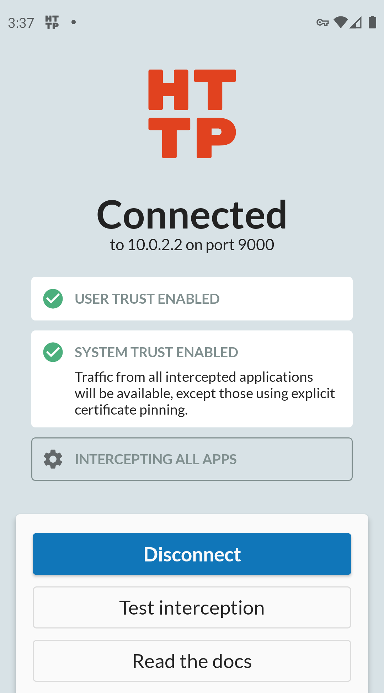
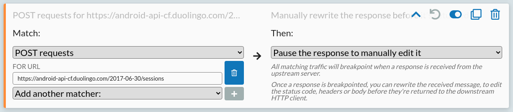

HTTP is used by almost all Android apps to request data, load content, and send changes to backend servers. If you can see and edit these requests & responses then you can understand, debug, and change how any app works, but Android makes this hard to do.

By default, almost all apps will use HTTPS but [won't trust user-installed certificates](/blog/intercepting-android-https). This means that you can't see their traffic with simple proxy tools, and you can't manually trust HTTPS debugging proxies without either editing and rebuilding the entire app, or setting up your own rooted device.

Fortunately, there's a quick & easy way around this: you can manually install official APKs into a normal Android emulator, which provides enough access that tools like [HTTP Toolkit](/android/) can capture all traffic for most apps for you totally automatically, and allow you to edit responses in just a couple of clicks.

Let's walk through how to do that, step-by-step:

## Setting up the emulator

To get started, you'll need an emulator.

It is possible to create and start one using the Android SDK directly (see [this article](https://dev.to/koscheyscrag/how-to-install-android-emulator-without-installing-android-studio-3lce)) but it's easiest to just install [Android Studio](https://developer.android.com/studio), create an empty project, and use the developer tools provided there (if you're not familiar with these developer tools at all, there's an [detailed official guide](https://developer.android.com/studio/run/managing-avds.html#createavd)).

To create an interceptable Android emulator, you should create an AVD, that:

* Can be any device model, though things may be smoother with a popular device like a Pixel 4.
* Uses an x86-based image, since the performance will be far better on most computers.
* Uses a relatively recent Android version - Android 10 or 11 is fine.
* Uses a 'Google APIs' target image. **The 'Google Play' target includes extra restrictions and is not easily interceptable.**

Once you've created your emulator, start it, and then we need to install the target app.

Since we don't have Google Play, you can't do that from the normal app store. You can do it easily though by downloading the APK directly from a 3rd party mirror like [APKPure.com](https://apkpure.com/) and installing using the Android developer tools.

Some apps are published as APKs, and some are published as XAPKs (app bundles), but either one can be installed manually using `adb`, which comes with the Android developer tools.

To install a normal APK you've downloaded into a running emulator, just run:

```
adb install <path to apk>
```

To install a downloaded XAPK:

* Rename it to `.zip` and extract it
* Look at the APKs within, and work out which are relevant to your device
    * There should be a core app APK plus various `config.*` APKs.
    * Assuming you're using an x86 emulator you _don't_ want APKs like `config.arm64_v8a.apk`, which only apply to ARM64 devices.
* To install the app and relevant config APKs, run:
  ```
  adb install-multiple <main-apk.apk> <...config-apk.apk>
  ```

As an example, let's install and intercept the Duolingo app:

* You can download the Duolingo XAPK from APKPure [here](https://apkpure.com/duolingo-learn-languages-free/com.duolingo).
* If you extract the APK, you'll find 5 files:
  * com.duolingo.apk
  * config.xxhdpi.apk
  * config.arm64_v8a.apk
  * icon.png
  * manifest.json
* To install the app we only need the first two, so run: `adb install-multiple com.duolingo.apk config.xxhdpi.apk`
* That should print 'Success', and Duolingo will appear in the app menu on your emulator.

## Intercepting your emulator

Next we need to intercept traffic from the emulator.

HTTP Toolkit is an HTTP debugger that can intercept, inspect & rewrite HTTP from any client, including Android. It's open-source and all the core features are completely free.

If you haven't installed it yet, [download it from here](https://httptoolkit.tech/android/).

Once you've installed and started HTTP Toolkit, you should see an ADB option on the 'Intercept' page that looks like this:


Click that, wait a few seconds, and you'll see the HTTP Toolkit app install and show a VPN setup prompt on the emulator:


Android interception uses a VPN which redirects all traffic from your emulator via the HTTP Toolkit app while the VPN is activated.

Accept this prompt, and you'll see confirmation that interception is setup and fully activated:



This means that all HTTP and HTTPS from this device will be captured and shown in the HTTP Toolkit app.

## Inspecting Android HTTP traffic

Once that's done, you can start your target app, and immediately start examining its traffic!

For Duolingo for example, when you start the app you'll immediately see a big list of requests:


In here we can see Duolingo API requests to check authentication, record device & billing state, and read the app feature flags. There's also requests elsewhere to set up the Facebook SDK and record data, configure Google ads, and to prepare to track app crashes later on.

You can click on any of these requests on the left to see the full request, response and body on the right.

If you continue to use the app, logging in and testing real functionality, you'll quickly see hundreds more requests, and you can start to piece together exactly how the app and the APIs it depends on all work together.

**This will work for 99% of apps, but not 100%.** This technique can capture traffic from every app that uses the default Android security settings, across all API versions, including major apps like Netflix, Slack and Ebay. Some very security-sensitive apps (like banking apps) or very high-profile apps (like Facebook and Twitter) will go further and pin their specific HTTPS certificates though, which will block this.

If that happens then you'll see warnings in the HTTP Toolkit app about rejected certificates or failed TLS connections. Defeating this to intercept that last 1% of extra-secure apps is very challenging, and requires non-trivial manual reverse engineering. It is possible, but that's a subject for another blog post...

## Mocking & rewriting Android HTTP

HTTP Toolkit allows you to rewrite outgoing requests and returned responses.

You can do this from the 'Mock' tab, which allows you to configure rules. Each rule matches against something (an HTTP method, or a specific path, or a header value) and then does something (breakpoints the response to edit manually, redirects the response elsewhere, returns some fixed replacement data, disconnects the connection, etc).

Some of the advanced options here require [HTTP Toolkit Pro](/get-pro) but you can get started with manual breakpointing to immediately test & manipulate apps without that.

As an example for now, let's try changing some of Duolingo's behaviour. If you log in, pick a language (if you've never used the app before), and start a lesson, you'll see a request like this:


This is how the Duolingo app loads the data for each lesson: a POST request to `https://android-api-cf.duolingo.com/2017-06-30/sessions`, including a list of fields to return, plus some auth data and personal config (not shown here) in the headers.

That request will have a response body like this:


In my case, I'm learning Catalan from Spanish, and this response shows that the lesson starts with a prompt in Spanish ("El ratón es menos grande que el elefante"), and 3 possible answers in Catalan ("El ratolí és...") where the answer in index 1 ("...menys gros que l'elefant") is the correct one.

This response contains the entire lesson. Every single question, all the right answers, and various bits of metadata about how that should be presented and which images should be shown throughout.

Let's change it, to change how the app behaves. To do so:

* Click 'Mock' on the left, to configure traffic rewriting rules
* Click 'Add a new rule' at the top
* On the left, match POST requests for `https://android-api-cf.duolingo.com/2017-06-30/sessions`
* On the right, select 'Pause the response to manually edit it'
* Save your new rule, using the button in the top right.

That should look like this:



That means next time the app sends a request like that, HTTP Toolkit will breakpoint at the response, so you can manually edit it before the app receives it.

Start a new lesson in the app, and HTTP Toolkit will jump to the breakpointed request immediately.

From there, you can edit the response (click the 'format body' icon in the top left if you'd like to make the minified JSON more readable first), to change the lesson content:


Click 'Resume' above and the app will receive the response, and use it like normal:


Easy! Bien hecho indeed.

You can go further to change the right questions or other any other content of each lesson, drastically change the content is presented, or apply the same technique to other API requests to change other features work or to cheat in more dramatic ways (but that's probably not going to improve your language skills, so I really wouldn't recommend it!)

This same technique applies to any app you can intercept: find an interesting request, create a rule that matches it, and change the request or response to instantly test and change how the app behaves.

Thanks for reading - give it a go for yourself, and feel free to get in touch [on Twitter](https://twitter.com/pimterry) if you have any questions.