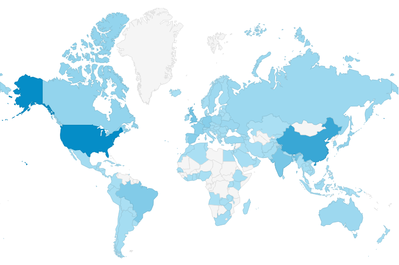
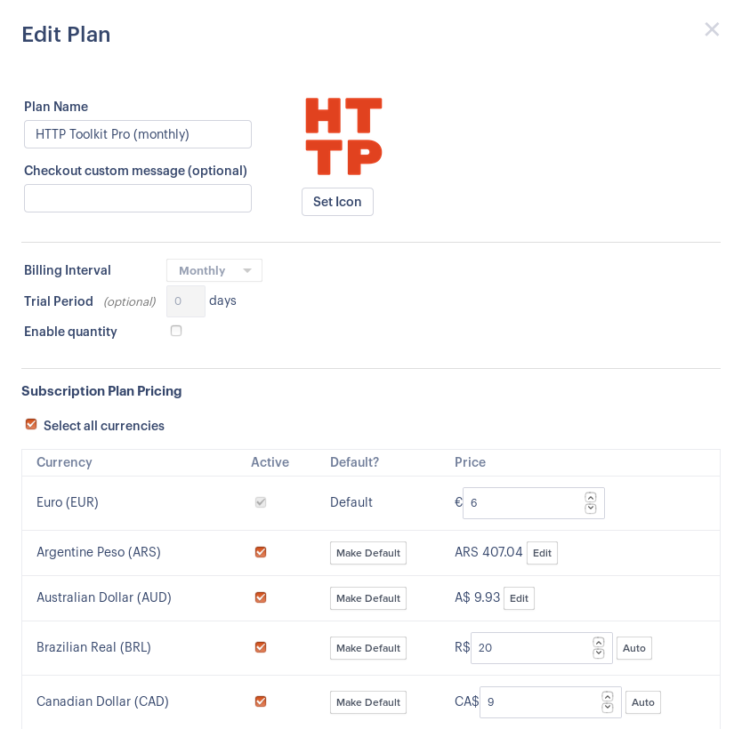

Naming a price for your latest magnum opus is one of the hardest decisions in releasing a product. In theory you price on the value you're providing, but wow that's hard to measure. Instead it's better (and often easier) to experiment: try a price, see how it converts and what that means for the bottom line, try another, compare, repeat.

**If you're selling software on the internet (like me) then your pricing experiments are probably missing a key variable: the customer's local market.**

In this post, I'm going to show you why that's important for your bottom line, explain how to think about this kind of pricing, and give you the tools I'm using to fix this for HTTP Toolkit (my product), starting next week.

## Why Localized Pricing Matters

Right now [HTTP Toolkit](https://httptoolkit.com) costs €5/month, and I'm selling to software engineers. In the US (average software engineer annual salary [$84,000](https://www.payscale.com/research/US/Job=Software_Engineer/Salary) = €76,000 = €200/day) that's extremely cheap. In India however (average software engineer salary [₹502,000](https://www.payscale.com/research/IN/Job=Software_Engineer/Salary) = €6,400 = €17/day) it's completely unaffordable.

This is a real problem. These are two very different markets, but they're both full of my target audience (professional software developers). They're also actually very similar-sized markets: India is predicted to have more developers than the entire US [by 2024](https://www.financialexpress.com/industry/technology/india-to-have-worlds-largest-app-developers-base-by-2024/1704821/). Although it's likely the US will be more profitable regardless, it is a crowded & expensive market to enter, and the majority of developers in the world don't live there (notably this is true for _every_ country).

If you're building a paid software product that isn't fundamentally tied to a specific location, you have this same dilemma. You can price high and ignore big parts of the world, or price lower and undervalue your product in the richest parts of the world. Regardless, **if you pick one price worldwide, you'll pick the wrong price for most of your potential customers**.

One classic example of this: Netflix vs Amazon in India. Netflix were charging $7.50 per month, similar to their US pricing, and limiting themselves to a small audience. Meanwhile Amazon charged $15 for an entire year and [won big](https://www.wired.com/2017/01/how-netflix-lost-big-to-amazon-in-india/#.ea7yv24cw). More recently, Netflix have now started localizing too, with a new [$3/month mobile-only subscription](https://thenextweb.com/apps/2019/07/24/netflix-mobile-plan-india/).

In addition to the financial impact of all this, it also artificially limits the reach and value of your software. For me, developers in India (and much of the rest of the world) will get just as much use out of my product, and it's not fair or rational to price them out of it.

Finally, even for users where your fixed price is 'right', having a sensible local prices improves your checkout experience. Prices shown in the fixed currency (€5) are harder to interpret for customers that don't use that currency day to day, and create currency conversion distractions. Meanwhile if you simply show the directly converted price in the local currency ($5.54) it looks ugly, which [measurably affects](https://www.sciencedirect.com/science/article/abs/pii/S0010880401900084) how customers perceive the quality of your product.

This is not good, but we can fix it.

## Picking the countries you care about

The first step is working out which countries to localize for.

There's a diminishing return here, which means you probably don't want to localize for every country on earth. Instead, you want to pick the set of countries most likely to buy from you. The local economy and overall size of your target audience in the country do have some bearing too, so there's a little art to this. Some important metrics to dig into:

* Which countries visit your site most?
* Which countries buy your product most?
* (For freemium/trial) Which countries most try for free, but don't upgrade?
* Which countries are most likely to _start_ buying your product, but not finish?

These should give you a good set to start with. The users currently converting in earnest are clearly interested and getting a good (for them) price, which should perhaps be higher. Meanwhile the countries where users consistently visit your site and show interest, but don't convert from free to paid, are the audience you're missing out on.

These are the users for whom you most want to customize your pricing. Pick a small set of countries depending on how much time you have. The most interesting 80% of your customers is probably a good starting point. There's a lot of countries in the world, but there should be a few huge ones that stick out.

Personally, I've picked 13 _currencies_ (mostly an implementation feature/limitation - more on that later): the Euro, US Dollar, Brazilian Real, Canadian Dollar, Chinese Yuan, British Pound, Indian Rupee, Swedish Krona, Czech Koruna, Russian Ruble, Hong Kong Dollar, Swiss Franc, and Danish Krona.

## Benchmarking your prices

Once you have a list of countries, the next step is to decide a price for each. To do so, we're going to relate them to a market metric.

When talking about pricing here, I'm assuming you're not doing this 100% from scratch! You need some initial signal from a real set of customers on what general level of pricing is appropriate in at least one market, before you can focus on per-location pricing. If not, talk to your customers more, confidently pick a number out of a hat and try it, or copy your competitors, to work out how the market reacts to some prices and get an initial starting point.

If you do have that, great! Pick your biggest customer country where it seems like your price is about right: not too high that nobody buys, and not so low that nobody complains. This is going to be our benchmark. That price works in this market, and we're going to extrapolate from here.

**The key hypothesis here is that the value your customers get from your product is related to another known market metric.**

For example, my product is usually a business cost. It saves developers time & effort. It's thus related to the value of software developer work, and so should be related to the software developer salaries in a region. If your product is similarly tied to a job, you're probably in the same place. For other products your pricing might be sensitive to the cost of food, or transport, or tourist accomodation, or disposable income.

Regardless of the metric, we can use this to directly derive equivalent prices. In my case, my existing prices suggest that if you're willing to pay X/day for a software developer, then you're willing to pay about 6% of X/month for my product. I can take that, look up the average developer salary in a country, and immediately get an appropriate local price.

## Running the numbers

You've now got a set of countries, a base price, and a local pricing metric, and it's time to break out the spreadsheets.

I'll walk you through the process below, but if you just want to see the result, then **[take a look at my full pricing calculations for HTTP Toolkit](https://docs.google.com/spreadsheets/d/1ujH8cCb09YNXL1EtIrLEp04BYR-I_LSQqDNxJeiJAt4/edit?usp=sharing)**.

Here's the general idea:

1. Set up your country data: per country, the currency conversion rate & the value of the metric you care about (in a common currency, if it's monetary).
2. Create another sheet to track your current prices.
3. For each product you have, for each country, add your current product price there, and add another column using the conversion rates to convert these prices to one common currency.
4. For each row there, calculate the ratio between your price and your metric.
5. For your base country, this ratio is your target ratio. Every other country that isn't close to that is currently mis-priced.
   In my case for example, I'm charging 5.8% of developer daily salaries in the eurozone, 3% in the USA, and 35% in India - pretty clearly not optimal.
6. Add any other metrics you need to be aware of, e.g: overheads/margin, relationships to any other potential market metrics, comparative discount between multiple products, how annual prices will appear per-month, etc.
7. That's your current pricing. Duplicate this sheet to start changing it.
8. Add one more column: the ratio of the soon-to-be new prices here vs the current price in the previous sheet.
9. Edit the prices for each row here, optimising the metrics shown, to make your market metric ratios consistent, and preferably get nice round numbers too.

If that doesn't make sense, or you're not a big spreadsheet fan, do take a look at [the HTTP Toolkit sheet](https://docs.google.com/spreadsheets/d/1ujH8cCb09YNXL1EtIrLEp04BYR-I_LSQqDNxJeiJAt4/edit?usp=sharing), which should help with a lot of this.

Do bear in mind that while these metrics are a useful indicator, they don't tell the whole story. The levels of competition in each market, relative preferences for your different products, and many other factors are all relevant to your pricing - but hopefully the metrics here should provide a good baseline.

If you're confident, you can try to extend this to model more factors and explore the data. You can add in your real sales data, for example, to see how it might affect revenue, or put the prices of multiple products together so you can work out what your pricing page will look like for users from a given country.

## Implementing localized pricing

Ok, we have prices. Let's talk mechanics. Now you know what you want to charge, how do you actually do that for customers in different countries? There's two tricks here:

* Credit cards are registered to an address in a specific country, and this is non-trivial to forge, so this is fairly easy to enforce at payment time.
* Most of the time, IP geolocation is accurate enough that you can also accurately predict a customer's country beforehand, so showing the correct pricing up front is doable too.

That means it's generally quite practical to charge for the right country. This likely isn't foolproof, but it's good enough in practice. The details of actually implementing this depends on your payment setup.

For my case I'm using [Paddle](https://paddle.com), who have a built-in UI for this:

Note that this only works per _currency_, not per country. That's not perfect (the euro particularly covers a lot of different countries and markets), but it's a pretty good approximation.

Paddle also have an API to [query prices](https://developer.paddle.com/api-reference/checkout-api/prices/getprices), automatically appropriately localized, and handle they the checkout country bit too, so if you're using them too it's really just a setting your prices in their dashboard, matter of reading your prices from the API instead of hardcoding them, and you're good to go.

If you're not using Paddle, you're probably using [Stripe](https://stripe.com). I'm not, so I can't comment in detail ([though I'd love pointers if you have them](https://twitter.com/pimterry)) but subscription plans are all tied to a specific currency so you'd likely want to make a plan per currency, priced appropriately, then handle country detection yourself, and set up the subscription against the corresponding plan.

## Pricing updates for HTTP Toolkit

As an end result then, in my case, what does all this mean for HTTP Toolkit?

First, I'm not changing any prices for existing customers, and I have no plans for price hikes any time in the foreseeable future.

However one week from now, for all new customers, I am going to rebalance a lot of prices. They're not exclusively going up though - for some countries, this is going to be a dramatic discount. There will be price increases for some of the more well-off countries (Canada, USA, Sweden, Denmark, Hong Kong & Switzerland), but price cuts for others (Brazil, China, India, Czechia & Russia).

Those are all the clear-cut cases for now, so everybody else is staying the same. If you think I do need to customize pricing for your country though, [let me know](/contact/), and I'll take a look.

## Conclusion

It's easy to sell software to the world nowadays, but it's also easy to do it badly.

**If you sell to everybody worldwide at one fixed price, then you're pricing your product wrong for the majority of your potential customers.**

With a couple of hours and a little spreadsheet-fu you can fix this, and boost revenues while giving more customers more value.

Don't forget that this isn't a one-off process though! Look at this as just one more experiment, and go back to the data again to tweak it further once you've tried it out.

Have any questions? [Let me know](https://twitter.com/pimterry).