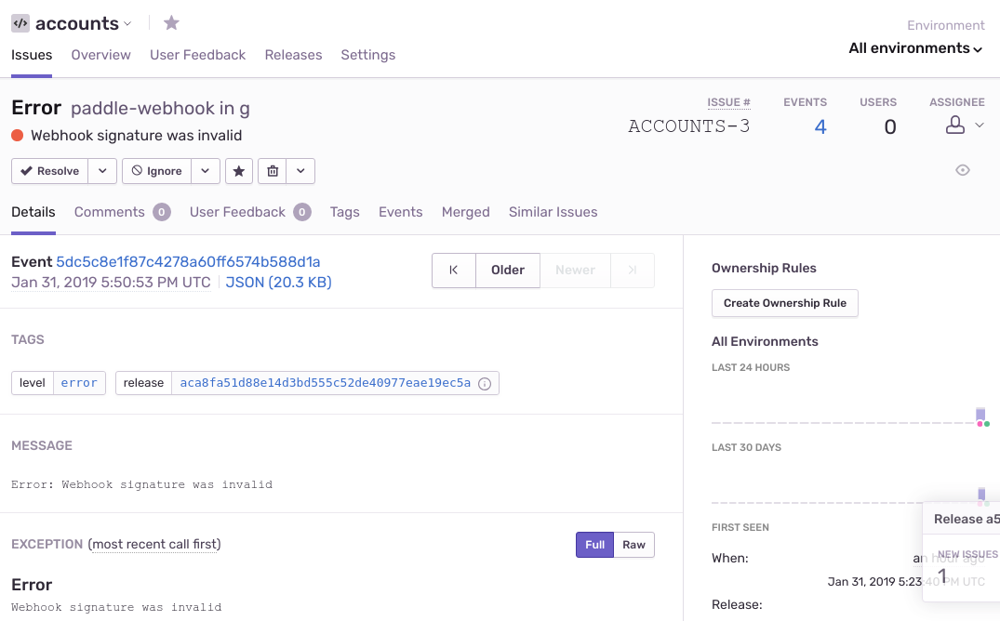

Netlify functions are a quick, easy & powerful tool, but they can be even more difficult to debug & monitor than traditional server applications. It's a hard environment to precisely recreate locally, there's no machine you can SSH into in a pinch, and no built-in error notifications.

Your code is going to break eventually, and you need the tools to fix it.

[HTTP Toolkit](https://httptoolkit.tech) uses Netlify functions under the hood to manage user account information and Paddle checkout callbacks. If we hit errors here, people's payments will fail, or they'll stop being given access to paid features, so this can be pretty bad! I need to be able to catch errors immediately, debug and work out why they're happening, and confirm that my fixes work.

Debugging & fixing issues here is a big topic, but one of the first steps is knowing exactly when & how errors happen. There's a few tools for this, but personally I've had a lot of success on projects recently with [Sentry](https://sentry.io). They've got a generous free plan (5k errors a month), built-in integrations for almost everything, and some good & detailed error reporting tools too.

If you can get Sentry set up, you'll get emails every time there's an error in your function, and you can explore the errors themselves in detail to work out exactly what failed. Perfect, but the setup for Netlify functions has a few extra steps.

## Start reporting errors to Sentry

I'm going to be using JS here, and I'm assuming you've already got a working Netlify function set up. To add Sentry reporting from there, you need to:

* Create a Sentry account
* Create a Sentry project in that account for your functions
* Take the DSN for your Sentry project and set it as a SENTRY_DSN variable in your Netlify build
* `npm install --save @sentry/node`
* Initialize your error logging logic:

```js
const Sentry = require('@sentry/node');

const { SENTRY_DSN } = process.env;

let sentryInitialized = false;
export function initSentry() {
    if (SENTRY_DSN) {
        Sentry.init({ dsn: SENTRY_DSN });
        sentryInitialized = true;
    }
}

// Import & call this from your function handlers:
initSentry();
```

With just this in place, uncaught errors & rejections are now reported automatically!

Unfortunately though, errors/rejections in handlers are caught and swallowed, so we'll need to catch those too. In addition, AWS Lambda (the service behind Netlify functions) doesn't behave exactly as you'd expect, so some error reports will be delayed or lost when your function is shut down after execution.

## Catching handler errors

Let's detect handler function errors first. To start with, create an convenient `reportError` method you can call and wait on to confirm errors are reported (as otherwise your function may be shutdown before reporting completes):

```javascript
// Don't use this example quite yet! It's not complete - see below.
function reportError(error) {
    console.warn(error);
    if (!sentryInitialized) return;

    if (typeof error === 'string') {
        Sentry.captureMessage(error);
    } else {
        Sentry.captureException(error);
    }
}
```

Then add a wrapper around each of your function handlers. The wrapper needs to call the handler as normal, but catch any errors or promise rejections, and report them to Sentry. It then needs to rethrow the error too, so that an HTTP error is still returned:

```js
// Don't use this example quite yet! It's not complete - see below.
function catchErrors(handler) {
    return async function() {
        try {
            return await handler.call(this, ...arguments);
        } catch(e) {
            // This catches both sync errors & promise
            // rejections, because we 'await' on the handler
            reportError(e);
            throw e;
        }
    };
}
```

## Reliable reporting with Sentry & AWS Lambda

A Lambda function runs until completion, and then will be frozen. Later calls may start it up again, or it might be disposed of, and the whole process created afresh. That means that any Sentry requests that haven't been sent when your function responds might be lost. Fortunately, we can fix this. We need to do two things: wait for reported errors to be fully sent, and ensure that Sentry doesn't interfere with normal Lambda shutdown.

The latest Sentry SDK doesn't fully support any kind of callback when we report errors (though [they're investigating a flush() method](github.com/getsentry/sentry-javascript/issues/1449)), so we need to dig into the internals a little to report the error more directly, in a form where we _can_ wait for it to complete.

Change your report error function to the below:

```js{1,5,6,9,11}
async function reportError(error) {
    console.warn(error);
    if (!sentryInitialized) return;

    const scope = Sentry.getCurrentHub().getScope();
    const sentryClient = Sentry.getCurrentHub().getClient();

    if (typeof error === 'string') {
        await sentryClient.captureMessage(error, scope);
    } else {
        await sentryClient.captureException(error, scope);
    }
}
```

Lastly, to stop Sentry callbacks interfering with normal Lambda lifecycle, we need to set `context.callbackWaitsForEmptyEventLoop` to false.

We can do this in our handler wrapper, and we also need to update that wrapper to wait on the `reportError` call too, to make sure that it's completed.

Change your `catchErrors` wrapper to:

```js{3,9}
function catchErrors(handler) {
    return async function(event, context) {
        context.callbackWaitsForEmptyEventLoop = false;
        try {
            return await handler.call(this, ...arguments);
        } catch(e) {
            // This catches both sync errors & promise
            // rejections, because we 'await' on the handler
            await reportError(e);
            throw e;
        }
    };
}
```

All done! With this in place, all handler errors will be reliably reported to Sentry, and you can rest safe in the knowledge that your functions are working nicely (or at least, that you know exactly how much they're failing).

## Bonus Extensions

There's two optional extra steps I'd like to mention, to help you debug your issues more easily.

First, extra reporting is super useful. [`Sentry.addBreadcrumb`](https://docs.sentry.io/learn/breadcrumbs/) for example lets you record extra events that will be included in any later exceptions. You can also call our `reportError` function from anywhere else in your code to immediate report errors, even if you don't actually throw them and fail (but do remember to wait on the returned promise).

Second, include your function's git commit as your Sentry release, so you always know which version of the code threw which errors. Netlify provides this as a `COMMIT_REF` environment variable, but this sadly isn't available in the runtime Lambda environment, so we need to make sure we bake it in at build time. To do that, first extend the default webpack config:

```js
// webpack.js:
const webpack = require('webpack');
const { COMMIT_REF } = process.env;

module.exports = {
    plugins: [
        new webpack.DefinePlugin({
            "process.env.COMMIT_REF": JSON.stringify(COMMIT_REF)
        })
    ]
};
```

You'll need to change your build script to pass `-c ./webpack.js` to your `netlify-lambda build` command to use this.

Then, change the initial Sentry setup to pass this variable on to Sentry:

```js{3,8}
const Sentry = require('@sentry/node');

const { SENTRY_DSN, COMMIT_REF } = process.env;

let sentryInitialized = false;
export function initSentry() {
    if (SENTRY_DSN) {
        Sentry.init({ dsn: SENTRY_DSN, release: COMMIT_REF });
        sentryInitialized = true;
    }
}

// Import & call this from your function handlers:
initSentry();
```

And voila, automated error reports for Netlify functions:



Want to see a complete example of this in action? Take a look at [HTTP Toolkit's accounting internals](https://github.com/httptoolkit/accounts/tree/master/src).