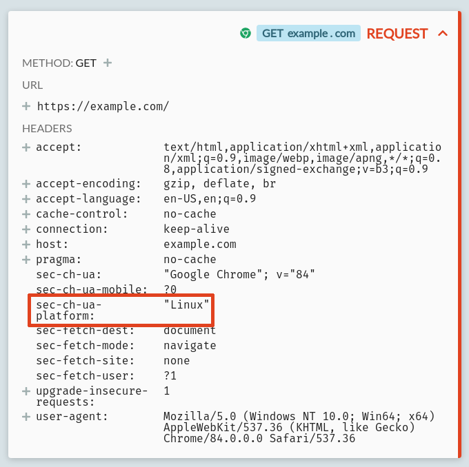

In the coming months, browsers are going to start killing the `User-Agent` HTTP header to replace it with user-agent client hints, a set of opt-in `Sec-CH-UA-*` headers.

Maybe you've heard about this already, maybe that all sounds great, but what _exactly_ does this mean in practice?

Let's talk about how the `Accept-CH` and `Sec-CH-UA-*` headers will work, how you can test that with your own services today, and what comes next.

## What's the current situation?

Right now the user agent (UA) includes your browser version, OS version and architecture, specific mobile phone manufacturer & model, and more. This creates a wide range of unique user agent header values, and that means a server & proxies can use this header (along with other data points) to [fingerprint](https://en.wikipedia.org/wiki/Device_fingerprint) users - to recognize & track individual people without using cookies or other restricted tracking mechanisms.

In addition, many sites use UAs to decide which content to server. This UA 'sniffing' has historically been abused, blocking functional browsers from accessing services when they don't fit a whitelist of known UA formats. That in turn has resulted in UAs trying to preserve backward compatibility, and UA strings gaining more and more cruft that can never be removed. Right now, 100% of popular browsers' user agents start with `Mozilla/5.0`, for instance. Not great.

As a case in point, here's a user agent for Chrome on Android:

```
Mozilla/5.0 (Linux; Android 9; Pixel 2 XL Build/PPP3.180510.008) AppleWebKit/537.36 (KHTML, like Gecko) Chrome/67.0.3396.87 Mobile Safari/537.36
```

Very specific, and very inaccurate. In reality, there's no KHTML, Gecko, Safari or Mozilla involved. All this information is sent to every service your browser communicates with in any way. This is a mess.

## What's the plan?

The solution is not to remove the `User-Agent` header completely. For compatibility reasons it will still be sent, probably forever, but 'frozen'. The plan is to progressively reduce the number of unique UA values, by grouping more and more cases together to return the same UA.

Soon, there's likely be a single UA used by all Chrome versions on all desktop OSs, and a single UA used by all Chrome versions of all mobile OSs. That reduces the real information in the user agent down to just mobile/desktop, and the browser itself. Long term, it's very possible those will be frozen too, sharing UAs across desktop and mobile and more browsers.

This will apply to both the `User-Agent` header that's sent in HTTP requests, and the `navigator.userAgent` property accessible from client-side JavaScript.

Some services do need the information that the UA provides though. You might be serving content that depends on the specific browser version a user is using (either because the content itself is relevant to the browser, or because you need to work around behaviour in specific known versions), or you might be serving content that depends on the user's specific OS and OS version (offering a Mac download to Mac users and a Windows download to Windows users).

These cases exist, and will continue to be supported, but explicitly: the server will need to send an `Accept-CH` header to request this information.

## The Accept-CH header

`Accept-CH` is an existing HTTP header, currently an active but experimental [draft standard](https://datatracker.ietf.org/doc/draft-ietf-httpbis-client-hints/?include_text=1), currently in the "Last Call" phase (until the 8th of May 2020). It's been supported in Chrome on desktop & Android since 2015, and other Chromium-based browsers, though it's not yet available in Firefox or Safari.

Until now, its been used to request bonus details from browsers, such as the user's connection speed, viewport size or screen density. The idea is to allow servers to customize the content they serve, optimizing images and other content for mobile devices or users on low-bandwidth connections.

It works like so:

* The client sends a request to the server with no hints, for example an initial navigation to `https://example.com/index.html`
* The server responds with the content requested, and includes an `Accept-CH` header, such as:
    * `Accept-CH: Viewport-Width` - the server wants to know the width of the client's screen
    * `Accept-CH: Width` - the server wants to know the desired width of resources being requested (e.g. how much space is available to show an image)
    * `Accept-CH: DPR, Device-Memory, Downlink` - the server wants to know the screen density, amount of RAM, and bandwidth of the client
* For subsequent requests for pages or resources from the same origin, the client sends these hints, each as a separate header:
    * `Width: 123` - the size of image the device wants to show
    * `Device-Memory: 2` - the memory of the device, in GiB, rounded to 0.25/0.5/1/2/4/8 to resist fingerprinting
    * `Download: 2.5` - the bandwidth available, in Mbps, rounded to the nearest 25Kbps to resist fingerprinting

### There's a few caveats to this:

First, client hints aren't always honoured. They're only supported for HTTPS connections, and only on first-party resources, so if you open `https://example.com` in your browser, requests to load subresources from `example.com` may include client hints, but requests for subresources from `ads.otherdomain.com` will not (although this may be [configurable](https://github.com/WICG/client-hints-infrastructure#cross-origin-hint-delegation) using a [feature policy](https://developer.mozilla.org/en-US/docs/Web/HTTP/Headers/Feature-Policy)).

They're also optional. Clients might refuse to send them, or might not support them at all, and they'll likely never appear in the first request to your origin.

That said, if you do need a hint in the initial request, you could return an `Accept-CH` header with a 307 redirect back to the same URL to ask for the hint immediately, but you rarely want to do this. Doing so adds a redirect to your page load, and you risk putting users who can't or won't provide these hints into a redirect loop that locks them out of your site. It's better to serve a default version of your content, and treat client hints as progressive enhancement, to be used when available but not depended upon.

These client hints are then persisted for the origin. The exact lifetime is left up to the client (a previous draft included a `Accept-CH-Lifetime` header, but that's now [been removed](https://github.com/httpwg/http-extensions/pull/878)) but its likely to be at least the rest of the current browser session. Although this means the same hint headers are duplicated on all future requests, with HTTP/2's [header compression](https://blog.cloudflare.com/hpack-the-silent-killer-feature-of-http-2/) that can be done extremely efficiently.

Lastly, if you are building a server that uses any client hints, you should be sure to include `Vary: <hint name>` in all responses, to ensure that they're only cached for requests that send the same hint values.

All of this is Chrome only right now, although there's [some progress](https://bugzilla.mozilla.org/show_bug.cgi?id=935216) in other browsers, and the standardisation process is intended to encourage that. The set of opt-in hints supported in the latest stable Chrome includes:

* Width
* Viewport-Width
* DPR
* Content-DPR
* Device-Memory
* RTT
* Downlink
* ECT

Google's web fundamentals guide has [more detail](https://developers.google.com/web/fundamentals/performance/optimizing-content-efficiency/client-hints) about using these in practice.

That's the state of things _today_. Let's talk about how we can use this to kill off `User-Agent` once and for all.

## User-agent client hints

The current [UA client hints draft](https://wicg.github.io/ua-client-hints/) proposes a few user-agent client hint headers to expose the information from `User-Agent` in a granular form:

* `Sec-CH-UA` - basic UA info, e.g. `"Google Chrome"; v="84"`
* `Sec-CH-UA-Arch` - the CPU architecture, e.g. `x86_64`
* `Sec-CH-UA-Model` - the device model, e.g. `Pixel 3`
* `Sec-CH-UA-Platform` - the client OS, e.g. `Linux`
* `Sec-CH-UA-Platform-Version` - the client OS version, e.g. `NT 6.0`
* `Sec-CH-UA-Full-Version` - the full client UA version, e.g. `"84.0.4128.3"`
* `Sec-CH-UA-Mobile` - a [boolean header](https://tools.ietf.org/html/draft-ietf-httpbis-header-structure-18#section-3.3.6), describing whether the client a mobile device, either `?1` (yes) or `?0` (no)

The `Sec-` prefix here may be unfamiliar. This is a general prefix for a [forbidden header name](https://fetch.spec.whatwg.org/#forbidden-header-name) as defined by [the Fetch spec](https://fetch.spec.whatwg.org/). Headers starting with `Sec-` can never be manually sent by JS in a web page.

`Sec-CH-UA` and `Sec-CH-UA-Mobile` are considered ['low-entropy hints'](https://wicg.github.io/client-hints-infrastructure/#low-entropy-table), which will be sent by default. For the others, you'll need to send an `Accept-CH` header, with the header name without the `Sec-CH-` prefix. For example, if you want to know what platform the client is using, send a `Accept-CH: UA-Platform` response.

It's important not to ask for too much, and request only the hints you really need. In addition to potential data transfer concerns (especially for HTTP/1.1 clients or servers), requesting too much information may trip a [privacy budget](https://github.com/mikewest/privacy-budget) or otherwise trigger permission prompts in future, and implies collecting unnecessary personal information about your users.

The draft also proposes a `navigator.userAgentData` JavaScript API to access this hint data client-side, but that doesn't seem to be implemented anywhere yet.

## How to start using these today

Right now, the only browser that supports this is Chrome, and only in the dev & canary channels, and behind a flag. It's early days! That said, testing it out now allows you to see how this might impact your application, and start to see how you can capture any hints that you need to handle this, once this does land for real.

To test this out today, you'll need an HTTPS server locally where you can log requests and play with the response headers, or you can use an HTTP debugger like [HTTP Toolkit](/) to directly inspect & inject responses to test around with. Once you have that in place:

* Open Chrome (either the Dev or Canary builds)
* Enable "Experimental Web Platform features" and "Freeze User-Agent request header" from `chrome://flags`
* Load a page from your domain over HTTPS, and look at the request headers you receive - this is what'll happen soon by default:
    
    _Note the frozen "84.0.0.0" version and "Windows" platform in the UA here_
* Load the page afresh, this time returning edited headers (directly from your server, or by adding a breakpoint from the [Mock page](/docs/reference/mock-page/) in HTTP Toolkit) that include `Accept-CH: UA-Platform`
    
* Reload once more, and you should see the client send you a new `Sec-CH-UA-Platform` header in the request.
    

Bear in mind this is still a draft, not yet released in any stable browsers, and not yet final. **Don't ship code that depends on this!** The full details aren't yet decided, and it's still very possible that it'll change over the coming months.

## When is this happening?

In [Chromium's original timeline](https://groups.google.com/a/chromium.org/forum/#!msg/blink-dev/-2JIRNMWJ7s/yHe4tQNLCgAJ) (now [disrupted](https://groups.google.com/a/chromium.org/d/msg/blink-dev/-2JIRNMWJ7s/u-YzXjZ8BAAJ) by COVID-19), the goal was to freeze browser & OS versions from June 2020, eventually freezing to just 2 possible user-agent values - one for desktop & one for mobile - for all versions of Chrome from September 2020.

That's now delayed until 2021, and the specific new plan hasn't yet been announced, but it's likely to take a similar shape.

Other browsers will likely follow suite. Edge have been [supportive](https://twitter.com/_scottlow/status/1206831008261132289), while Firefox are [broadly supportive](https://github.com/mozilla/standards-positions/issues/202#issuecomment-558294095), and already have UA freezing implemented in place as a privacy option today. Recording Firefox's HTTP traffic with HTTP Toolkit normally shows Firefox sending a detailed UA:


But if the `privacy.resistFingerprinting` flag is set in Firefox's `about:config`, that same browser sends:


Safari haven't formally announced their position, but they've previously attempted to freeze the UA in [preview builds](https://twitter.com/rmondello/status/943545865204989953) (though that was partially rolled back), and it seems likely they'd follow suit once the rest of the ecosystem commits to this.

Watch out for more changes in the same direction too, as browsers move other fingerprintable data behind client hints in future, including the [`Accept-Language`](https://github.com/WICG/lang-client-hint) header, and begin investigating approaches like [GREASE](https://wicg.github.io/ua-client-hints/#grease) to mitigate sniffing risks. You can follow the detailed progress on this in the [Chromium](https://bugs.chromium.org/p/chromium/issues/detail?id=924047) and [Firefox](https://bugzilla.mozilla.org/show_bug.cgi?id=1609304) bug trackers.

Have thoughts? `Accept-CH` in general is now in its [last call for comments](https://datatracker.ietf.org/doc/draft-ietf-httpbis-client-hints/), until the 8th of May 2020, whilst the UA freezing and client hints details are still very much subject to change, with discussion happening in the WICG [ua-client-hints repo](https://github.com/WICG/ua-client-hints) on GitHub. There's still time to shape them to work for you!